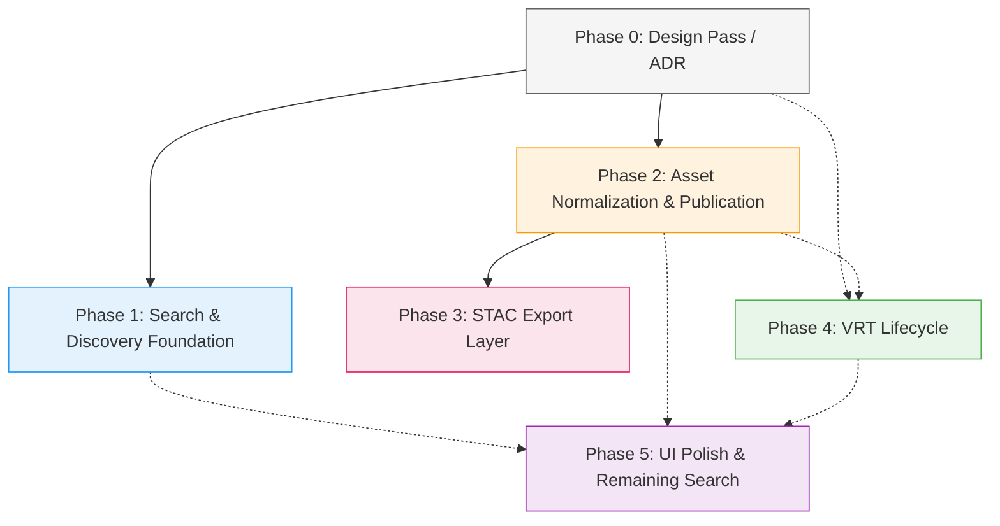

# Implementation Roadmap: Record-First Discovery Architecture

**Date:** 2026-03-16 (revised)
**Derived from:** [GAP-ANALYSIS.md](./GAP-ANALYSIS.md) (26 gaps across 6 categories)

---

## 1. Overview

This roadmap sequences the 26 identified gaps into 6 implementation phases (Phase 0-5), ordered by:

1. **Design-first** -- lock the key definitions (what is a "record," what is "published," how are assets exposed) before writing code
2. **Dependency resolution** -- foundational changes that unblock later work come first
3. **Value delivery** -- high-impact, user-visible improvements early
4. **Risk reduction** -- asset normalization and security before external STAC exposure
5. **Effort clustering** -- related gaps grouped to minimize context switching

Each phase is designed to be independently shippable and testable, with clear value delivered at each stage.

---

## 2. Phasing Strategy

**Design pass first (Phase 0):** Before writing implementation code, lock the definitions that downstream phases depend on. This is a short ADR/design exercise, not a code phase.

**Search/discovery foundation next (Phase 1):** Deliver the highest-value improvements (faceted counts, collection-level discovery, datetime, conformance) while the definitions from Phase 0 are fresh.

**Asset normalization + security (Phase 2):** Tackle the cross-cutting assets refactoring (the single most impactful issue) alongside the publication/security contract. This must precede STAC export.

**STAC export layer (Phase 3):** Build dedicated STAC endpoints, enabled by unified assets and clear publication semantics from Phase 2.

**VRT lifecycle (Phase 4):** Establish generation tracking first, then manual regeneration, then source health. Correct dependency ordering avoids retrofits.

**UI polish and remaining search (Phase 5):** Detail page consistency, remaining filters, ranking boosts. Lower priority, can be deferred or run in parallel with Phase 4.

---

## 3. Phase Breakdown

### Phase 0: Design Pass (ADR)

**Theme:** Lock key definitions before implementation
**Gaps addressed:** Foundation for GAP-SEARCH-07, GAP-PUB-01, GAP-STD-03
**Prerequisites:** None
**Estimated scope:** 1 plan, ~3K context budget (document output, no code)

#### Decisions to Lock

| # | Decision | What to Define | Impact on Downstream |
|---|---|---|---|
| 1 | Searchable record type taxonomy | Top-level record types in global search: `collection`, `vector_dataset`, `raster_dataset`, `vrt_dataset` (future: `service`). Explicit exclusion list: source COGs, individual vector features, internal processing artifacts. | Determines Phase 1 search query scope, UI card variants, and what "record" means system-wide |
| 2 | Collection ranking vs datasets | When collections appear in results, how they rank relative to datasets, whether result-type grouping is used, whether collections are always shown or only on high-relevance/exact matches. Default search should still feel dataset-first. | Determines Phase 1 ranking implementation and UI grouping strategy |
| 3 | Publication lifecycle states | Full lifecycle: `draft` → `ready` → `internal` → `published` (optionally `deprecated` later). Not a binary flag. A dataset can be technically valid (`ready`) but not externally publishable. A VRT may be usable internally while regenerating. | Determines Phase 2 publication filter, Phase 3 STAC endpoint scoping, and state transition rules |
| 4 | Which records are eligible for STAC export? | All `published` raster/VRT vs. opt-in per-collection vs. opt-in per-dataset | Determines Phase 3 serializer filtering logic |
| 5 | Asset URL exposure strategy per context | Define behavior for each access context: (a) GeoLens web app users -- auth-gated direct URLs, (b) STAC machine clients -- signed URLs or proxy, (c) thumbnails vs full data assets -- thumbnails may be public for published records, (d) background jobs -- direct URLs with service auth, (e) internal vs published datasets -- different URL strategies | Determines Phase 2 security implementation scope |
| 6 | VRT ordering and concurrency semantics | Source ordering persistence rules, mutation locking (at most one regeneration per VRT), generation status model (`active`/`regenerating`/`failed`/`superseded`), atomic swap and rollback behavior | Determines Phase 4 acceptance criteria and prevents underbuilding |

#### Output

- ADR document in `.planning/` with all 6 decisions recorded
- No code changes

**Value delivered:** All downstream phases can proceed without design ambiguity. Prevents building technically correct features with fuzzy semantics. The explicit exclusion list and ranking rules prevent collection-crowding and scope creep.

---

### Phase 1: Search & Discovery Foundation

**Theme:** Faceted counts, collection discovery, and standards conformance
**Gaps addressed:** GAP-SEARCH-01, GAP-SEARCH-02, GAP-SEARCH-07, GAP-STD-01, GAP-STD-02, GAP-UI-01
**Prerequisites:** Phase 0 (need collection-as-record decision)
**Estimated scope:** 2-3 plans, ~15K context budget

#### Work Items

| # | Work Item | Files to Modify | Changes | Acceptance Criteria |
|---|---|---|---|---|
| 1 | Create `/search/facets` endpoint | `backend/app/search/router.py`, `backend/app/search/service.py`, `backend/app/search/schemas.py` | New `search_facets()` function accepting same filter params as search. Dedicated endpoint, not embedded in primary search response. **Phase 1 scope:** `record_type` counts. **Contract design:** response shape must be `{ facet_name: { value: count } }` (e.g., `{ "record_type": { "vector_dataset": 95, ... } }`) so that additional facets (keywords, source_organization, srid) can be added in Phase 5 without breaking the response schema. This is the long-term multi-facet aggregation endpoint; Phase 5 extends it backward-compatibly. | `GET /search/facets?q=imagery` returns `{"record_type": {"vector_dataset": 5, "raster_dataset": 22, "vrt_dataset": 10}}`; counts update with filter changes; response shape supports future facet keys |
| 2 | Add faceted count badges to UI | `frontend/src/components/search/FilterPanel.tsx`, `frontend/src/hooks/use-search.ts` | Fetch from `/search/facets`, display as badges on ToggleGroup items | Type toggle shows "Vector (95)" etc., counts update as filters change |
| 3 | Collection-level records in discovery | `backend/app/search/service.py`, `backend/app/search/router.py`, `frontend/src/components/search/DatasetCard.tsx` | Per Phase 0 decisions #1 and #2: extend search query to include collection records, add `collection` card rendering variant, implement ranking rules from ADR | Collections appear in search results with member count badge; clicking drills into collection members; searching "parcels" returns the parcels dataset before collection groupings; collection ranking follows Phase 0 ADR rules |
| 4 | Declare OGC Records conformance | `backend/app/ogc/router.py` | Add Records Core, Record Schema, and JSON conformance URIs to `conformance()` endpoint (line 142) | `GET /conformance` includes 3 new Records URIs; existing Features URIs unchanged |
| 5 | Add `datetime` query parameter | `backend/app/search/router.py`, `backend/app/search/service.py`, `backend/app/ogc/router.py`, `backend/app/ogc/filtering.py` | Parse OGC interval syntax (`../date`, `date/..`, `date/date`), filter on `Record.temporal_start`/`temporal_end`, add to queryables | `?datetime=2023-01-01/2024-01-01` returns records with temporal overlap |

**Value delivered:** Users understand catalog composition at a glance. Collections are discoverable. Machine clients find GeoLens via standard conformance. Temporal filtering works with OGC syntax.

---

### Phase 2: Asset Normalization & Publication Contract

**Theme:** Unify assets, add STAC raster properties, define publication/security model
**Gaps addressed:** GAP-STD-03, GAP-STD-04, GAP-STD-05, GAP-STD-06, GAP-PUB-01, GAP-PUB-02
**Prerequisites:** Phase 0 (need publication state and asset URL decisions)
**Estimated scope:** 2-3 plans, ~15K context budget

#### Work Items

| # | Work Item | Files to Modify | Changes | Acceptance Criteria |
|---|---|---|---|---|
| 1 | Refactor `_build_assets()` to be modality-aware | `backend/app/search/service.py` | Accept `record_type` parameter. Vector: download + tiles + OGC Features. Raster/VRT: raster tile endpoint + COG download. Remove vector download links from raster records. | Raster records no longer include `download_gpkg`, `download_shp` etc. |
| 2 | Merge DatasetAsset rows into main assets | `backend/app/search/service.py` | Combine `_build_assets()` and `_build_stac_assets()` into single function. DatasetAsset entries (COG, VRT, thumbnails) merged into `assets` dict. Emit both `assets` and `stac_assets` during transition period. | Single `assets` dict on all records; `stac_assets` deprecated but still present |
| 3 | Add STAC projection/band properties | `backend/app/search/service.py`, `backend/app/search/router.py`, `backend/app/search/schemas.py` | Call `RasterAsset.to_stac_properties()` for raster/VRT records, merge `proj:epsg`, `proj:shape`, `gsd`, `bands` into `properties` | Raster records include `proj:epsg`, `gsd`, `bands` in properties |
| 4 | Add `stac_extensions` array | `backend/app/search/service.py` | Conditional `stac_extensions` array when STAC properties are present (now that GAP-STD-04 properties exist) | Raster/VRT records include `stac_extensions` with projection extension URI |
| 5 | Implement publication lifecycle | `backend/app/datasets/models.py`, `backend/app/search/service.py` | Per Phase 0 decision #3: add `publication_state` enum column (`draft`/`ready`/`internal`/`published`), define valid state transitions, filter external endpoints to `published` only, update internal search to respect all states, apply to all record types equally (vector, raster, VRT) | State transitions enforced; only `published` records appear in STAC endpoints; `ready` datasets usable internally but not externally; VRTs can be `internal` while regenerating |
| 6 | Implement asset URL security | `backend/app/search/service.py` or new proxy module | Per Phase 0 decision #5: implement per-context URL strategy. Web app: auth-gated direct URLs. STAC: signed URLs (cloud) or proxy (local). Thumbnails: public for published records. Internal assets: never exposed in STAC output. | Asset URLs in STAC responses are signed/proxied; internal hrefs absent from `/stac/` output; thumbnails publicly accessible for published records; direct URLs still work for authenticated web app users |
| 7 | Update frontend asset consumers | `frontend/src/` (any components reading `stac_assets`) | Update to read from unified `assets` dict | No frontend regressions; raster tile URLs still resolve |

**Value delivered:** Clean, standards-compliant record output. STAC properties present on raster records. Publication boundaries defined. Asset security in place. Unblocks Phase 3.

---

### Phase 3: STAC Export Layer

**Theme:** Dedicated STAC endpoints for machine clients
**Gaps addressed:** GAP-STAC-01, GAP-STAC-02, GAP-STAC-03
**Prerequisites:** Phase 2 (unified assets, publication model, and asset security required)
**Estimated scope:** 2-3 plans, ~15K context budget

#### Work Items

| # | Work Item | Files to Modify | Changes | Acceptance Criteria |
|---|---|---|---|---|
| 1 | Create STAC Item serializer | `backend/app/stac/serializer.py` (new) | Transform OGC Record dict to STAC 1.1 Item JSON: ensure `stac_version`, `stac_extensions`, proper `assets`, `collection`, `links` with STAC rels. Filter to published records only. Apply asset URL security from Phase 2. | Output validates against STAC 1.1 JSON Schema |
| 2 | Create STAC Item endpoint | `backend/app/stac/router.py` (new) | `GET /stac/items/{id}` returns STAC Item for published raster/VRT records. 404 for vector records or unpublished. | Valid STAC Item JSON; loadable by PySTAC |
| 3 | Create STAC Collection/Catalog endpoints | `backend/app/stac/router.py` | `GET /stac/` (catalog landing page) and `GET /stac/collections/{id}` (STAC Collection for raster/VRT subsets) with proper STAC conformance URIs and `rel: "child"` links | STAC Catalog with child links; STAC Collection with extent and summaries |
| 4 | Add STAC search endpoint | `backend/app/stac/router.py` | `GET /stac/search` with `datetime`, `bbox`, `collections`, `ids` params. Reuse existing search service with `record_type` + publication filter. | STAC-compliant search returning ItemCollection |
| 5 | Declare STAC conformance | `backend/app/stac/router.py` or `backend/app/ogc/router.py` | Add STAC API conformance classes | STAC clients can auto-discover capabilities |
| 6 | Validator-based acceptance tests | `backend/tests/` | Run STAC Item/Collection output through STAC validator; test PySTAC roundtrip; verify asset URLs are secure | All STAC output validates; no internal URLs exposed |
| 7 | Register STAC router | `backend/app/main.py` | Mount STAC router at `/stac` prefix | All STAC endpoints accessible |

**Value delivered:** GeoLens becomes a STAC-compliant catalog for raster data. STAC Browser, PySTAC, and other STAC clients can browse and search published raster/VRT records with secure asset URLs.

**Architectural principle:** STAC export is a serialization/publication layer over GeoLens's internal catalog model. STAC semantics must NOT drive internal search behavior. The GeoLens internal search model (record types, ranking, facets) is the primary architecture; STAC endpoints are a standards-compliant view over that model for machine clients. This distinction matters for vector and mixed-content UX -- STAC's raster-centric ecosystem should not dictate how vector datasets are discovered or presented in the GeoLens UI.

---

### Phase 4: VRT Lifecycle

**Theme:** Generation tracking, then regeneration, then source health
**Gaps addressed:** GAP-VRT-02, GAP-VRT-01, GAP-VRT-03
**Prerequisites:** None (independent of Phases 1-3, though Phase 1 datetime is helpful)
**Estimated scope:** 2-3 plans, ~15K context budget

#### Work Items (ordered by dependency)

| # | Work Item | Files to Modify | Changes | Acceptance Criteria |
|---|---|---|---|---|
| 1 | VRT generation history model + status | `backend/app/raster/models.py`, `backend/app/ingest/tasks.py` | Introduce a `vrt_generations` table (or equivalent persisted history model) with: `id`, `vrt_dataset_id`, `generation_number`, `status` (`active`/`regenerating`/`failed`/`superseded`), `artifact_path`, `created_at`, `completed_at`. `RasterAsset.current_generation_id` becomes an FK to this table. Each regeneration creates a new row; `superseded` lives on the prior row, not as a field on the current asset. Backfill existing VRTs with generation=1/`active`. **Design choice:** a real generation-history table is required because `superseded` and rollback need a place to live -- two fields on the current asset cannot represent prior generations for audit or rollback. | `vrt_generations` table exists; all VRTs have at least one generation row; `current_generation_id` FK is valid; status enum enforced at DB level; existing VRTs backfilled |
| 2 | VRT generation tracking API | `backend/app/datasets/router.py`, `backend/app/datasets/schemas.py` | `GET /datasets/{id}/vrt/status` endpoint returning current generation (from `vrt_generations`), status, last regeneration time, source count, source ordering. `GET /datasets/{id}/vrt/generations` returns generation history (all rows for this VRT, most recent first). | Current generation metadata visible; generation history queryable; source order matches `vrt_source_links.position` |
| 3 | VRT generation UI panel | `frontend/src/pages/DatasetPage.tsx`, `frontend/src/components/dataset/VrtPanel.tsx` (new) | Show current generation, status badge, last regeneration time. Show "regenerating" state with disabled controls when applicable. | VRT detail page shows lifecycle info; `regenerating` status renders distinctly |
| 4 | VRT manual regeneration endpoint | `backend/app/ingest/router.py` or `backend/app/datasets/router.py`, `backend/app/ingest/tasks.py` | `POST /datasets/{id}/vrt/regenerate`: insert new `vrt_generations` row with status=`regenerating`, rebuild VRT from current source links respecting `position` ordering, build to temp path, validate, atomic swap (update `current_generation_id`, mark old row `superseded`, mark new row `active`), update timestamps. **Concurrency:** at most one active regeneration per VRT (advisory lock on `vrt_dataset_id`); concurrent requests return 409 Conflict. **Rollback:** if rebuild fails, mark new generation row `failed`, leave `current_generation_id` pointing to previous `active` row unchanged. | New generation row created; VRT rebuilt; `current_generation_id` updated; old generation row marked `superseded`; concurrent requests rejected with 409; failed rebuild marks new row `failed` and leaves previous generation active |
| 5 | Regenerate button in UI | `frontend/src/components/dataset/VrtPanel.tsx` | "Regenerate" button on VRT detail. Disabled during active regeneration. Shows regeneration progress/status. Polls or subscribes to status updates. | Users can trigger regeneration; button disabled during `regenerating`; status updates reflected without page refresh |
| 6 | VRT source health check | `backend/app/datasets/service.py` (new function), `frontend/src/components/dataset/VrtPanel.tsx` | Check each source dataset exists and raster asset is accessible. Respect source ordering (`position`). Return per-source health status. Display in VRT detail page with position-aware ordering. | Health status visible; broken sources flagged; source order matches VRT band/overlap precedence |

**Value delivered:** VRT lifecycle becomes operationally manageable. Generation tracking provides audit trail. Manual regeneration enables recovery from source changes. Source health monitoring prevents silent breakage.

---

### Phase 5: UI Polish & Remaining Search

**Theme:** Detail page consistency, remaining filters, ranking
**Gaps addressed:** GAP-UI-02, GAP-UI-03, GAP-SEARCH-03, GAP-SEARCH-04, GAP-SEARCH-05, GAP-SEARCH-06, GAP-STD-07, GAP-STD-08
**Prerequisites:** Phases 1-2 (standards and search foundations); GAP-UI-02 benefits from Phase 4 (VRT generation tracking)
**Estimated scope:** 2-3 plans, ~15K context budget

#### Work Items

| # | Work Item | Files to Modify | Changes | Acceptance Criteria |
|---|---|---|---|---|
| 1 | Detail page layout refactor | `frontend/src/pages/DatasetPage.tsx` | Consistent skeleton: header (shared) + type-specific panel (vector schema, raster bands, VRT sources+generation) | All three modalities have consistent but type-appropriate detail layouts |
| 2 | Extend `/search/facets` with additional facets | `backend/app/search/service.py`, `backend/app/search/router.py` | Add `keywords`, `source_organization`, `srid` facet groups to `/search/facets` response (backward-compatible extension of Phase 1 contract) | `/search/facets` returns all facet groups; existing `record_type` facet unchanged |
| 3 | Keyword facet picker (UI) | `frontend/src/components/search/FilterPanel.tsx`, `frontend/src/components/search/KeywordPicker.tsx` (new) | Multi-select combobox for keywords, populated from `/search/facets` `keywords` group | Users can select keywords to filter |
| 4 | Vintage/temporal filter (UI) | `frontend/src/components/search/FilterPanel.tsx` | Add temporal extent filter targeting `datetime` param (from Phase 1) | Users can filter by data temporal coverage |
| 5 | Search ranking boosts | `backend/app/search/service.py` | Add published status boost, freshness signal, de-boost large inventories | Published records rank above draft for same relevance |
| 6 | Source org filter (UI) -- skip if completed as quick win | `frontend/src/components/search/FilterPanel.tsx` | Select/combobox for source_organization, wired to `/search/facets` `source_organization` group | Users can filter by organization |
| 7 | CRS filter (UI) -- skip if completed as quick win | `frontend/src/components/search/FilterPanel.tsx` | Add CRS/SRID filter select, wired to `/search/facets` `srid` group | Users can filter by coordinate reference system |
| 8 | Per-record `conformsTo` -- skip if completed as quick win | `backend/app/search/service.py` | Optional `conformsTo` array on OGC Record output | Records include `conformsTo` referencing OGC Record schema |

**Note on quick-win overlap:** Items 6, 7, and 8 overlap with the Quick Wins table (Section 6). If completed as quick wins before Phase 5, skip them here. Phase 5 versions are listed as fallbacks and include wiring to the extended `/search/facets` endpoint (which quick-win versions would not have).

**Value delivered:** Polished search and detail experience. Richer filtering for power users. Better ranking for mixed-modality catalogs.

**Note:** GAP-STD-08 (cursor-based catalog pagination) is intentionally excluded from the roadmap. Offset pagination works fine for catalogs under 100K records. Cursor migration is a breaking change that deserves its own major version when scale demands it.

---

## 4. Dependency Graph

**Solid arrows:** Hard dependency (must complete before starting)
**Dashed arrows:** Soft dependency (benefits from but not blocked by)

**Key insights:**
- Phase 0 → Phase 1 and Phase 0 → Phase 2 are hard dependencies (design decisions gate implementation)
- Phase 2 → Phase 3 is a hard dependency (unified assets + publication model required for STAC)
- Phase 4 (VRT) is operationally independent and can run in parallel with Phases 1-3, but is semantically aligned with Phase 2 lifecycle rules (Phase 0 ADR decision #3 defines that a VRT can be `internal` while regenerating, and Phase 2 implements publication state — Phase 4 should respect those states but does not need Phase 2 to ship)
- Phase 5 benefits from all earlier phases but is soft-dependent only

---

## 5. Risk Assessment

| Risk | Likelihood | Impact | Mitigation |
|---|---|---|---|
| Assets merge breaks frontend consumers | Medium | High | Transition period: emit both `assets` and `stac_assets`; audit all frontend files reading `stac_assets`; comprehensive test coverage |
| Publication model ambiguity delays Phase 3 | Medium | High | Phase 0 ADR forces the decision upfront |
| `datetime` param conflicts with existing `date_from`/`date_to` | Low | Medium | Keep existing params for backward compat; add `datetime` as additional param |
| STAC endpoints expose internal data | Medium | High | Phase 2 asset security + publication filter; validator tests assert no internal URLs |
| VRT regeneration data loss | Medium | High | Atomic swap: build new VRT file, verify, then rename; keep old file until verified |
| Collection-as-record changes search contract | Medium | Medium | Phase 0 locks the design; UI uses `record_type` discriminator for card rendering |
| Effort underestimate on L-sized items | High | Medium | Budget extra time for assets unification, STAC export, VRT regeneration; treat labeled M→L items seriously |
| Breaking API changes for existing clients | Medium | Medium | Deprecation periods; version the changes; migration guides |

### Migration Concerns

- **`stac_assets` removal (Phase 2):** Frontend and any external consumers reading `stac_assets` need migration. Approach: emit both during transition, then remove `stac_assets` after one version cycle.
- **Collection records in search (Phase 1):** Existing API consumers may not expect `record_type=collection` in search results. Use `record_type` filter to opt-in or opt-out.
- **Pagination (GAP-STD-08):** Cursor-based pagination is a breaking change. Deferred to future major version.

---

## 6. Quick Wins

These can be done immediately with minimal risk, independent of the phasing above:

| Quick Win | Gap ID | Effort | What to Do |
|---|---|---|---|
| Declare OGC Records conformance | GAP-STD-01 | 15 min | Add 3 URIs to `ogc/router.py` conformance list |
| Per-record `conformsTo` | GAP-STD-07 | 15 min | Small dict addition in `dataset_to_ogc_record()` |
| Source org filter UI | GAP-SEARCH-04 | 1 hour | Copy geometry type select pattern for organization |
| CRS filter UI | GAP-UI-03 | 1 hour | Copy geometry type select pattern for SRID |

**Notes:**
- `stac_extensions` array (GAP-STD-06) is NOT a quick win -- it depends on GAP-STD-04 (STAC projection/band properties). Declaring extensions without the actual properties they claim to conform to is worse than omitting the array.
- Quick wins that overlap with Phase 5 items: `conformsTo` (Phase 5 #8), source org filter (Phase 5 #6), CRS filter (Phase 5 #7). If completed as quick wins, mark the corresponding Phase 5 items as "skip." If deferred, Phase 5 picks them up and wires them to the extended `/search/facets` endpoint.

---

## 7. Decision Points

The project owner needs to make these decisions before certain phases proceed:

### Phase 0 Decisions (must lock before Phase 1 and Phase 2)

**Decision 1: Searchable record type taxonomy**
- Define top-level record types: `collection`, `vector_dataset`, `raster_dataset`, `vrt_dataset` (future: `service`)
- Define explicit exclusion list: source COGs (components, not records), individual vector features (OGC Features drill-down only), internal processing artifacts
- **Implication:** Determines what "record" means throughout the system. Without the exclusion list, different implementers will make different assumptions.

**Decision 2: Collection ranking vs datasets**
- **Option A:** Collections always appear in results, ranked by same relevance scoring as datasets
- **Option B (Recommended):** Collections appear but are de-ranked relative to datasets by default (dataset-first feel); boosted only on high-relevance/exact-match queries
- **Option C:** Collections appear in a separate "Collections" section below datasets (result-type grouping)
- **Implication:** Determines Phase 1 ranking implementation. Getting this wrong means users searching "parcels" see 5 collection groupings before the actual parcels dataset.

**Decision 3: Publication lifecycle states**
- **Option A:** Binary `published` boolean (simplest but insufficient)
- **Option B:** Reuse existing `visibility` field
- **Option C (Recommended):** Full lifecycle enum: `draft` → `ready` → `internal` → `published` (optionally `deprecated` later), separate from `visibility`. A `ready` dataset is technically valid but not externally published. A VRT can be `internal` while regenerating. All record types (vector, raster, VRT) use the same lifecycle.
- **Implication:** Determines Phase 2 state transitions, Phase 3 STAC scoping. Binary flag is insufficient for the real-world states datasets pass through.

**Decision 4: Asset URL exposure strategy per context**
- Must define behavior for each access context explicitly:
  - GeoLens web app users: auth-gated direct URLs (current, acceptable)
  - STAC machine clients: signed URLs with expiry (cloud assets) or proxy endpoint (local)
  - Thumbnails: public URLs for `published` records, auth-gated otherwise
  - Background jobs / internal services: direct URLs with service auth
  - Internal vs published datasets: different URL strategies
- **Recommendation:** Signed URLs for S3/cloud assets in STAC output, proxy endpoint for local file assets, public thumbnail URLs for published records.
- **Implication:** If left as "we'll secure it somehow," it will come back to bite in Phase 3.

### Before Phase 2 (Assets Normalization)

**Decision 5: `stac_assets` transition strategy**
- **Option A:** Hard merge -- replace `stac_assets` with merged `assets` in one release. Simpler code, but breaking change.
- **Option B (Recommended):** Soft merge -- emit both during transition period, then deprecate `stac_assets`. More complex but backward compatible.

### Before Phase 3 (STAC Export)

**Decision 6: Separate STAC API or integrated?**
- **Option A (Recommended):** Separate `/stac/` router with its own endpoints. Clean separation, follows STAC API spec closely.
- **Option B:** Extend existing endpoints with content negotiation. Avoids endpoint proliferation but muddies OGC Records/STAC boundary.

### Before Phase 4 (VRT Lifecycle)

**Decision 7: VRT regeneration trigger model?**
- **Option A (Recommended):** Manual only -- user clicks "Regenerate" button. Design for Option B.
- **Option B:** Manual + webhook -- regenerate on source change notification.
- **Option C:** Automatic -- background job monitors and regenerates. Adds significant operational complexity; defer until VRT usage patterns are understood.
