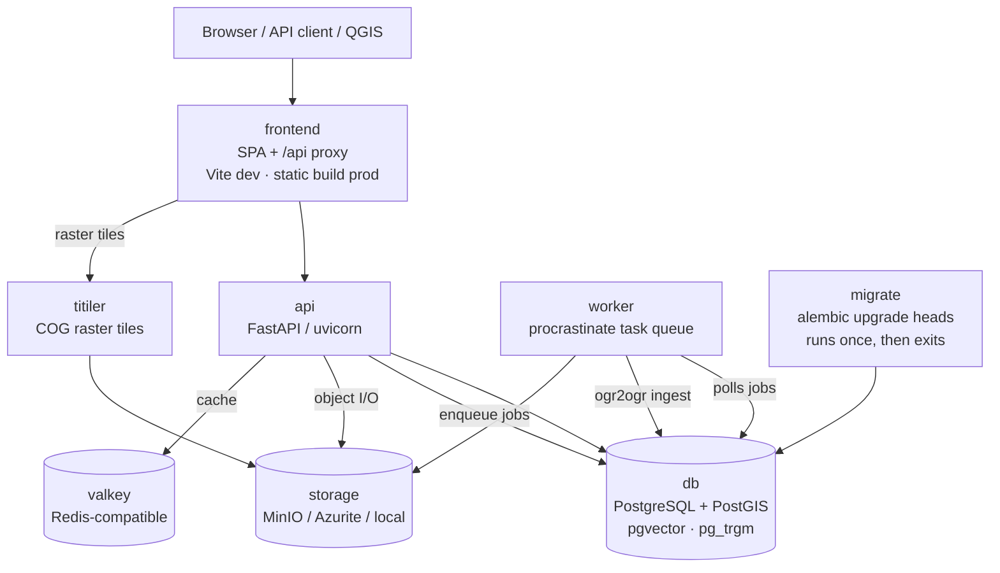

# GeoLens Architecture

A map of how GeoLens fits together — the runtime pieces, how a request and an upload
flow through them, and **where to make the most common changes**. For the full file
tree, the per-module file pattern, and dev setup, see
[`.github/CONTRIBUTING.md`](.github/CONTRIBUTING.md).

This document describes things that rarely change. If you find it out of date, a PR
fixing it is a great first contribution.

---

## Runtime topology

GeoLens runs as a small set of Docker services (`docker-compose.yml`):



| Service | Role |
|---|---|
| **db** | PostgreSQL with **PostGIS** (spatial), **pgvector** (semantic search), **pg_trgm** (full-text). Also the task queue backend. |
| **api** | FastAPI app (`backend/app`). Synchronous request/response. |
| **worker** | `backend/app/worker.py` — a [procrastinate](https://procrastinate.readthedocs.io) worker. There is **no separate broker**: jobs live in Postgres. Handles ingest, embeddings, exports. |
| **titiler** | Renders raster (COG) tiles; proxied to the browser under `/api`. |
| **frontend** | Serves the React SPA and proxies `/api` to **api** (Vite in dev, static build behind a proxy in prod). |
| **migrate** | Runs Alembic migrations on boot, then exits. |
| **valkey** | Redis-compatible cache (tiles, hot config). |
| **minio / azurite** | Dev object storage (S3 / Azure Blob). Prod points at real buckets via the storage abstraction. |
| **backup** | Default-on `pg_dump` + object-store backup (cron-driven; pull-able `geolens-backup` image). See `RUNBOOK.md`. |

The app version, edition flags, and DB session live in `backend/app/core/`. The FastAPI
app factory, root router, middleware, and lifespan are in `backend/app/api/`.

---

## Backend layout (by responsibility)

`backend/app/` is organized by **what code does**, not by layer:

| Package | Owns |
|---|---|
| `api/` | App factory (`main.py`), root router (`router.py`), middleware, lifespan startup/shutdown. |
| `core/` | Edition flags (`edition.py`, `require_enterprise`), persistent config, permissions, DB engine/session (`core/db/`), runtime helpers. |
| `modules/` | Domain areas: **`catalog`** (datasets, records, maps, layers, search, collections, sources, validation, features — the big one), `auth`, `admin`, `audit`, `settings`, `embed_tokens`, `quota`, `tenancy`. |
| `standards/` | **OGC API** Features/Records (`ogc/`), `stac/`, `dcat/` + `dcat_us/` + `geodcat_ap/`. **Hard-free — never gate these.** |
| `processing/` | Pipelines: `ingest/` (ogr2ogr), `raster/` (COG/VRT), `tiles/` (vector tiles + token signing), `vector/` (quicklooks), `export/`, `embeddings/` (pgvector), `ai/` (chat, metadata gen). |
| `platform/` | Cross-cutting services: `extensions/` (open-core seams), `storage/`, `cache/`, `jobs/`, `sandbox/` (safe SQL), `config_ops/`, `notifications/`, `assets/`, `audit.py`. |
| `observability/` | Logging, metrics, health checks. |

Each domain module follows a stable pattern — `router.py` → `service.py` → `schemas.py`
→ `models.py`. Large domains split the service behind a facade; `backend/tests/test_layering.py`
**guards against importing split internals across domains**, so import from the facade.

---

## How a request flows

**Read / write (synchronous):**
`client → frontend (/api proxy) → FastAPI app → middleware (auth) → root router → modules/<domain>/router.py → service.py → SQLAlchemy → PostGIS`.

Auth is resolved in this order: **`Authorization` header → `?api_key=` query param → JWT → anonymous**. (The query-param fallback is excluded from OGC/Features reserved params.)

**Search** (`modules/catalog/search/`) combines full-text (`pg_trgm`) and semantic
(`pgvector`) ranking **in a single PostGIS query**, so results can be ranked by meaning
*inside* a spatial window.

**Standards** (`standards/{ogc,stac,dcat}`) expose the same catalog as OGC API
Features/Records, STAC, and DCAT.

## How an upload flows (asynchronous)

```
upload → processing/ingest/router.py (validates, stages file, checks quota)
       → enqueues a procrastinate job (row in Postgres)
       → worker.py picks it up → ogr2ogr pipeline → writes features to PostGIS,
         creates catalog Records, generates embeddings + a quicklook
```

The HTTP request returns immediately; the heavy work happens in the **worker**. (Note:
the per-user quota is checked at request time, not atomically in the worker — see issue #302.)

---

## The open-core seam

Core is **Apache-2.0 and fully self-hostable**. Paid capabilities live in a **separate
private overlay** (`geolens-enterprise`), not behind inline gates in this repo.

- Extension points are `Protocol` interfaces in `backend/app/platform/extensions/`.
- Community defaults ship in `extensions/defaults.py`; the overlay registers real
  implementations via `importlib.metadata` entry points at startup.
- `core/edition.py` exposes `require_enterprise` (returns 404 in community, so gated
  features don't even advertise themselves).

**Rule for contributors:** never move an existing open feature behind a gate, and never
gate the standards (`standards/`). New paid features extend a Protocol; they do not add
`if enterprise:` branches to core. See [`EDITIONS.md`](EDITIONS.md) for the
open/commercial boundary.

---

## Frontend (React + Vite)

`frontend/src/` — React 19, Vite, TanStack Query (server state), Zustand (`stores/`,
client state; auth token under `geolens-auth`), `@vis.gl/react-maplibre` v8 + `maplibre-gl`
v5, Tailwind, and shadcn/ui primitives in `components/ui/`.

- **API access:** `api/client.ts` `apiFetch()` wraps fetch + auth; one file per domain in `api/`.
- **Routes:** `pages/` (admin sub-pages in `pages/admin/`).
- **Map builder:** `components/builder/` + `src/builder/` + `lib/builder/`.
- **Public viewer:** `components/viewer/`. **Map plugins/widgets:** `components/map-plugins/`.
- **i18n:** new user-facing strings must be added to **all 4 locales** in
  `i18n/locales/` (`en`/`fr`/`es`/`de`) or the CI "Locale parity" check fails.

---

## Where do I change X?

| I want to… | Start here |
|---|---|
| Add / modify an API endpoint | `backend/app/modules/<domain>/router.py` (+ `service.py`); wire it in `backend/app/api/router.py` |
| Support a new ingest format | `backend/app/processing/ingest/` (ogr2ogr pipeline) |
| Change raster / COG / VRT handling | `backend/app/processing/raster/` (+ the **titiler** service) |
| Adjust an OGC / STAC / DCAT output | `backend/app/standards/{ogc,stac,dcat}/` — *never gate these* |
| Change search ranking or filters | `backend/app/modules/catalog/search/` |
| Add a map-builder layer type or style control | `frontend/src/components/builder/` (+ `src/builder/`, `lib/builder/`) |
| Add a map plugin / toolbar widget | `frontend/src/components/map-plugins/` |
| Touch the public map viewer | `frontend/src/components/viewer/` |
| Add an admin setting | `backend/app/modules/settings/` + `frontend/src/components/admin/settings/` |
| Add an enterprise-gated capability | Extend a Protocol in `backend/app/platform/extensions/`; implement in the `geolens-enterprise` overlay — don't inline-gate core |
| Add a DB column or table | New migration in `backend/alembic/versions/` + the domain's `models.py`; apply with `alembic upgrade heads` |
| Add UI text | The component + **all 4** `frontend/src/i18n/locales/` files |

---

## Gotchas worth knowing early

- **Migrations use `heads` (plural):** `alembic upgrade heads` — the chain can carry multiple heads. Baseline is squashed (`0001_baseline` + `0002_procrastinate`).
- **Trailing slashes matter:** the app runs with `redirect_slashes=False`; some routes 404 on a trailing slash.
- **Don't import split service internals across domains** — go through the domain facade (enforced by `test_layering.py`).
- **Locale parity is a CI gate** — a new `t()` key needs all 4 locale files, not just a `defaultValue`.
- **The worker is Postgres-backed** (procrastinate) — no Redis/RabbitMQ broker to run.
- **Tests run in the container:** `docker compose exec api pytest` / `docker compose exec frontend npm test`. E2E (Playwright) is local-only by policy.
