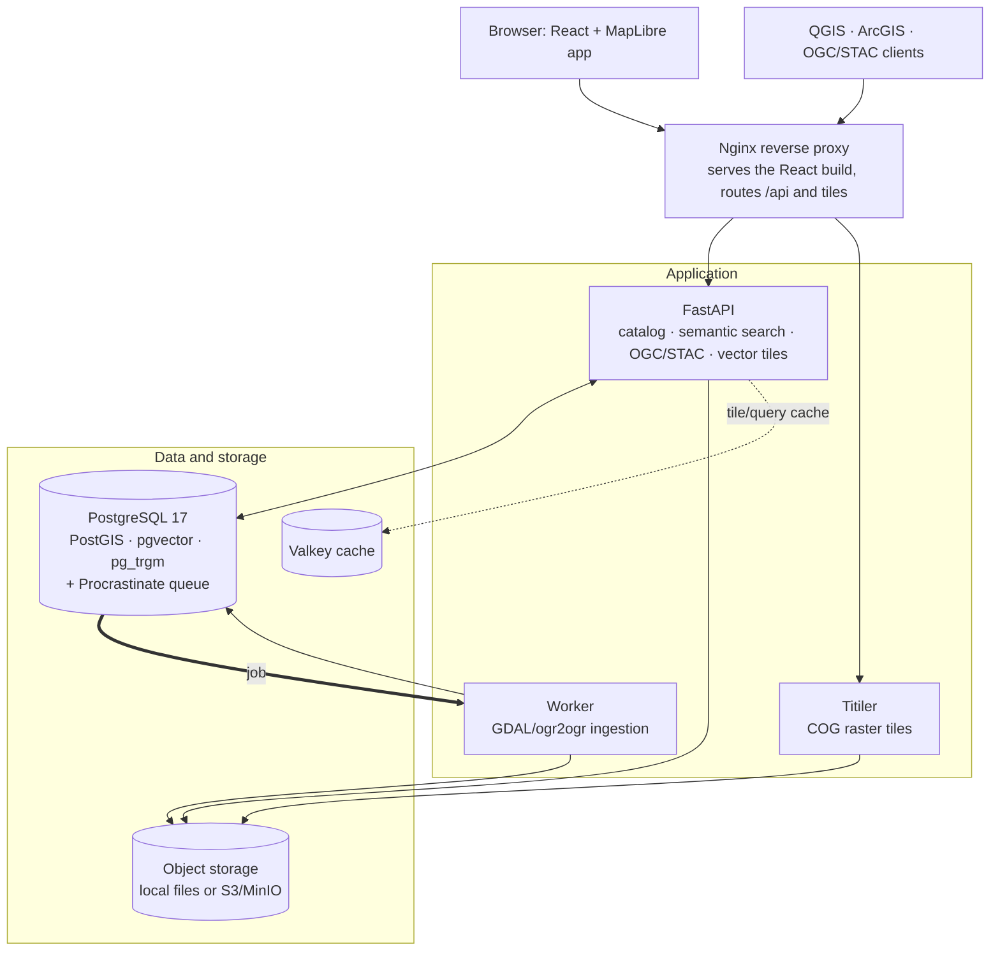

# GeoLens

[English](README.md) | [Español](README.es.md) | [Français](README.fr.md) | [Deutsch](README.de.md)

**Die Geodaten Ihres Teams: an einem Ort durchsuchbar, kartierbar und teilbar.**

GeoLens ist ein quelloffener, selbst gehosteter Katalog und Karteneditor für GIS- und Datenteams: ein zentraler Ort für Geodaten auf Ihrer eigenen Infrastruktur und ohne Telemetrie. GeoLens selbst stellt keinerlei externe Verbindungen her. (Von Ihnen aktivierte Funktionen können ausgehende Verbindungen nutzen: die KI-Unterstützung zum gewählten OpenAI-kompatiblen Endpunkt oder Anthropic-Schlüssel, OAuth/OIDC-Anmeldung, SMTP, Basiskartenkacheln, entfernte/S3-Datenquellen und externe Sicherungen.) Laden Sie Shapefiles, GeoTIFFs, GeoPackages, CSVs oder XLSX hoch (oder registrieren Sie vorhandene Daten); GeoLens speichert alles in PostGIS, indiziert es mit pg_trgm für sofort verfügbare unscharfe Suche (pgvector ergänzt semantische Rangfolge, sobald ein Embedding-Anbieter konfiguriert und die semantische Suche aktiviert ist) und stellt OGC/STAC-APIs bereit, mit denen sich QGIS, ArcGIS und MapLibre nativ verbinden. Erstellen, gestalten und teilen Sie mehrschichtige Karten direkt im Browser. Entwickelt mit FastAPI und React. Bereitgestellt mit einem Befehl.

<p align="center">
  <a href="https://demo.getgeolens.com"></a>
  <br />
  <sub>Keine Installation erforderlich. Erkunden Sie Beispielkatalog und -karten ohne Konto oder melden Sie sich mit Google, GitHub oder Microsoft an, um den Karteneditor zu testen. Demodaten können jederzeit gelöscht werden.</sub>
</p>

[](https://github.com/geolens-io/geolens/actions/workflows/ci.yml)
[](LICENSE)
[]()
[](https://postgis.net/)
[](https://ogcapi.ogc.org/)

```bash
curl -fsSL https://getgeolens.com/install.sh | sh
# Open http://localhost:8080, then log in with the credentials you chose
```

<p align="center">
  
  <br />
  <em>Der Karteneditor: jedes Gebäude Manhattans bis zur tatsächlichen Dachhöhe extrudiert und nach Bauzeit eingefärbt, darunter die U-Bahn; aus offenen Daten mit <code>scripts/seed-showcase.py</code> erstellt</em>
</p>

> [!NOTE]
> **Frühe Version.** GeoLens wird aktiv entwickelt und gepflegt und wurde erst
> kürzlich als Open Source veröffentlicht. Der Kern lief bereits produktiv, doch
> die selbst gehostete Distribution ist jung und manche Funktionen und APIs können
> sich noch ändern. [Erstellen Sie ein Issue](https://github.com/geolens-io/geolens/issues), wenn Probleme auftreten.

## Dokumentation

Die vollständige Benutzer-, Administrations- und API-Dokumentation finden Sie unter **[docs.getgeolens.com](https://docs.getgeolens.com)**. Die Tabelle [Referenz](#referenz) verlinkt alle Anleitungen.

## Veröffentlichte Artefakte

GeoLens wird über die üblichen Paketregistrierungen veröffentlicht:

```bash
pip install geolens          # Python SDK
pip install geolens-cli      # CLI; installs the `geolens` command
npm install @geolens/sdk     # TypeScript/JavaScript SDK
```

Vorgefertigte öffentliche API- und Frontend-Images werden in der GitHub Container Registry veröffentlicht:

```bash
docker pull ghcr.io/geolens-io/geolens-api:latest
docker pull ghcr.io/geolens-io/geolens-frontend:latest
```

Das Tag `latest` verweist auf die neueste veröffentlichte stabile Version.

## Warum GeoLens?

Geodaten sind oft verstreut: Shapefiles auf Netzlaufwerken, Tabellen in Datenbankschemata, Raster in Cloud-Buckets und Metadaten in Tabellenkalkulationen. Den richtigen Datensatz zu finden bedeutet, in Slack nachzufragen oder Dateiserver zu durchsuchen. Zum Teilen wird exportiert, per E-Mail versandt und gehofft, dass das CRS stimmt.

GeoLens ersetzt diesen Ablauf:

- **Ein Katalog:** Laden Sie Shapefiles, GeoPackages, GeoTIFFs, CSVs oder XLSX hoch; innerhalb weniger Minuten sind sie durchsuchbar, als Vorschau verfügbar und exportierbar
- **Funktioniert mit Ihren Werkzeugen:** OGC API Features/Records, STAC API 1.0, DCAT-3-/DCAT-US-/GeoDCAT-AP-Kataloge und direkte Kachel-URLs für QGIS, ArcGIS und MapLibre
- **Semantische und räumliche Suche:** sofort einsatzbereiter unscharfer Abgleich mit pg_trgm; mit Embedding-Anbieter und aktivierter semantischer Suche werden Datensätze nach Bedeutung geordnet (pgvector)
- **Integrierter Karteneditor:** mehrschichtige Karten zusammenstellen, gestalten und über öffentlichen Link oder einbettbares iframe teilen
- **KI-Unterstützung (optional):** mit Karten chatten, Beschreibungen automatisch erzeugen und in natürlicher Sprache suchen. Verwenden Sie einen OpenAI-kompatiblen Endpunkt oder Anthropic-Schlüssel – oder verzichten Sie vollständig darauf

## GeoLens in Aktion

Die folgenden Beispiele verwenden ein JWT bearer token. Erzeugen Sie eines im lokalen Stack (der Anmeldeendpunkt akzeptiert ein OAuth2-Passwortformular; verwenden Sie daher `-d` mit Formularfeldern statt JSON). Ersetzen Sie den Admin-Benutzernamen und das Passwort aus `.env` (`grep '^GEOLENS_ADMIN_PASSWORD=' .env`):

```bash
TOKEN=$(curl -s -X POST http://localhost:8080/api/auth/login/ \
  -d 'username=admin&password=<your-admin-password>' | jq -r '.access_token')
```

Die semantische Suche benötigt eine einmalige Admin-Konfiguration: einen Embedding-Anbieter, die Schalter KI + Semantische Suche in den Admin-KI-Einstellungen sowie eine nachträgliche Embedding-Erstellung für zuvor importierte Daten (siehe [Suchanleitung](https://docs.getgeolens.com/guides/user/search/)). Danach suchen Sie Datensätze nach Bedeutung statt nur nach exakten Schlüsselwörtern:

```bash
# Semantic search ranks by meaning: "hydrology" surfaces subwatersheds, lakes,
# and river networks whose titles never mention the word
curl "http://localhost:8080/api/search/datasets/?q=hydrology&limit=3" \
  -H "Authorization: Bearer $TOKEN" | jq '.features[].properties.title'
```

Jeder Datensatz ist zugleich ein standardmäßiger OGC API Features-Endpunkt:

```bash
# Grab a public collection id from the catalog. Search anonymously (no token) so
# the id is one anyone can read, matching the unauthenticated items request below.
CID=$(curl -s "http://localhost:8080/api/search/datasets/?q=countries&limit=1" \
  | jq -r '.features[0].id')

# GeoJSON features with a bbox filter, works in QGIS, ArcGIS, any OGC client
curl "http://localhost:8080/api/collections/$CID/items?bbox=-10,35,30,60&limit=5"
```

PostGIS und pgvector teilen sich eine Datenbank. Bei aktivierter semantischer Suche lassen sich Datensätze daher mit einer Abfrage nach Bedeutung *innerhalb* eines räumlichen Fensters ordnen. Die [Suchanleitung](https://docs.getgeolens.com/guides/user/search/) erläutert das Zusammenspiel semantischer und räumlicher Suche.

Direkt aus QGIS verbinden: **Layer > Add WFS / OGC API Features**, Ziel `http://localhost:8080/api/`.

## Funktionen

Für jedes Beispiel gibt es eine vollständige Anleitung in der [Dokumentation](https://docs.getgeolens.com/guides/). GeoLens liest, schreibt und veröffentlicht:

### Datenimport und -export

- **Vektor:** Shapefile, GeoPackage, GeoJSON, CSV, XLSX
- **Raster:** GeoTIFF und Cloud-Optimized GeoTIFF (COG) mit automatischer Konvertierung
- **Mosaike:** VRT-basierte Rastermosaike aus mehreren Quelldateien
- **Export:** GeoJSON, Shapefile, GeoPackage, CSV, mit CRS-Reprojektion
- Herkunftsverfolgung und Metadatenbearbeitung

### Standards und Interoperabilität

- OGC API - Features und OGC API - Records; STAC API 1.0-Katalogendpunkt; JSON-LD-Kataloge nach DCAT 3, DCAT-US 3.0 und GeoDCAT-AP
- Direkte Kachel-URLs und benutzerspezifische API-Schlüssel für QGIS, ArcGIS, MapLibre und jeden OGC-Client
- Vektorkacheln lassen unter Zoomstufe 10 Attributspalten weg, damit Kacheln klein bleiben; fügen Sie `cols=<column>,<column>` an die URL an, um bestimmte Spalten bei jeder Zoomstufe einzuschließen (Namen werden mit den Datensatzspalten abgeglichen, unbekannte verworfen)
- JWT + OAuth 2.0/OIDC, RBAC mit datensatzbezogenen Berechtigungen

<details>
<summary>Sicherheit</summary>

- JWT-Authentifizierung mit Aktualisierungstokens
- API-Schlüsselverwaltung pro Benutzer
- OAuth 2.0 / OIDC-Unterstützung (Google, Microsoft, generische Anbieter)
- Rollenbasierte Zugriffskontrolle (RBAC) mit datensatzbezogenen Berechtigungen
- Selbstregistrierung ist standardmäßig deaktiviert; wird sie mit SMTP-Prüfung aktiviert, erfolgt der Versand für neue und bereits vorhandene Anmeldungen einheitlich
- Auditprotokollierung aller administrativen Aktionen
- Internationalisierung: Englisch, Spanisch, Französisch, Deutsch

</details>

## Screenshots

<p align="center">
  
  <br />
  <em><strong>Finden:</strong> nach Bedeutung suchen. „natural disasters“ findet Erdbeben und Vulkanausbrüche ohne Schlüsselworttreffer, ergänzt um Typ-, Orts- und Zeitfilter</em>
</p>

<p align="center">
  
  <br />
  <em><strong>Untersuchen:</strong> jeder Datensatz erhält Kartenvorschau, Schemastatistiken und typisierte Metadaten. Hier: 32.186 Meteoritenfunde weltweit</em>
</p>

<p align="center">
  
  <br />
  <em><strong>Erstellen:</strong> mehrschichtige Karten im Browser mit sortierbarem Ebenenstapel und Ebeneneditoren zusammenstellen (hier: Matterhorn als 3D-Geländemodell aus swissALTI3D-Lidar)</em>
</p>

<p align="center">
  
  <br />
  <em><strong>KI fragen:</strong> Karten in natürlicher Sprache bearbeiten. „Label the volcanoes with their names“ fügt der Restless-Earth-Karte lesbare Beschriftungen hinzu (optional mit OpenAI-kompatiblem Endpunkt oder Anthropic-Schlüssel)</em>
</p>

## Schnellstart

**Voraussetzungen:** Docker Engine 24+ und Docker Compose v2. Der enthaltene Stack liefert PostgreSQL 17. Für eine extern verwaltete Datenbank ist **PostgreSQL 13+** (für `gen_random_uuid()`) mit **pgvector 0.5+** (für HNSW-Indizes der semantischen Suche) sowie PostGIS, pg_trgm und unaccent erforderlich. API und Worker laufen in Containern (Python 3.14 enthalten, kein Python auf dem Host nötig). Die optionale CLI läuft auf dem Host und benötigt Python 3.11+; Python-SDK und Seed-Skripte benötigen Python 3.10+.

Die Einzeileninstallation lädt vorgefertigte, versionsgebundene Images und startet den Stack:

```bash
curl -fsSL https://getgeolens.com/install.sh | sh
```

Möchten Sie das Skript zuerst lesen oder aus dem Quellcode bauen? Klonen Sie das Repository und führen Sie denselben Installer aus. Er baut die Images lokal, statt sie herunterzuladen:

```bash
git clone https://github.com/geolens-io/geolens.git
cd geolens
bash scripts/install.sh
```

In beiden Fällen kopiert `scripts/install.sh` `.env.example` nach `.env`, erzeugt ein JWT-Signaturgeheimnis, richtet Admin-Zugangsdaten ein und führt `docker compose up -d` aus. Der Admin-**Benutzername** ist standardmäßig `admin`; das **Passwort** wird als starker Zufallswert automatisch erzeugt (in `.env` geschrieben und nie im Terminal ausgegeben), sofern Sie keines angeben. Für unbeaufsichtigte Installationen setzen Sie vorher `GEOLENS_ADMIN_USERNAME` und `GEOLENS_ADMIN_PASSWORD`; die Abfragen entfallen. Erneutes Ausführen ist idempotent und erhält bestehende `.env`-Werte.

Warten Sie etwa 60 Sekunden und öffnen Sie [http://localhost:8080](http://localhost:8080). Melden Sie sich mit dem Admin-Benutzernamen und dem erzeugten Passwort an (abrufbar mit `grep '^GEOLENS_ADMIN_PASSWORD=' .env`).

Prüfen Sie den Zustand aller Dienste:

```bash
docker compose ps
```

Beim ersten Start **lädt** die Einzeileninstallation vorgefertigte Images und ist nach etwa einer Minute bereit (nur die kleine PostGIS- + pgvector-Datenbankschicht wird lokal gebaut). Klonen und `bash scripts/install.sh` **baut** alle Images aus dem Quellcode: beim ersten Mal 5–10 Minuten (GDAL + Postgres-Erweiterungen + Frontend-Bundle); weitere Starts benötigen in beiden Fällen etwa 60 Sekunden. Sind 5434/8001/8080 belegt, ändern Sie `DB_PORT`, `API_PORT` oder `FRONTEND_PORT` in `.env`. Hinweise zu Portkonflikten, blockierten Starts, Speichermangel und Migrationswarnungen enthält die [Fehlerbehebungsanleitung](https://docs.getgeolens.com/guides/quickstart/install/#troubleshooting).

Für die Produktion siehe [Installationsanleitung](https://docs.getgeolens.com/guides/quickstart/install/). Ein von der Community gepflegtes [Helm-Chart](https://github.com/geolens-io/geolens-deployments) liegt im separaten Repository [`geolens-deployments`](https://github.com/geolens-io/geolens-deployments).

### Installer überprüfen

Jedes [GitHub-Release](https://github.com/geolens-io/geolens/releases) enthält neben `install.sh` eine von CI erstellte Datei `SHA256SUMS`. Laden Sie beide aus demselben Release in dasselbe Verzeichnis und prüfen Sie vor der Ausführung, dass der Installer nicht verändert wurde:

```bash
# Linux / Windows WSL
sha256sum -c SHA256SUMS

# macOS
shasum -a 256 -c SHA256SUMS
```

Eine erfolgreiche Prüfung gibt `install.sh: OK` aus.

### Upgrade

Führen Sie für das Upgrade einer vorgefertigten Installation `./scripts/upgrade.sh` im Installationsverzeichnis aus. Das Skript sichert die Datenbank, lädt neue Images, führt Migrationen hinter einer Zustandsprüfung aus und zeigt bei Fehlern eine Rollback-Anleitung. [`UPGRADING.md`](UPGRADING.md) beschreibt vorgefertigte und aus Quellen gebaute Installationen samt Rollback; alternativ siehe [Upgrade-Anleitung](https://docs.getgeolens.com/guides/quickstart/upgrade/).

### Ersten Datensatz hinzufügen

Das Repository enthält eine kleine Datei `city-parks.geojson`. Laden Sie sie mit einem Befehl über die **GeoLens-CLI** hoch und veröffentlichen Sie sie:

```bash
pip install geolens-cli                              # installs the `geolens` command
geolens login http://localhost:8080/api              # use your admin username + password
geolens publish examples/manifests/first-catalog/city-parks.geojson --name "City Parks"
```

`geolens publish` führt den Importablauf Hochladen → Vorschau → Bestätigen aus und gibt die URL aus. Ein Befehl macht aus einer lokalen Datei einen veröffentlichten, kartierbaren Datensatz.

Beschreiben Sie für wiederholbare Kataloge mit mehreren Datensätzen die Quellen in einem **Manifest** (`geolens.yaml`) und wenden Sie es mit `geolens apply` an. Quellen werden per HTTP(S)-URL, S3-URI oder bereits serverseitig bereitgestelltem Pfad referenziert; [`examples/manifests/`](examples/manifests/) enthält Vorlagen. Erstellen Sie mit `geolens init` eine neue und passen Sie sie an:

```bash
geolens init                       # writes geolens.yaml in the current directory
geolens validate geolens.yaml      # local schema check, no API call
geolens apply geolens.yaml         # validates + applies via /ingest/manifest/apply
```

Die [CLI-Anleitung](https://docs.getgeolens.com/guides/cli/) dokumentiert das gesamte Manifestschema, Quelltypen und CI-Integrationsmuster.

### Beispieldaten

`scripts/seed-showcase.py` erstellt sechs Beispielkarten aus öffentlichen offenen Daten: globale Tektonik über echtem Meeresbodenrelief, Manhattans nach Bauzeit gefärbte 3D-Skyline (Titelbild), 75 Jahre atlantischer Hurrikanbahnen, gruppierte Meteoritenfälle, das Matterhorn als 3D-Gelände aus 2-m-Lidar und referenzierte Sentinel-2-Bilder von New York:

```bash
pip install httpx
python scripts/seed-showcase.py --username admin --password "$(grep '^GEOLENS_ADMIN_PASSWORD=' .env | cut -d= -f2-)"
```

Benötigt Internetzugriff auf die Datenquellen. Optionen (`--no-terrain`, `--prune`, …) stehen in [`scripts/README.md`](scripts/README.md).

## Architektur

GeoLens besteht aus wenigen Diensten um eine einzelne PostgreSQL/PostGIS-Datenbank: Die API bedient Katalog, Suche und OGC/STAC-Endpunkte; ein Worker verarbeitet Importe; Titiler liefert Rasterkacheln aus dem Objektspeicher.



| Komponente | Technologie |
|-----------|-----------|
| Frontend | React 19, Vite, MapLibre GL v5, TanStack Query, Tailwind CSS |
| Backend-API | FastAPI (Python), GDAL/ogr2ogr, Procrastinate (Aufgabenwarteschlange) |
| Rasterkacheln | Titiler (COG-Kachelserver) |
| Objektspeicher | MinIO (S3-kompatibel, lokale Entwicklung) oder beliebiger S3-Anbieter |
| Cache | Valkey (Kachel- und Abfragecache) |
| Datenbank | PostgreSQL 17 + PostGIS 3.5 + pgvector + pg_trgm (Minimum: PostgreSQL 13, pgvector 0.5) |
| Reverse Proxy | Nginx (Produktion) / Vite-Entwicklungsproxy (Entwicklung) |

## Konfiguration

Die gesamte Konfiguration erfolgt über Umgebungsvariablen in `.env`. Die [Konfigurationsreferenz](https://docs.getgeolens.com/guides/quickstart/configuration/) enthält alle Optionen, Standardwerte und Beschreibungen.

### Budget des Verbindungspools

GeoLens ist für **eine PostgreSQL-Instanz** abgestimmt: API-, Worker- und Admin-Pools passen standardmäßig in **70 von 80 max_connections** (`max_connections` von Postgres ist 80), gesteuert durch `DB_POOL_SIZE` (`pool_size`) und `DB_MAX_OVERFLOW` (`max_overflow`, Standard 3). [Connection Pool Tuning](https://docs.getgeolens.com/guides/quickstart/configuration/#connection-pool-tuning) erklärt Prozessbudgets und höhere Grenzen.

### Sicherungen

Automatische, geplante Sicherungen laufen **standardmäßig**. `--profile backup` ist nicht erforderlich. Der Sicherungsdienst startet bei jedem `docker compose up` mit `api`, `worker` und `db`, führt `pg_dump` täglich/wöchentlich aus und archiviert das Staging-Volume des Objektspeichers, sodass eine Wiederherstellung eine funktionsfähige Instanz erzeugt (DB + hochgeladene Dateien).

Der **externe Upload (S3)** erfordert zusätzlich `BACKUP_S3_ENABLED=true`. Der integrierte Uploader signiert Anfragen mit **AWS Signature V4** (awscli), kompatibel mit Cloudflare R2, aktuellem AWS S3 und MinIO. Fehler erscheinen als sichtbares `ERROR` im Containerprotokoll (nicht als verschluckte Warnung), damit stiller Verlust externer Sicherungen sofort erkennbar ist.

Für laufenden Betrieb, Wiederherstellung und Störungsreaktion siehe [RUNBOOK.md](RUNBOOK.md), für anbieterspezifische Optionen [Backups & Restore](https://docs.getgeolens.com/guides/admin/backups/#backup-destinations).

### Monitoring

API und Worker exportieren sofort Prometheus-Metriken (HTTP-Rate/Latenz/Fehler, Warteschlangentiefe, DB-Pool, Kachelcache). Referenzkonfiguration, Alarmregeln und Grafana-Dashboard liegen in [`infra/monitoring/`](infra/monitoring/); die Einrichtung beschreibt [RUNBOOK.md §4](RUNBOOK.md#4-monitoring).

## Referenz

| Anleitung | Beschreibung |
|-------|-------------|
| [Installationsanleitung](https://docs.getgeolens.com/guides/quickstart/install/) | Schrittweise Bereitstellung mit Docker Compose |
| [Upgrade-Anleitung](https://docs.getgeolens.com/guides/quickstart/upgrade/) | Versionswechsel mit Rollback-Verfahren |
| [Konfigurationsreferenz](https://docs.getgeolens.com/guides/quickstart/configuration/) | Alle Umgebungsvariablen und Standardwerte |
| [Administrationsanleitung](https://docs.getgeolens.com/guides/admin/) | Benutzer, Datensätze und Systemzustand verwalten |
| [Selbsthosting auf AWS, GCP oder DigitalOcean](https://docs.getgeolens.com/guides/quickstart/cloud-deployment/) | Anleitungen für verwaltete Datenbank, Objektspeicher und Cache |
| [CLI & Manifeste](https://docs.getgeolens.com/guides/cli/) | Dateien veröffentlichen und Kataloge mit `geolens` verwalten |
| [API-Referenz](https://docs.getgeolens.com/guides/api/) | Automatisch erzeugte Referenz; interaktive Swagger UI unter `/api/docs` zur Laufzeit |
| [Manifestbeispiele](examples/manifests/) | Anpassbare `geolens.yaml`-Vorlagen: public-cog (entferntes COG), url-source, s3-source, publication-states |

## Community

- [GitHub Discussions](https://github.com/geolens-io/geolens/discussions): Fragen, Ideen und Präsentationen
- [Support](SUPPORT.md): Hilfe und Weiterleitung von Problemen
- [Beitragsleitfaden](.github/CONTRIBUTING.md): Entwicklungsumgebung, Codestil und PR-Richtlinien

## Bekannte Einschränkungen

- Einzelne PostgreSQL-Instanz ohne integrierte Hochverfügbarkeit oder Clusterbildung.
- GeoLens ist für eine Organisation pro selbst gehosteter Bereitstellung ausgelegt.
- Geländedarstellung setzt DEM-Einheiten in Metern voraus; andere vertikale Einheiten können überhöht erscheinen.
- Die selbst gehostete Distribution ist jung; manche Funktionen und APIs können sich noch ändern (siehe Hinweis zur frühen Version).

## Lizenz

GeoLens steht unter der [Apache License 2.0](LICENSE). Name, Logo und Markenmaterialien von GeoLens fallen nicht unter diese Lizenz. Siehe [TRADEMARKS.md](TRADEMARKS.md). Quellenangaben zu Beispieldaten Dritter stehen in [THIRD_PARTY_DATA.md](THIRD_PARTY_DATA.md).

Projektrichtlinien: [Governance](GOVERNANCE.md) · [Maintainer](MAINTAINERS.md) · [Beiträge](.github/CONTRIBUTING.md) · [Sicherheit](.github/SECURITY.md) · [Release-Prozess](RELEASE.md) · [ausgehender Datenverkehr &amp; Air-Gap](EGRESS.md).
