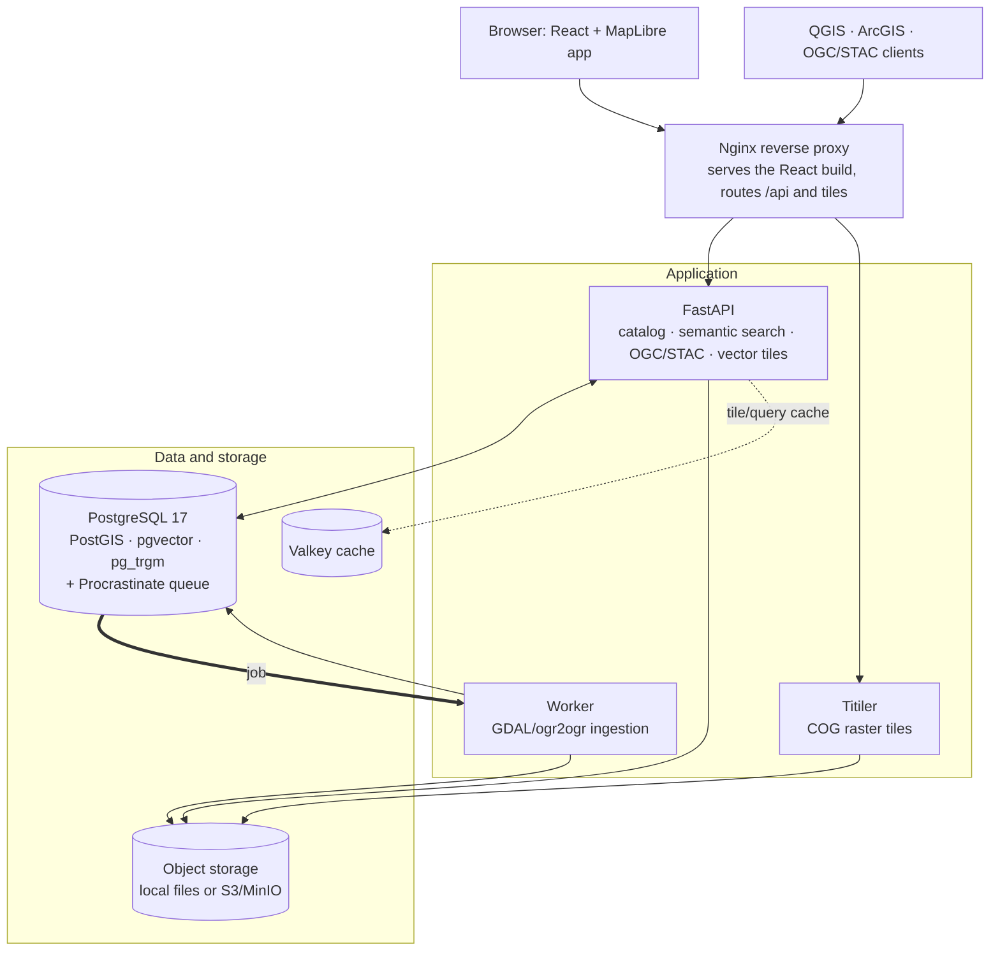

# GeoLens

[English](README.md) | [Español](README.es.md) | [Français](README.fr.md) | [Deutsch](README.de.md)

**Los datos espaciales de tu equipo: consultables, representables en mapas y compartibles desde un único lugar.**

GeoLens es un catálogo y constructor de mapas de código abierto y autohospedado para equipos de SIG y datos: un único hogar para los datos espaciales, ejecutado en la infraestructura que controlas y sin telemetría. GeoLens no se comunica con ningún servicio externo por sí mismo. (Las funciones que actives sí pueden realizar llamadas salientes: el asistente de IA al endpoint compatible con OpenAI o la clave de Anthropic que elijas, el inicio de sesión OAuth/OIDC, SMTP, teselas de mapas base, fuentes de datos remotas/S3 y copias de seguridad externas). Sube Shapefiles, GeoTIFFs, GeoPackages, CSVs o XLSX (o registra datos que ya tengas); GeoLens lo almacena todo en PostGIS, lo indexa con pg_trgm para ofrecer búsqueda difusa desde el primer momento (pgvector añade clasificación semántica cuando configuras un proveedor de embeddings y activas la búsqueda semántica) y publica APIs OGC/STAC a las que QGIS, ArcGIS y MapLibre se conectan de forma nativa. Compón, aplica estilos y comparte mapas multicapa directamente en el navegador. Construido con FastAPI y React. Desplegado con un solo comando.

<p align="center">
  <a href="https://demo.getgeolens.com"></a>
  <br />
  <sub>No requiere instalación. Explora el catálogo y los mapas de ejemplo sin una cuenta, o inicia sesión con Google, GitHub o Microsoft para probar el constructor de mapas. Los datos de demostración pueden borrarse en cualquier momento.</sub>
</p>

[](https://github.com/geolens-io/geolens/actions/workflows/ci.yml)
[](LICENSE)
[]()
[](https://postgis.net/)
[](https://ogcapi.ogc.org/)

```bash
curl -fsSL https://getgeolens.com/install.sh | sh
# Open http://localhost:8080, then log in with the credentials you chose
```

<p align="center">
  
  <br />
  <em>El constructor de mapas: cada edificio de Manhattan extruido a la altura real de su tejado y coloreado según la época en que se construyó, con el metro discurriendo por debajo; creado a partir de datos abiertos con <code>scripts/seed-showcase.py</code></em>
</p>

> [!NOTE]
> **Versión inicial.** GeoLens se desarrolla y mantiene activamente y se ha publicado
> recientemente como código abierto. El núcleo se ha ejecutado en producción, pero la
> distribución autohospedada es joven y algunas funciones y APIs aún pueden cambiar.
> [Abre una incidencia](https://github.com/geolens-io/geolens/issues) si encuentras algún problema.

## Documentación

La documentación completa para usuarios, administradores y la API está en **[docs.getgeolens.com](https://docs.getgeolens.com)**. La tabla de [referencia](#referencia) enlaza cada guía.

## Artefactos publicados

GeoLens se publica en los registros de paquetes estándar:

```bash
pip install geolens          # Python SDK
pip install geolens-cli      # CLI; installs the `geolens` command
npm install @geolens/sdk     # TypeScript/JavaScript SDK
```

Las imágenes precompiladas de la API pública y del frontend se publican en GitHub Container Registry:

```bash
docker pull ghcr.io/geolens-io/geolens-api:latest
docker pull ghcr.io/geolens-io/geolens-frontend:latest
```

La etiqueta `latest` apunta a la versión estable publicada más reciente.

## ¿Por qué GeoLens?

Los datos espaciales terminan dispersos: shapefiles en unidades compartidas, tablas en esquemas de bases de datos, rásteres en buckets en la nube y metadatos en hojas de cálculo. Encontrar el conjunto adecuado exige preguntar en Slack o buscar en servidores de archivos. Compartirlo implica exportar, enviarlo por correo y esperar que el CRS coincida.

GeoLens sustituye ese flujo de trabajo:

- **Un solo catálogo:** sube Shapefiles, GeoPackages, GeoTIFFs, CSVs o XLSX y en minutos serán consultables, previsualizables y exportables
- **Funciona con tus herramientas:** OGC API Features/Records, STAC API 1.0, catálogos DCAT 3/DCAT-US/GeoDCAT-AP y URLs directas de teselas para QGIS, ArcGIS y MapLibre
- **Búsqueda semántica y espacial:** coincidencia difusa con pg_trgm desde el primer momento; añade un proveedor de embeddings y activa la búsqueda semántica para clasificar conjuntos de datos por significado (pgvector)
- **Constructor de mapas integrado:** compón mapas multicapa, aplica estilos y compártelos mediante un enlace público o un iframe incrustable
- **Asistencia de IA (opcional):** conversa con tus mapas, genera descripciones automáticamente y busca con lenguaje natural. Aporta un endpoint compatible con OpenAI o una clave de Anthropic, o prescinde por completo de esta función

## En acción

Los ejemplos siguientes usan un token JWT bearer. Genéralo contra el entorno local (el endpoint de inicio de sesión acepta un formulario de contraseña OAuth2, por lo que debes usar `-d` con campos de formulario, no JSON). Sustituye el nombre de usuario administrador y la contraseña de `.env` (`grep '^GEOLENS_ADMIN_PASSWORD=' .env`):

```bash
TOKEN=$(curl -s -X POST http://localhost:8080/api/auth/login/ \
  -d 'username=admin&password=<your-admin-password>' | jq -r '.access_token')
```

La búsqueda semántica requiere una configuración administrativa inicial: un proveedor de embeddings, los interruptores IA + Búsqueda semántica en los ajustes de IA del administrador y un relleno de embeddings para los datos ingeridos antes de la configuración (la [guía de búsqueda](https://docs.getgeolens.com/guides/user/search/) explica el proceso). Después podrás buscar conjuntos de datos por significado, en vez de limitarte a coincidencias exactas de palabras clave:

```bash
# Semantic search ranks by meaning: "hydrology" surfaces subwatersheds, lakes,
# and river networks whose titles never mention the word
curl "http://localhost:8080/api/search/datasets/?q=hydrology&limit=3" \
  -H "Authorization: Bearer $TOKEN" | jq '.features[].properties.title'
```

Cada conjunto de datos es también un endpoint estándar de OGC API Features:

```bash
# Grab a public collection id from the catalog. Search anonymously (no token) so
# the id is one anyone can read, matching the unauthenticated items request below.
CID=$(curl -s "http://localhost:8080/api/search/datasets/?q=countries&limit=1" \
  | jq -r '.features[0].id')

# GeoJSON features with a bbox filter, works in QGIS, ArcGIS, any OGC client
curl "http://localhost:8080/api/collections/$CID/items?bbox=-10,35,30,60&limit=5"
```

PostGIS y pgvector comparten una única base de datos, de modo que, con la búsqueda semántica activa, puedes clasificar conjuntos por significado *dentro* de una ventana espacial en una sola consulta. Consulta la [guía de búsqueda](https://docs.getgeolens.com/guides/user/search/) para saber cómo se combinan las búsquedas semántica y espacial.

Conecta directamente desde QGIS: **Capa > Añadir WFS / OGC API Features** y apunta a `http://localhost:8080/api/`.

## Funciones

Cada ejemplo anterior tiene una guía completa en la [documentación](https://docs.getgeolens.com/guides/). GeoLens lee, escribe y publica lo siguiente:

### Ingesta y exportación de datos

- **Vector:** Shapefile, GeoPackage, GeoJSON, CSV, XLSX
- **Ráster:** GeoTIFF y Cloud-Optimized GeoTIFF (COG) con conversión automática
- **Mosaicos:** mosaicos ráster basados en VRT a partir de varios archivos fuente
- **Exportación:** GeoJSON, Shapefile, GeoPackage y CSV, con reproyección del CRS
- Seguimiento de procedencia y edición de metadatos

### Estándares e interoperabilidad

- OGC API - Features y OGC API - Records; endpoint de catálogo STAC API 1.0; catálogos JSON-LD DCAT 3, DCAT-US 3.0 y GeoDCAT-AP
- URLs directas de teselas y claves de API por usuario para QGIS, ArcGIS, MapLibre y cualquier cliente OGC
- Las teselas vectoriales omiten columnas de atributos por debajo del zoom 10 para mantener pequeñas las teselas de zoom bajo; añade el parámetro de consulta `cols=<column>,<column>` a una URL de tesela para incluir columnas concretas en todos los niveles de zoom (los nombres se validan contra las columnas del conjunto y se descartan los desconocidos)
- JWT + OAuth 2.0/OIDC y RBAC con permisos por conjunto de datos

<details>
<summary>Seguridad</summary>

- Autenticación JWT con tokens de actualización
- Gestión de claves de API por usuario
- Compatibilidad con OAuth 2.0 / OIDC (Google, Microsoft y proveedores genéricos)
- Control de acceso basado en roles (RBAC) con permisos por conjunto de datos
- El registro de autoservicio está desactivado por defecto; cuando se activa con verificación SMTP, la entrega del correo de registro es uniforme para solicitudes nuevas y coincidentes
- Registro de auditoría para todas las acciones administrativas
- Internacionalización: inglés, español, francés y alemán

</details>

## Capturas de pantalla

<p align="center">
  
  <br />
  <em><strong>Encuentra:</strong> busca por significado. Una consulta de "natural disasters" muestra terremotos y erupciones volcánicas sin coincidencia de palabras clave, junto con filtros de tipo, ubicación y tiempo</em>
</p>

<p align="center">
  
  <br />
  <em><strong>Inspecciona:</strong> cada conjunto obtiene una vista previa cartográfica, estadísticas del esquema y metadatos tipados. Aquí, 32.186 caídas de meteoritos por todo el mundo</em>
</p>

<p align="center">
  
  <br />
  <em><strong>Construye:</strong> compón mapas multicapa en el navegador con una pila de capas reordenable y editores por capa (aquí, el Matterhorn como malla de terreno 3D a partir de lidar swissALTI3D)</em>
</p>

<p align="center">
  
  <br />
  <em><strong>Pregunta a la IA:</strong> edita mapas con lenguaje natural. "Label the volcanoes with their names" añade etiquetas legibles al mapa Restless Earth (opcional: aporta un endpoint compatible con OpenAI o una clave de Anthropic)</em>
</p>

## Inicio rápido

**Requisitos previos:** Docker Engine 24+ y Docker Compose v2. El entorno incluido incorpora PostgreSQL 17. Si conectas GeoLens a una base de datos administrada externamente, debe ser **PostgreSQL 13+** (para `gen_random_uuid()`) con **pgvector 0.5+** (para índices HNSW de búsqueda semántica), además de PostGIS, pg_trgm y unaccent. La API y el worker se ejecutan en contenedores (se incluye Python 3.14; no hace falta Python en el host). La CLI opcional se ejecuta en el host y requiere Python 3.11+; el SDK de Python y los scripts de datos iniciales requieren Python 3.10+.

La instalación en una línea descarga las imágenes precompiladas y fijadas a una versión e inicia el entorno:

```bash
curl -fsSL https://getgeolens.com/install.sh | sh
```

¿Prefieres leer primero el script o compilar desde el código fuente? Clona el repositorio y ejecuta el mismo instalador. Compilará las imágenes localmente en lugar de descargarlas:

```bash
git clone https://github.com/geolens-io/geolens.git
cd geolens
bash scripts/install.sh
```

En ambos casos, `scripts/install.sh` copia `.env.example` a `.env`, genera un secreto de firma JWT, configura las credenciales de administrador y ejecuta `docker compose up -d`. El **nombre de usuario** administrador predeterminado es `admin`; la **contraseña** se genera automáticamente como un valor aleatorio robusto (se escribe en `.env` y nunca se muestra en el terminal), salvo que proporciones la tuya. Para instalaciones desatendidas, define `GEOLENS_ADMIN_USERNAME` y `GEOLENS_ADMIN_PASSWORD` en el entorno antes de ejecutar el script y se omitirán las preguntas. Volver a ejecutarlo es idempotente: conserva los valores existentes en `.env`.

Espera unos 60 segundos a que se inicien los servicios y abre [http://localhost:8080](http://localhost:8080). Inicia sesión con el usuario administrador y la contraseña generada (recupérala con `grep '^GEOLENS_ADMIN_PASSWORD=' .env`).

Comprueba que todos los servicios están en buen estado:

```bash
docker compose ps
```

Notas del primer arranque: la instalación en una línea **descarga** imágenes precompiladas y tarda alrededor de un minuto (solo se compila localmente la pequeña capa de base de datos PostGIS + pgvector). Clonar y ejecutar `bash scripts/install.sh` **compila** cada imagen desde el código fuente: 5-10 minutos la primera vez (GDAL + extensiones de Postgres + bundle del frontend); los arranques posteriores se estabilizan en unos 60 segundos en ambos casos. Si los puertos 5434/8001/8080 están ocupados, cambia `DB_PORT`, `API_PORT` o `FRONTEND_PORT` en `.env`. Para conflictos de puertos, arranques bloqueados, falta de memoria y advertencias de migración, consulta la [guía de resolución de problemas](https://docs.getgeolens.com/guides/quickstart/install/#troubleshooting).

Para despliegues de producción, consulta la [guía de instalación](https://docs.getgeolens.com/guides/quickstart/install/). Hay un [chart de Helm](https://github.com/geolens-io/geolens-deployments) mantenido por la comunidad en el repositorio independiente [`geolens-deployments`](https://github.com/geolens-io/geolens-deployments).

### Verificar el instalador

Cada [versión de GitHub](https://github.com/geolens-io/geolens/releases) adjunta un archivo `SHA256SUMS` generado por CI junto a `install.sh`. Para confirmar que un instalador descargado no se ha manipulado, descarga ambos recursos de la misma versión, colócalos en el mismo directorio y ejecuta:

```bash
# Linux / Windows WSL
sha256sum -c SHA256SUMS

# macOS
shasum -a 256 -c SHA256SUMS
```

Una comprobación correcta muestra `install.sh: OK`.

### Actualización

Para actualizar una instalación precompilada, ejecuta `./scripts/upgrade.sh` desde su directorio. El script realiza una copia de seguridad de la base de datos, descarga las nuevas imágenes, ejecuta migraciones tras una comprobación de estado y muestra instrucciones para revertir si algo falla. Consulta [`UPGRADING.md`](UPGRADING.md) para los flujos precompilado y compilado desde el código, además de la reversión, o la [guía de actualización](https://docs.getgeolens.com/guides/quickstart/upgrade/) en línea.

### Añadir tu primer conjunto de datos

El repositorio incluye un pequeño `city-parks.geojson`. Súbelo y publícalo con un solo comando mediante la **CLI de GeoLens**:

```bash
pip install geolens-cli                              # installs the `geolens` command
geolens login http://localhost:8080/api              # use your admin username + password
geolens publish examples/manifests/first-catalog/city-parks.geojson --name "City Parks"
```

`geolens publish` ejecuta el flujo de ingesta carga → vista previa → confirmación e imprime la URL del nuevo conjunto. Un solo comando convierte un archivo local en un conjunto publicado y representable en mapas.

Para catálogos repetibles con varios conjuntos, describe las fuentes en un **manifiesto** (`geolens.yaml`) y aplícalo con `geolens apply`. Las fuentes del manifiesto se indican mediante una URL HTTP(S), URI S3 o una ruta ya preparada en el servidor; los ejemplos de [`examples/manifests/`](examples/manifests/) son plantillas adaptables. Genera uno nuevo con `geolens init` y edítalo para tus fuentes:

```bash
geolens init                       # writes geolens.yaml in the current directory
geolens validate geolens.yaml      # local schema check, no API call
geolens apply geolens.yaml         # validates + applies via /ingest/manifest/apply
```

Consulta la [guía de la CLI](https://docs.getgeolens.com/guides/cli/) para ver el esquema completo del manifiesto, los tipos de fuente y los patrones de integración con CI.

### Datos de muestra

`scripts/seed-showcase.py` construye seis mapas de muestra a partir de datos abiertos públicos: una historia tectónica global sobre el relieve real del fondo oceánico, el horizonte 3D de Manhattan coloreado por época de construcción (la imagen principal anterior), 75 años de trayectorias de huracanes del Atlántico, caídas de meteoritos agrupadas, el Matterhorn como terreno 3D de lidar a 2 m e imágenes Sentinel-2 de Nueva York por referencia:

```bash
pip install httpx
python scripts/seed-showcase.py --username admin --password "$(grep '^GEOLENS_ADMIN_PASSWORD=' .env | cut -d= -f2-)"
```

Requiere acceso a Internet para las fuentes de datos abiertos. Consulta [`scripts/README.md`](scripts/README.md) para las opciones (`--no-terrain`, `--prune`, …).

## Arquitectura

GeoLens es un pequeño conjunto de servicios alrededor de una única base de datos PostgreSQL/PostGIS: la API publica el catálogo, la búsqueda y los endpoints OGC/STAC; un worker procesa la ingesta y Titiler sirve teselas ráster desde el almacenamiento de objetos.



| Componente | Tecnología |
|-----------|-----------|
| Frontend | React 19, Vite, MapLibre GL v5, TanStack Query, Tailwind CSS |
| API backend | FastAPI (Python), GDAL/ogr2ogr, Procrastinate (cola de tareas) |
| Teselas ráster | Titiler (servidor de teselas COG) |
| Almacenamiento de objetos | MinIO (compatible con S3, desarrollo local) o cualquier proveedor S3 |
| Caché | Valkey (caché de teselas y consultas) |
| Base de datos | PostgreSQL 17 + PostGIS 3.5 + pgvector + pg_trgm (mínimo: PostgreSQL 13, pgvector 0.5) |
| Proxy inverso | Nginx (producción) / proxy de desarrollo Vite (desarrollo) |

## Configuración

Toda la configuración se gestiona mediante variables de entorno en `.env`. Consulta la [referencia de configuración](https://docs.getgeolens.com/guides/quickstart/configuration/) para ver todas las opciones, valores predeterminados y descripciones.

### Presupuesto del pool de conexiones

GeoLens viene ajustado para una **única instancia PostgreSQL**: los pools de API, worker y administración caben de serie en **70 de 80 max_connections** (`max_connections` de Postgres es 80), dimensionados por `DB_POOL_SIZE` (`pool_size`) y `DB_MAX_OVERFLOW` (`max_overflow`, predeterminado 3). Consulta [Ajuste del pool de conexiones](https://docs.getgeolens.com/guides/quickstart/configuration/#connection-pool-tuning) para ver el presupuesto por proceso y cómo elevar el límite.

### Copias de seguridad

Las copias de seguridad programadas y automáticas se ejecutan **por defecto**. No necesitas la opción `--profile backup`. El servicio de copias se inicia junto a `api`, `worker` y `db` en cada `docker compose up` y ejecuta `pg_dump` con una programación diaria/semanal, además de archivar el volumen de preparación del almacenamiento de objetos, de forma que una restauración reproduce una instancia operativa (BD + archivos subidos).

La **carga externa (S3)** requiere además `BACKUP_S3_ENABLED=true`. El cargador integrado firma solicitudes con **AWS Signature V4** (awscli), compatible con Cloudflare R2, AWS S3 moderno y MinIO. Una carga fallida produce un `ERROR` visible en los registros del contenedor (no una advertencia ignorada), por lo que la pérdida silenciosa de copias externas se detecta de inmediato.

Para operaciones posteriores al despliegue, restauración y respuesta a incidentes, consulta [RUNBOOK.md](RUNBOOK.md). Para opciones específicas de proveedores, consulta [Copias de seguridad y restauración](https://docs.getgeolens.com/guides/admin/backups/#backup-destinations).

### Monitorización

La API y el worker exportan métricas Prometheus de serie (tasa/latencia/errores HTTP, profundidad de la cola de trabajos, pool de BD y caché de teselas). La configuración de scraping de referencia, las reglas de alertas y un panel de Grafana están en [`infra/monitoring/`](infra/monitoring/); consulta [RUNBOOK.md §4](RUNBOOK.md#4-monitoring) para configurarlos.

## Referencia

| Guía | Descripción |
|-------|-------------|
| [Guía de instalación](https://docs.getgeolens.com/guides/quickstart/install/) | Despliegue paso a paso con Docker Compose |
| [Guía de actualización](https://docs.getgeolens.com/guides/quickstart/upgrade/) | Actualización entre versiones con procedimientos de reversión |
| [Referencia de configuración](https://docs.getgeolens.com/guides/quickstart/configuration/) | Todas las variables de entorno y sus valores predeterminados |
| [Guía de administración](https://docs.getgeolens.com/guides/admin/) | Gestión de usuarios, conjuntos de datos y estado del sistema |
| [Autohospedaje en AWS, GCP o DigitalOcean](https://docs.getgeolens.com/guides/quickstart/cloud-deployment/) | Guías para bases de datos, almacenamiento de objetos y caché administrados |
| [CLI y manifiestos](https://docs.getgeolens.com/guides/cli/) | Publica archivos y gestiona catálogos con la CLI `geolens` |
| [Referencia de la API](https://docs.getgeolens.com/guides/api/) | Referencia generada en docs.getgeolens.com; Swagger UI interactiva en `/api/docs` durante la ejecución |
| [Ejemplos de manifiestos](examples/manifests/) | Plantillas `geolens.yaml` adaptables: public-cog (COG remoto), url-source, s3-source, publication-states |

## Comunidad

- [GitHub Discussions](https://github.com/geolens-io/geolens/discussions): preguntas, ideas y demostraciones
- [Soporte](SUPPORT.md): dónde pedir ayuda y cómo se canalizan los problemas
- [Guía de contribución](.github/CONTRIBUTING.md): configuración de desarrollo, estilo de código y directrices para PRs

## Limitaciones conocidas

- Una única instancia PostgreSQL, sin alta disponibilidad ni agrupación integradas.
- GeoLens está diseñado para una organización por despliegue autohospedado.
- La representación del terreno presupone que las unidades del DEM son metros; los conjuntos con otras unidades verticales pueden aparecer exagerados.
- La distribución autohospedada es joven y algunas funciones y APIs aún pueden cambiar (consulta la nota de versión inicial anterior).

## Licencia

GeoLens se distribuye bajo la [licencia Apache 2.0](LICENSE). El nombre, el logotipo y los recursos de marca de GeoLens no están cubiertos por esta licencia. Consulta [TRADEMARKS.md](TRADEMARKS.md). Las atribuciones de datos de muestra de terceros están en [THIRD_PARTY_DATA.md](THIRD_PARTY_DATA.md).

Políticas del proyecto: [gobernanza](GOVERNANCE.md) · [mantenedores](MAINTAINERS.md) · [contribución](.github/CONTRIBUTING.md) · [seguridad](.github/SECURITY.md) · [proceso de versiones](RELEASE.md) · [salida de red y entornos aislados](EGRESS.md).
