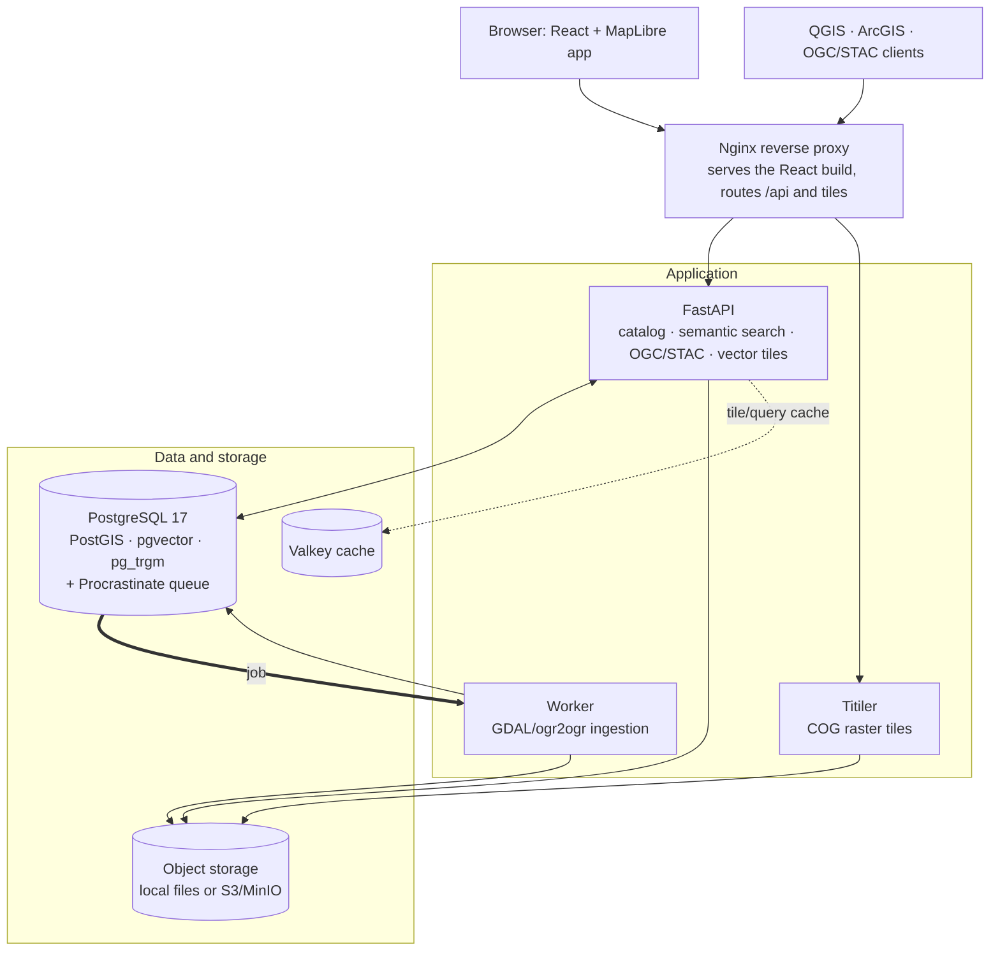

# GeoLens

[English](README.md) | [Español](README.es.md) | [Français](README.fr.md) | [Deutsch](README.de.md)

**Les données géospatiales de votre équipe : consultables, cartographiables et partageables au même endroit.**

GeoLens est un catalogue et un générateur de cartes open source et auto-hébergé pour les équipes SIG et données : un espace unique pour les données géospatiales, exécuté sur l’infrastructure que vous contrôlez et sans télémétrie. GeoLens ne contacte aucun service externe de lui-même. (Les fonctions que vous activez peuvent effectuer des appels sortants : assistance IA vers le point de terminaison compatible OpenAI ou la clé Anthropic de votre choix, connexion OAuth/OIDC, SMTP, tuiles de fond de carte, sources distantes/S3 et sauvegardes hors site.) Chargez des Shapefiles, GeoTIFFs, GeoPackages, CSVs ou XLSX (ou référencez des données existantes) ; GeoLens stocke tout dans PostGIS, indexe les données avec pg_trgm pour fournir immédiatement une recherche approximative (pgvector ajoute un classement sémantique après la configuration d’un fournisseur d’embeddings et l’activation de la recherche sémantique), et expose des APIs OGC/STAC auxquelles QGIS, ArcGIS et MapLibre se connectent nativement. Composez, stylisez et partagez des cartes multicouches dans le navigateur. Construit avec FastAPI et React. Déployé en une commande.

<p align="center">
  <a href="https://demo.getgeolens.com"></a>
  <br />
  <sub>Aucune installation nécessaire. Parcourez le catalogue et les cartes d’exemple sans compte, ou connectez-vous avec Google, GitHub ou Microsoft pour essayer le générateur de cartes. Les données de démonstration peuvent être effacées à tout moment.</sub>
</p>

[](https://github.com/geolens-io/geolens/actions/workflows/ci.yml)
[](LICENSE)
[]()
[](https://postgis.net/)
[](https://ogcapi.ogc.org/)

```bash
curl -fsSL https://getgeolens.com/install.sh | sh
# Open http://localhost:8080, then log in with the credentials you chose
```

<p align="center">
  
  <br />
  <em>Le générateur de cartes : chaque bâtiment de Manhattan extrudé à la hauteur réelle de son toit et coloré selon son époque de construction, le métro passant en dessous ; créé à partir de données ouvertes avec <code>scripts/seed-showcase.py</code></em>
</p>

> [!NOTE]
> **Version initiale.** GeoLens est activement développé et maintenu, et vient
> d’être publié en open source. Le cœur a été utilisé en production, mais la
> distribution auto-hébergée est jeune et certaines fonctions et APIs peuvent
> encore évoluer. [Ouvrez un ticket](https://github.com/geolens-io/geolens/issues) en cas de difficulté.

## Documentation

La documentation complète pour les utilisateurs, les administrateurs et l’API se trouve sur **[docs.getgeolens.com](https://docs.getgeolens.com)**. Le tableau de [référence](#référence) ci-dessous renvoie vers chaque guide.

## Artéfacts publiés

GeoLens est publié dans les registres de paquets standard :

```bash
pip install geolens          # Python SDK
pip install geolens-cli      # CLI; installs the `geolens` command
pip install geolens-mcp      # MCP server for coding agents (read-only)
npm install @geolens/sdk     # TypeScript/JavaScript SDK
```

Les images précompilées de l’API publique et du frontend sont publiées dans GitHub Container Registry :

```bash
docker pull ghcr.io/geolens-io/geolens-api:latest
docker pull ghcr.io/geolens-io/geolens-frontend:latest
```

La balise `latest` suit la dernière version stable publiée.

## Pourquoi GeoLens ?

Les données géospatiales finissent dispersées : shapefiles sur des lecteurs partagés, tables dans des schémas de bases de données, rasters dans des buckets cloud et métadonnées dans des feuilles de calcul. Trouver le bon jeu de données revient à interroger Slack ou à fouiller des serveurs de fichiers. Le partager impose de l’exporter, de l’envoyer et d’espérer que le CRS corresponde.

GeoLens remplace ce processus :

- **Un catalogue unique :** chargez des Shapefiles, GeoPackages, GeoTIFFs, CSVs ou XLSX ; ils deviennent consultables, prévisualisables et exportables en quelques minutes
- **Compatible avec vos outils :** OGC API Features/Records, STAC API 1.0, catalogues DCAT 3/DCAT-US/GeoDCAT-AP et URLs directes de tuiles pour QGIS, ArcGIS et MapLibre
- **Recherche sémantique et spatiale :** correspondance approximative pg_trgm prête à l’emploi ; ajoutez un fournisseur d’embeddings et activez la recherche sémantique pour classer les jeux de données par sens (pgvector)
- **Générateur de cartes intégré :** composez des cartes multicouches, stylisez-les et partagez-les par lien public ou iframe intégrable
- **Assistance IA (facultative) :** dialogue avec les cartes, génération automatique de descriptions et recherche en langage naturel. Utilisez un point de terminaison compatible OpenAI ou une clé Anthropic, ou ignorez entièrement cette fonction

## Démonstration

Les exemples suivants utilisent un bearer token JWT. Créez-en un sur la pile locale (le point de connexion accepte un formulaire de mot de passe OAuth2 : utilisez donc `-d` avec des champs de formulaire, et non du JSON). Remplacez le nom d’administrateur et le mot de passe de `.env` (`grep '^GEOLENS_ADMIN_PASSWORD=' .env`) :

```bash
TOKEN=$(curl -s -X POST http://localhost:8080/api/auth/login/ \
  -d 'username=admin&password=<your-admin-password>' | jq -r '.access_token')
```

La recherche sémantique demande une configuration administrative unique : un fournisseur d’embeddings, les options IA + Recherche sémantique dans les réglages IA d’administration et un rattrapage des embeddings pour les données ingérées auparavant (le [guide de recherche](https://docs.getgeolens.com/guides/user/search/) détaille la procédure). Vous pouvez ensuite rechercher des jeux par signification plutôt que par mot-clé exact :

```bash
# Semantic search ranks by meaning: "hydrology" surfaces subwatersheds, lakes,
# and river networks whose titles never mention the word
curl "http://localhost:8080/api/search/datasets/?q=hydrology&limit=3" \
  -H "Authorization: Bearer $TOKEN" | jq '.features[].properties.title'
```

Chaque jeu de données est également un point de terminaison OGC API Features standard :

```bash
# Grab a public collection id from the catalog. Search anonymously (no token) so
# the id is one anyone can read, matching the unauthenticated items request below.
CID=$(curl -s "http://localhost:8080/api/search/datasets/?q=countries&limit=1" \
  | jq -r '.features[0].id')

# GeoJSON features with a bbox filter, works in QGIS, ArcGIS, any OGC client
curl "http://localhost:8080/api/collections/$CID/items?bbox=-10,35,30,60&limit=5"
```

PostGIS et pgvector partagent une base de données. Lorsque la recherche sémantique est activée, vous pouvez donc classer les jeux par sens *dans* une fenêtre spatiale en une seule requête. Le [guide de recherche](https://docs.getgeolens.com/guides/user/search/) explique comment associer recherches sémantique et spatiale.

Connectez-vous directement depuis QGIS : **Couche > Ajouter une couche WFS / OGC API Features** et indiquez `http://localhost:8080/api/`.

## Fonctionnalités

Chaque exemple ci-dessus dispose d’un guide complet dans la [documentation](https://docs.getgeolens.com/guides/). Voici ce que GeoLens lit, écrit et expose :

### Ingestion et exportation des données

- **Vecteur :** Shapefile, GeoPackage, GeoJSON, GeoParquet, CSV, XLSX
- **Raster :** GeoTIFF et Cloud-Optimized GeoTIFF (COG) avec conversion automatique
- **Mosaïques :** mosaïques raster basées sur VRT à partir de plusieurs fichiers sources
- **Exportation :** GeoJSON, Shapefile, GeoPackage, CSV, avec reprojection du CRS
- Suivi de provenance et édition des métadonnées

### Normes et interopérabilité

- OGC API - Features et OGC API - Records ; point de terminaison de catalogue STAC API 1.0 ; catalogues JSON-LD DCAT 3, DCAT-US 3.0 et GeoDCAT-AP
- URLs directes de tuiles et clés d’API par utilisateur pour QGIS, ArcGIS, MapLibre et tout client OGC
- Les tuiles vectorielles omettent les colonnes d’attributs en dessous du zoom 10 afin de limiter leur taille ; ajoutez le paramètre `cols=<column>,<column>` à leur URL pour inclure certaines colonnes à chaque zoom (les noms sont validés par rapport aux colonnes du jeu et les noms inconnus sont ignorés)
- JWT + OAuth 2.0/OIDC, RBAC avec permissions par jeu de données

<details>
<summary>Sécurité</summary>

- Authentification JWT avec jetons de renouvellement
- Gestion des clés d’API par utilisateur
- Prise en charge d’OAuth 2.0 / OIDC (Google, Microsoft, fournisseurs génériques)
- Contrôle d’accès par rôles (RBAC) avec permissions par jeu de données
- L’inscription en libre-service est désactivée par défaut ; lorsqu’elle est activée avec vérification SMTP, l’envoi du courriel d’inscription est uniforme pour les demandes nouvelles ou déjà existantes
- Journal d’audit de toutes les actions administratives
- Internationalisation : anglais, espagnol, français, allemand

</details>

## Captures d’écran

<p align="center">
  
  <br />
  <em><strong>Trouver :</strong> recherchez par sens. La requête « natural disasters » fait ressortir séismes et éruptions volcaniques sans correspondance de mots-clés, avec des filtres de type, lieu et période</em>
</p>

<p align="center">
  
  <br />
  <em><strong>Inspecter :</strong> chaque jeu reçoit un aperçu cartographique, des statistiques de schéma et des métadonnées typées. Ici, 32 186 chutes de météorites dans le monde</em>
</p>

<p align="center">
  
  <br />
  <em><strong>Construire :</strong> composez des cartes multicouches dans le navigateur avec une pile réordonnable et des éditeurs par couche (ici, le Cervin en maillage de terrain 3D issu du lidar swissALTI3D)</em>
</p>

<p align="center">
  
  <br />
  <em><strong>Interroger l’IA :</strong> modifiez les cartes en langage naturel. « Label the volcanoes with their names » ajoute des étiquettes lisibles à Restless Earth (facultatif : fournissez un point compatible OpenAI ou une clé Anthropic)</em>
</p>

## Démarrage rapide

**Prérequis :** Docker Engine 24+ et Docker Compose v2. La pile incluse fournit PostgreSQL 17. Si GeoLens utilise une base gérée en externe, celle-ci doit être **PostgreSQL 13+** (pour `gen_random_uuid()`) avec **pgvector 0.5+** (pour les index HNSW de recherche sémantique), ainsi que PostGIS, pg_trgm et unaccent. L’API et le worker s’exécutent en conteneurs (Python 3.14 inclus, aucun Python hôte nécessaire). La CLI facultative s’exécute sur l’hôte et nécessite Python 3.11+ ; le SDK Python et les scripts d’initialisation nécessitent Python 3.10+.

L’installation en une ligne télécharge les images précompilées épinglées à une version et démarre la pile :

```bash
curl -fsSL https://getgeolens.com/install.sh | sh
```

Vous préférez lire le script ou construire depuis les sources ? Clonez le dépôt et exécutez le même installateur. Il construit les images localement au lieu de les télécharger :

```bash
git clone https://github.com/geolens-io/geolens.git
cd geolens
bash scripts/install.sh
```

Dans les deux cas, `scripts/install.sh` copie `.env.example` vers `.env`, génère un secret de signature JWT, configure les identifiants administrateur et exécute `docker compose up -d`. Le **nom d’utilisateur** administrateur vaut `admin` par défaut ; le **mot de passe** est automatiquement généré de façon robuste (écrit dans `.env`, jamais affiché dans le terminal), sauf si vous fournissez le vôtre. Pour une installation sans intervention, définissez `GEOLENS_ADMIN_USERNAME` et `GEOLENS_ADMIN_PASSWORD` dans l’environnement avant l’exécution afin d’ignorer les questions. Le script est idempotent : les valeurs existantes de `.env` sont conservées.

Attendez environ 60 secondes, puis ouvrez [http://localhost:8080](http://localhost:8080). Connectez-vous avec votre nom administrateur et le mot de passe généré (obtenez-le avec `grep '^GEOLENS_ADMIN_PASSWORD=' .env`).

Vérifiez que tous les services sont opérationnels :

```bash
docker compose ps
```

Au premier démarrage, l’installation en une ligne **télécharge** les images précompilées et prend environ une minute (seule la petite couche PostGIS + pgvector est construite localement). Cloner puis exécuter `bash scripts/install.sh` **construit** toutes les images depuis les sources : 5 à 10 minutes la première fois (GDAL + extensions Postgres + bundle frontend) ; les démarrages suivants prennent environ 60 secondes dans les deux cas. Si les ports 5434/8001/8080 sont occupés, modifiez `DB_PORT`, `API_PORT` ou `FRONTEND_PORT` dans `.env`. Pour les conflits de ports, blocages, manques de mémoire et avertissements de migration, consultez le [guide de dépannage](https://docs.getgeolens.com/guides/quickstart/install/#troubleshooting).

Pour un déploiement en production, consultez le [guide d’installation](https://docs.getgeolens.com/guides/quickstart/install/). Un [chart Helm](https://github.com/geolens-io/geolens-deployments) maintenu par la communauté se trouve dans le dépôt distinct [`geolens-deployments`](https://github.com/geolens-io/geolens-deployments).

### Vérifier l’installateur

Chaque [version GitHub](https://github.com/geolens-io/geolens/releases) joint un fichier `SHA256SUMS` généré par CI avec `install.sh`. Pour confirmer qu’un installateur téléchargé n’a pas été modifié, téléchargez les deux fichiers de la même version, placez-les dans le même répertoire puis exécutez :

```bash
# Linux / Windows WSL
sha256sum -c SHA256SUMS

# macOS
shasum -a 256 -c SHA256SUMS
```

Une vérification réussie affiche `install.sh: OK`.

### Mise à niveau

Pour mettre à niveau une installation précompilée, exécutez `./scripts/upgrade.sh` depuis son répertoire. Il sauvegarde la base, télécharge les nouvelles images, exécute les migrations après un contrôle de santé et affiche une procédure de retour arrière en cas d’échec. Consultez [`UPGRADING.md`](UPGRADING.md) pour les flux précompilé et construit depuis les sources ainsi que le retour arrière, ou le [guide de mise à niveau](https://docs.getgeolens.com/guides/quickstart/upgrade/) en ligne.

### Ajouter votre premier jeu de données

Le dépôt fournit un petit `city-parks.geojson`. Chargez-le et publiez-le en une commande avec la **CLI GeoLens** :

```bash
pip install geolens-cli                              # installs the `geolens` command
geolens login http://localhost:8080/api              # use your admin username + password
geolens publish examples/manifests/first-catalog/city-parks.geojson --name "City Parks"
```

`geolens publish` exécute le flux d’ingestion chargement → aperçu → validation et affiche l’URL du nouveau jeu. Une commande transforme un fichier local en jeu publié et cartographiable.

Pour des catalogues reproductibles à plusieurs jeux, décrivez les sources dans un **manifeste** (`geolens.yaml`) et appliquez-le avec `geolens apply`. Les sources sont référencées par URL HTTP(S), URI S3 ou chemin déjà présent sur le serveur ; les exemples de [`examples/manifests/`](examples/manifests/) sont des modèles à adapter. Créez-en un avec `geolens init` puis modifiez-le :

```bash
geolens init                       # writes geolens.yaml in the current directory
geolens validate geolens.yaml      # local schema check, no API call
geolens apply geolens.yaml         # validates + applies via /ingest/manifest/apply
```

Le [guide de la CLI](https://docs.getgeolens.com/guides/cli/) présente le schéma complet, les types de sources et les modèles d’intégration CI.

### Données d’exemple

`scripts/seed-showcase.py` construit six cartes de démonstration à partir de données ouvertes : une histoire tectonique mondiale sur le relief réel des fonds océaniques, la silhouette 3D de Manhattan colorée par époque de construction (visuel principal ci-dessus), 75 ans de trajectoires d’ouragans atlantiques, des chutes de météorites regroupées, le Cervin en terrain 3D lidar à 2 m et des images Sentinel-2 de New York référencées :

```bash
pip install httpx
python scripts/seed-showcase.py --username admin --password "$(grep '^GEOLENS_ADMIN_PASSWORD=' .env | cut -d= -f2-)"
```

Nécessite Internet pour accéder aux sources de données ouvertes. Consultez [`scripts/README.md`](scripts/README.md) pour les options (`--no-terrain`, `--prune`, …).

## Architecture

GeoLens est un petit ensemble de services autour d’une base PostgreSQL/PostGIS unique : l’API sert le catalogue, la recherche et les points OGC/STAC ; un worker gère l’ingestion ; Titiler sert les tuiles raster depuis le stockage objet.



| Composant | Technologie |
|-----------|-----------|
| Frontend | React 19, Vite, MapLibre GL v5, TanStack Query, Tailwind CSS |
| API backend | FastAPI (Python), GDAL/ogr2ogr, Procrastinate (file de tâches) |
| Tuiles raster | Titiler (serveur de tuiles COG) |
| Stockage objet | MinIO (compatible S3, développement local) ou tout fournisseur S3 |
| Cache | Valkey (cache de tuiles et de requêtes) |
| Base de données | PostgreSQL 17 + PostGIS 3.5 + pgvector + pg_trgm (minimum : PostgreSQL 13, pgvector 0.5) |
| Proxy inverse | Nginx (production) / proxy de développement Vite (développement) |

## Configuration

Toute la configuration est gérée par des variables d’environnement dans `.env`. Consultez la [référence de configuration](https://docs.getgeolens.com/guides/quickstart/configuration/) pour toutes les options, valeurs par défaut et descriptions.

### Budget du pool de connexions

GeoLens est réglé pour une **instance PostgreSQL unique** : les pools API, worker et administration tiennent dans **70 sur 80 max_connections** par défaut (`max_connections` de Postgres vaut 80), dimensionnés par `DB_POOL_SIZE` (`pool_size`) et `DB_MAX_OVERFLOW` (`max_overflow`, valeur par défaut 3). Consultez [Réglage du pool de connexions](https://docs.getgeolens.com/guides/quickstart/configuration/#connection-pool-tuning) pour le budget par processus et le relèvement de la limite.

### Sauvegardes

Les sauvegardes planifiées automatiques s’exécutent **par défaut**. L’option `--profile backup` n’est pas nécessaire. Le service démarre avec `api`, `worker` et `db` à chaque `docker compose up`, exécute `pg_dump` selon un calendrier quotidien/hebdomadaire et archive le volume de préparation du stockage objet, afin qu’une restauration reproduise une instance opérationnelle (BD + fichiers chargés).

Le **téléversement hors site (S3)** exige en plus `BACKUP_S3_ENABLED=true`. L’outil intégré signe les requêtes avec **AWS Signature V4** (awscli), compatible avec Cloudflare R2, AWS S3 moderne et MinIO. Un échec produit un `ERROR` visible dans les journaux du conteneur (pas un avertissement avalé), ce qui rend immédiatement détectable la perte silencieuse de sauvegarde hors site.

Pour l’exploitation, la restauration et la réponse aux incidents, consultez [RUNBOOK.md](RUNBOOK.md). Pour les options propres aux fournisseurs, consultez [Sauvegarde et restauration](https://docs.getgeolens.com/guides/admin/backups/#backup-destinations).

### Supervision

L’API et le worker exportent nativement des métriques Prometheus (taux/latence/erreurs HTTP, profondeur de file, pool BD, cache de tuiles). Une configuration de collecte, des règles d’alerte et un tableau de bord Grafana sont fournis dans [`infra/monitoring/`](infra/monitoring/) ; consultez [RUNBOOK.md §4](RUNBOOK.md#4-monitoring) pour la mise en place.

## Référence

| Guide | Description |
|-------|-------------|
| [Guide d’installation](https://docs.getgeolens.com/guides/quickstart/install/) | Déploiement pas à pas avec Docker Compose |
| [Guide de mise à niveau](https://docs.getgeolens.com/guides/quickstart/upgrade/) | Mise à niveau entre versions avec procédures de retour arrière |
| [Référence de configuration](https://docs.getgeolens.com/guides/quickstart/configuration/) | Toutes les variables d’environnement et leurs valeurs par défaut |
| [Guide d’administration](https://docs.getgeolens.com/guides/admin/) | Gestion des utilisateurs, jeux de données et santé du système |
| [Auto-hébergement sur AWS, GCP ou DigitalOcean](https://docs.getgeolens.com/guides/quickstart/cloud-deployment/) | Guides de déploiement de base, stockage objet et cache gérés |
| [CLI et manifestes](https://docs.getgeolens.com/guides/cli/) | Publication de fichiers et gestion des catalogues avec la CLI `geolens` |
| [Référence API](https://docs.getgeolens.com/guides/api/) | Référence générée sur docs.getgeolens.com ; Swagger UI interactive sur `/api/docs` à l’exécution |
| [Exemples de manifestes](examples/manifests/) | Modèles `geolens.yaml` : public-cog (COG distant), url-source, s3-source, publication-states |

## Communauté

- [GitHub Discussions](https://github.com/geolens-io/geolens/discussions) : questions, idées et présentations
- [Assistance](SUPPORT.md) : où demander de l’aide et comment les problèmes sont orientés
- [Guide de contribution](.github/CONTRIBUTING.md) : environnement de développement, style et règles de PR

## Limitations connues

- Une instance PostgreSQL unique, sans haute disponibilité ni clustering intégrés.
- GeoLens est conçu pour une organisation par déploiement auto-hébergé.
- Le rendu du terrain suppose que les unités du DEM sont des mètres ; d’autres unités verticales peuvent produire un relief exagéré.
- La distribution auto-hébergée est jeune et certaines fonctions et APIs peuvent encore évoluer (voir la note de version initiale ci-dessus).

## Licence

GeoLens est distribué sous [licence Apache 2.0](LICENSE). Le nom, le logo et les ressources de marque GeoLens ne sont pas couverts par cette licence. Consultez [TRADEMARKS.md](TRADEMARKS.md). Les attributions des données d’exemple tierces figurent dans [THIRD_PARTY_DATA.md](THIRD_PARTY_DATA.md).

Politiques du projet : [gouvernance](GOVERNANCE.md) · [mainteneurs](MAINTAINERS.md) · [contribution](.github/CONTRIBUTING.md) · [sécurité](.github/SECURITY.md) · [processus de publication](RELEASE.md) · [sortie réseau et environnement isolé](EGRESS.md).
