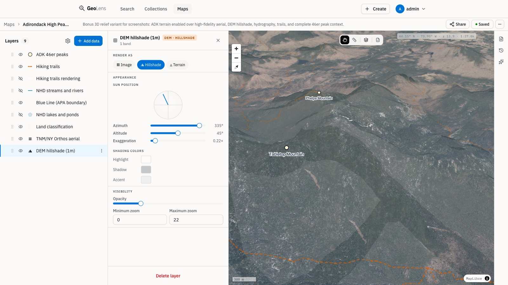

# GeoLens

[English](README.md) | [Español](README.es.md) | [Français](README.fr.md) | [Deutsch](README.de.md)

**Les données spatiales de votre équipe, consultables au même endroit.**

Importez des Shapefiles, GeoTIFFs, GeoPackages ou CSVs. GeoLens stocke tout dans PostGIS, indexe les métadonnées avec pgvector + pg_trgm pour la recherche sémantique et approximative, et expose des APIs OGC utilisables directement par QGIS, ArcGIS et les clients MapLibre. L'application est construite avec FastAPI et React, et se déploie avec une seule commande.

> Cette traduction suit le README anglais comme source canonique. Si une traduction vous semble incorrecte, ouvrez une issue ou une pull request.

[](https://github.com/geolens-io/geolens/actions/workflows/ci.yml)
[](LICENSE)
[]()
[](https://postgis.net/)
[](https://ogcapi.ogc.org/)

```bash
git clone https://github.com/geolens-io/geolens.git && cd geolens
bash scripts/install.sh
# Ouvrez http://localhost:8080 — connectez-vous avec les identifiants choisis
```

<p align="center">
  
  <br />
  <em>Ajustez les couches DEM, l'imagerie et les vecteurs dans le constructeur de cartes, puis partagez des cartes 3D interactives</em>
</p>

## Documentation

La documentation utilisateur, administrateur et API est disponible sur **[docs.getgeolens.com](https://docs.getgeolens.com)**.

- **Installation et démarrage rapide :** [docs.getgeolens.com/guides/quickstart](https://docs.getgeolens.com/guides/quickstart/)
- **Guide d'administration :** [docs.getgeolens.com/guides/admin](https://docs.getgeolens.com/guides/admin/)
- **Référence API :** [docs.getgeolens.com/guides/api](https://docs.getgeolens.com/guides/api/)

## Artefacts publiés

GeoLens est publié sur les registres de paquets standards :

```bash
pip install geolens          # SDK Python
pip install geolens-cli      # CLI; installe la commande `geolens`
npm install @geolens/sdk     # SDK TypeScript/JavaScript
```

Images publiques API et frontend sur GitHub Container Registry :

```bash
docker pull ghcr.io/geolens-io/geolens-api:latest
docker pull ghcr.io/geolens-io/geolens-frontend:latest
```

Les tags `1.0`, `1` et `latest` suivent la ligne de release 1.x actuelle.

## Pourquoi GeoLens ?

Les données spatiales finissent dispersées : shapefiles sur des partages réseau, tables dans des schémas de base de données, rasters dans des buckets et métadonnées dans des feuilles de calcul. Trouver le bon jeu de données revient souvent à demander sur Slack ou à fouiller des serveurs de fichiers. Le partager signifie exporter, envoyer par e-mail et espérer que le CRS corresponde.

GeoLens remplace ce flux :

- **Un catalogue** : importez Shapefiles, GeoPackages, GeoTIFFs ou CSVs et rendez-les consultables, prévisualisables et exportables en quelques minutes.
- **Compatible avec vos outils** : OGC API Features/Records avec filtrage CQL2, STAC 1.0 et URLs directes de tuiles pour QGIS, ArcGIS et MapLibre.
- **Recherche sémantique + spatiale** : trouvez les jeux de données par sens, pas seulement par mot-clé, avec pgvector et pg_trgm.
- **Constructeur de cartes intégré** : composez des cartes multicouches, appliquez des styles et partagez-les par lien public ou iframe.
- **IA optionnelle** : discutez avec vos cartes, générez des descriptions et recherchez en langage naturel. Utilisez toute API compatible OpenAI ou ignorez l'IA.

## En action

Recherchez des jeux de données par sens, pas seulement par mot-clé :

```bash
# Recherche sémantique : trouve les jeux de données "hydrology" même avec "rivers"
curl 'http://localhost:8080/api/search/datasets/?q=rivers+near+mountains&limit=3' \
  -H 'Authorization: Bearer <token>' | jq '.features[].properties.title'
```

Chaque jeu de données est aussi un endpoint OGC API Features standard :

```bash
# Features GeoJSON avec filtre bbox : fonctionne dans QGIS, ArcGIS et tout client OGC
curl 'http://localhost:8080/api/collections/ne_10m_admin_0_countries/items?bbox=-10,35,30,60&limit=5'
```

Depuis QGIS, utilisez **Layer > Add WFS / OGC API Features** et pointez vers `http://localhost:8080/api/`.

## Fonctionnalités

### Constructeur de cartes et partage

- Cartes interactives multicouches avec ordre par glisser-déposer, styles et filtres par couche.
- Styles pour points, lignes et polygones avec rampes de couleurs et classes par catégorie.
- Liens publics et snippets `<iframe>` embarquables.
- Couches raster COG et vectorielles côte à côte.

### IA assistée (optionnelle)

- Discutez avec vos cartes : posez des questions en langage naturel, l'IA ajoute et stylise des couches.
- Recherche vectorielle sémantique dans les métadonnées avec pgvector et index HNSW.
- Descriptions et tags de jeux de données générés automatiquement à l'ingestion.
- Compatible avec toute API compatible OpenAI (OpenAI, Anthropic, Ollama) ; GeoLens fonctionne entièrement sans elle.

### Recherche et découverte

- Recherche plein texte et trigrammes sur noms, descriptions et métadonnées.
- Recherche spatiale par bounding box et filtres dessinés sur la carte.
- Facettes par format, tags, collections et type d'enregistrement.
- Recherche sémantique optionnelle avec pgvector.
- Recherches sauvegardées pour les flux répétés.

### Ingestion et export

- **Vecteur :** Shapefile, GeoPackage, GeoJSON, CSV et XLSX.
- **Raster :** GeoTIFF et Cloud-Optimized GeoTIFF avec conversion automatique.
- **Mosaïques :** mosaïques raster basées sur VRT.
- **Export :** GeoJSON, Shapefile, GeoPackage et CSV avec reprojection CRS.
- Suivi de provenance et édition de métadonnées.

### Standards et interopérabilité

- Conforme à OGC API - Features et OGC API - Records.
- Endpoint de catalogue STAC 1.0.
- URLs directes de tuiles pour QGIS, ArcGIS, MapLibre et clients OGC.
- Authentification par API key pour les outils externes.
- JWT + OAuth 2.0/OIDC et RBAC avec permissions par jeu de données.

<details>
<summary>Entreprise et sécurité</summary>

- Authentification JWT avec refresh tokens.
- Gestion des API keys par utilisateur.
- Prise en charge OAuth 2.0 / OIDC (Google, Microsoft et fournisseurs génériques).
- Contrôle d'accès basé sur les rôles (RBAC) avec permissions par jeu de données.
- Audit logging pour toutes les actions administratives.
- Internationalisation : anglais, espagnol, français, allemand.

</details>

## Captures d'écran

<p align="center">
  
  <br />
  <em>Vue catalogue avec recherche, filtres spatiaux et cartes de jeux de données</em>
</p>

<p align="center">
  
  <br />
  <em>Détail de jeu de données avec aperçu cartographique, métadonnées et table attributaire</em>
</p>

## Démarrage rapide

**Prérequis :** Docker Engine 24+ et Docker Compose v2.

```bash
git clone https://github.com/geolens-io/geolens.git
cd geolens
bash scripts/install.sh
```

`scripts/install.sh` copie `.env.example` vers `.env`, génère un secret de
signature JWT, demande les identifiants administrateur (par défaut :
`admin` / `admin`), puis exécute `docker compose up -d`. Pour une installation
non interactive, définissez `GEOLENS_ADMIN_USERNAME` et `GEOLENS_ADMIN_PASSWORD`
dans l'environnement avant de lancer le script et les invites seront ignorées.
Relancer le script est idempotent — les valeurs existantes dans `.env` sont
préservées.

Attendez environ 60 secondes, ouvrez [http://localhost:8080](http://localhost:8080), puis connectez-vous avec les identifiants administrateur que vous avez définis.

Vérifiez que tous les services sont sains :

```bash
docker compose ps
```

Pour un déploiement en production, consultez l'[Install Guide](https://docs.getgeolens.com/guides/quickstart/install/). Pour les mises à niveau, consultez l'[Upgrade Guide](https://docs.getgeolens.com/guides/quickstart/upgrade/).

### Seed Data

Remplissez le catalogue avec des jeux de données [Natural Earth](https://www.naturalearthdata.com/) 1:10m :

```bash
pip install httpx  # dépendance unique sur l'hôte
python scripts/seed-natural-earth.py --username admin --password admin
```

Le script se connecte, crée une API key temporaire pour l'exécution, ingère les jeux de données et supprime la clé à la sortie. Il télécharge depuis le [NACIS CDN](https://naciscdn.org/naturalearth/), ignore les doublons lors d'une nouvelle exécution et crée deux collections (Cultural 10m, Physical 10m). Utilisez `--dry-run` pour prévisualiser ou `--theme cultural` pour filtrer par thème.

Si vous avez déjà une API key (Admin > API Keys > Create New, ou via `POST /api/auth/api-keys/`), passez `--api-key <plaintext>` au lieu de `--username/--password`.

## Architecture

| Composant | Technologie |
|-----------|-------------|
| Frontend | React 19, Vite, MapLibre GL v5, TanStack Query, Tailwind CSS |
| Backend API | FastAPI (Python), GDAL/ogr2ogr, Procrastinate (queue de tâches) |
| Tuiles raster | Titiler (serveur de tuiles COG) |
| Stockage objet | MinIO (compatible S3, dev local) ou tout fournisseur S3 |
| Cache | Valkey (cache de tuiles et requêtes) |
| Base de données | PostgreSQL 17 + PostGIS 3.5 + pgvector + pg_trgm |
| Proxy inverse | Nginx (production) / proxy Vite dev (développement) |

## Configuration

Toute la configuration est gérée par variables d'environnement dans `.env`. Consultez la [Configuration Reference](https://docs.getgeolens.com/guides/quickstart/configuration/) pour la liste complète des options avec valeurs par défaut et descriptions.

## Référence

| Guide | Description |
|------|-------------|
| [Install Guide](https://docs.getgeolens.com/guides/quickstart/install/) | Déploiement pas à pas avec Docker Compose |
| [Upgrade Guide](https://docs.getgeolens.com/guides/quickstart/upgrade/) | Mises à niveau avec procédures de rollback |
| [Configuration Reference](https://docs.getgeolens.com/guides/quickstart/configuration/) | Variables d'environnement et valeurs par défaut |
| [Admin Guide](https://docs.getgeolens.com/guides/admin/) | Gestion des utilisateurs, datasets et santé système |
| [Cloud Deployment](https://docs.getgeolens.com/guides/quickstart/cloud-deployment/) | Guides de déploiement AWS, GCP et DigitalOcean |
| [Developer Docs](https://docs.getgeolens.com/) | Créer des widgets personnalisés pour le map builder |
| [API Reference](https://docs.getgeolens.com/guides/api/) | Référence générée automatiquement sur docs.getgeolens.com ; Swagger UI interactif sur `/api/docs` |
| [Exemples de manifestes](examples/manifests/) | Exemples `geolens.yaml` opérationnels — first-catalog, public-cog (COG distant), s3-source, url-source |

## Communauté

- [GitHub Discussions](https://github.com/geolens-io/geolens/discussions) : questions, idées, show and tell.
- [Guide de contribution](.github/CONTRIBUTING.md) : environnement de développement, style de code et pull requests.

## Licence

GeoLens est sous [Apache License 2.0](LICENSE).
