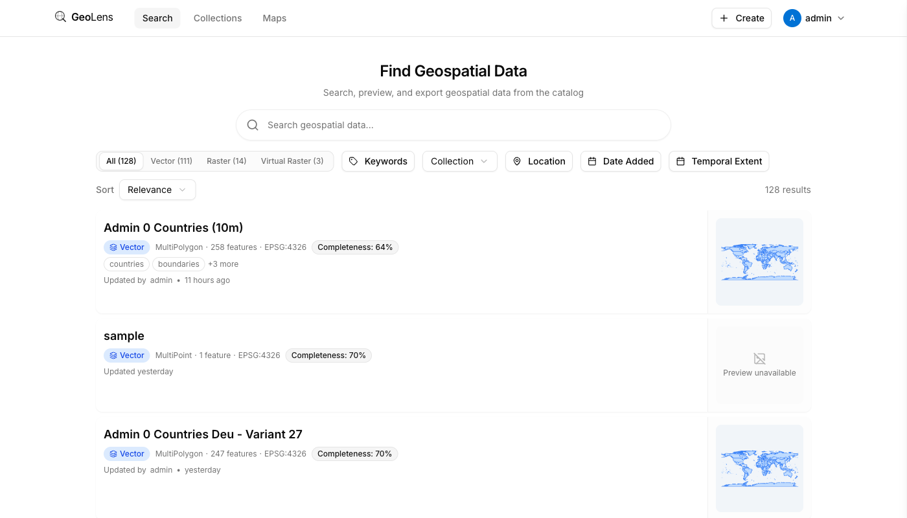

# GeoLens

A self-hosted spatial data catalog built on PostGIS. Search, preview, and export your GIS datasets from a single interface.

[](LICENSE)
[](docker-compose.yml)


---

<p align="center">
  
</p>

<p align="center">
  
</p>

## Why GeoLens?

GeoLens gives your team a single place to find, preview, and share spatial data. It connects directly to PostGIS, serves vector tiles and raster COGs, and speaks OGC APIs -- so it works with the tools GIS professionals already use (QGIS, ArcGIS, custom clients). Upload shapefiles, GeoPackages, GeoTIFFs, or CSVs and they become searchable, previewable, and exportable within minutes.

## Features

### Search and Discovery

- Full-text search across dataset names, descriptions, and metadata
- Spatial search with bounding box and map-drawn filters
- Faceted filtering by format, tags, collections, and record type
- Saved searches for repeated workflows
- Semantic search powered by pgvector (optional, requires LLM API key)

### Map Builder

- Multi-layer interactive maps with drag-and-drop layer ordering
- Point, line, and polygon styling with color ramps and category breaks
- Per-layer filters, labels, and opacity controls
- Share maps via public links or embeddable iframes
- Raster and vector layers side by side

### AI-Powered (Optional)

- Chat with your maps -- ask questions, AI adds and styles layers
- Semantic search across dataset metadata using natural language
- Auto-generated dataset descriptions and tags on ingest
- Requires an OpenAI-compatible API key; fully functional without it

### Data Management

- **Vector:** Shapefile, GeoPackage, GeoJSON, CSV, XLSX upload and ingestion
- **Raster:** GeoTIFF and Cloud-Optimized GeoTIFF (COG) with automatic conversion
- **Mosaics:** VRT-based raster mosaics from multiple source files
- **Export:** GeoJSON, Shapefile, GeoPackage, CSV, with CRS reprojection
- Provenance tracking and metadata editing

### Standards and Interop

- OGC API - Features and OGC API - Records compliant
- STAC 1.1 catalog endpoint
- Direct tile URL access for QGIS, ArcGIS, and MapLibre clients
- API key authentication for external tool integration

### Enterprise Ready

- JWT authentication with refresh tokens
- API key management per user
- OAuth 2.0 / OIDC support (SAML SSO available via enterprise extension)
- Role-based access control (RBAC) with per-dataset permissions
- Audit logging for all administrative actions
- Internationalization: English, Spanish, French, German

## Screenshots

<p align="center">
  
  <br />
  <em>Catalog view with search, spatial filters, and dataset cards</em>
</p>

<p align="center">
  
  <br />
  <em>Dataset detail with map preview, metadata, and attribute table</em>
</p>

## Quick Start

**Prerequisites:** Docker Engine 24+ and Docker Compose v2.

```bash
git clone https://github.com/geolens-io/geolens.git
cd geolens
cp .env.example .env
docker compose up -d
```

Open [http://localhost:8080](http://localhost:8080) -- log in with `admin` / `admin`.

For production deployment, see the [Install Guide](docs/install-guide.md).

### Seed Data

GeoLens ships with a script that imports all 130 [Natural Earth](https://www.naturalearthdata.com/) 1:10m vector datasets, giving you a fully populated catalog out of the box.

```bash
pip install httpx

# Import all datasets
python scripts/seed-natural-earth.py --api-key admin

# Dry run -- list datasets without importing
python scripts/seed-natural-earth.py --api-key admin --dry-run

# Filter by theme
python scripts/seed-natural-earth.py --api-key admin --theme cultural

# Cache downloads for resumable imports
python scripts/seed-natural-earth.py --api-key admin --cache-dir /tmp/ne-cache
```

The script downloads from the [NACIS CDN](https://naciscdn.org/naturalearth/), ingests through the upload API, skips duplicates on re-run, and creates "Natural Earth Cultural (10m)" and "Natural Earth Physical (10m)" collections.

## Architecture

| Component | Technology |
|-----------|-----------|
| Frontend | React 19, Vite, MapLibre GL v5, TanStack Query, Tailwind CSS |
| Backend API | FastAPI (Python), PostGIS, Procrastinate (task queue) |
| Raster Tiles | Titiler (COG tile server) |
| Object Storage | MinIO (S3-compatible, local dev) or any S3 provider |
| Cache | Valkey (Redis-compatible) |
| Database | PostgreSQL 17 + PostGIS 3.5 |
| Reverse Proxy | Nginx |

## Configuration

All configuration is managed through environment variables in `.env`. See the [Configuration Reference](docs/configuration-reference.md) for the full list of options with defaults and descriptions.

## Documentation

| Guide | Description |
|-------|-------------|
| [Install Guide](docs/install-guide.md) | Step-by-step deployment with Docker Compose |
| [Configuration Reference](docs/configuration-reference.md) | All environment variables and their defaults |
| [Admin Guide](docs/admin-guide.md) | User management, datasets, system health |
| [Cloud Deployment](docs/cloud-deployment.md) | AWS, GCP, and DigitalOcean deployment guides |
| [AI Map Features](docs/llm-map-features.md) | Chat-driven map building with LLMs |
| [AI Data Features](docs/llm-data-features.md) | Semantic search and auto-generated metadata |
| [Widget Development](docs/widgets.md) | Build custom map builder widgets |

## Contributing

Contributions are welcome. See [CONTRIBUTING.md](.github/CONTRIBUTING.md) for development setup, code style, and PR guidelines.

## License

GeoLens is licensed under the [Apache License 2.0](LICENSE).
