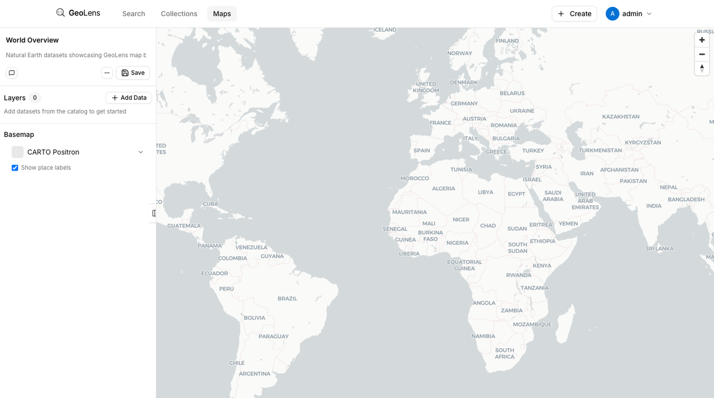
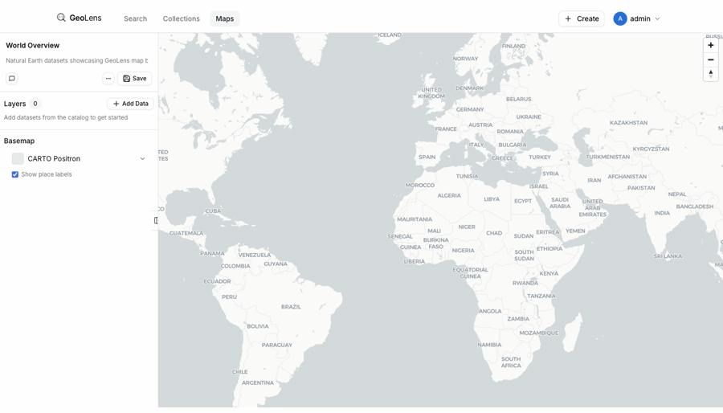
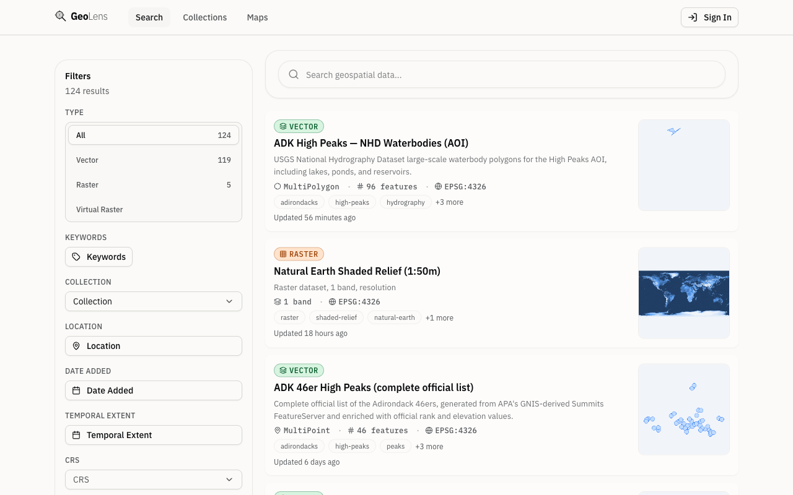
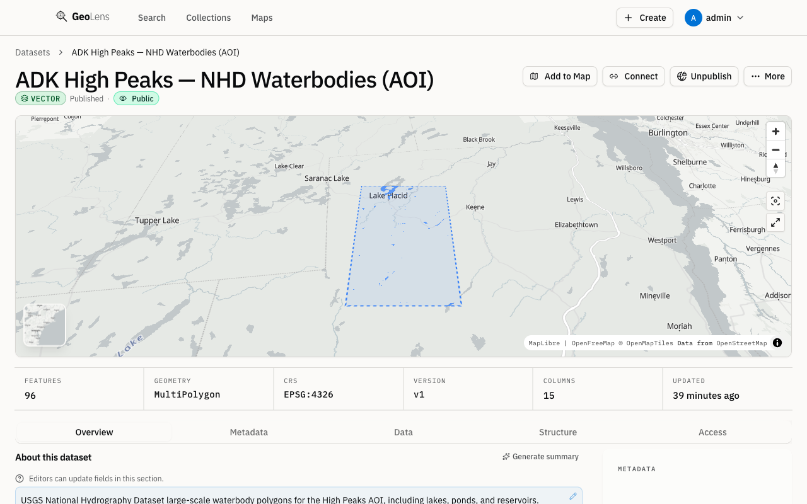

# GeoLens

[English](README.md) | [Español](README.es.md) | [Français](README.fr.md) | [Deutsch](README.de.md)

**Your team's spatial data, searchable in one place.**

Upload Shapefiles, GeoTIFFs, GeoPackages, or CSVs. GeoLens stores everything in PostGIS, indexes it with pgvector + pg_trgm for semantic and fuzzy search, and serves OGC APIs that QGIS, ArcGIS, and MapLibre clients connect to natively. Built on FastAPI and React. Deployed with one command.

[](https://github.com/geolens-io/geolens/actions/workflows/ci.yml)
[](LICENSE)
[]()
[](https://postgis.net/)
[](https://ogcapi.ogc.org/)

```bash
git clone https://github.com/geolens-io/geolens.git && cd geolens
cp .env.example .env && docker compose up -d
# Open http://localhost:8080 — login: admin / admin
```

<p align="center">
  
  <br />
  <em>Upload a shapefile, get a searchable, previewable, exportable dataset in minutes</em>
</p>

## Documentation

Full user, admin, and API documentation lives at **[docs.getgeolens.com](https://docs.getgeolens.com)**.

- **Install & quickstart:** [docs.getgeolens.com/guides/quickstart](https://docs.getgeolens.com/guides/quickstart/)
- **Admin guide:** [docs.getgeolens.com/guides/admin](https://docs.getgeolens.com/guides/admin/)
- **API reference:** [docs.getgeolens.com/guides/api](https://docs.getgeolens.com/guides/api/)

## Try the Themed Demo

GeoLens ships with three themed demo collections — **Planet Earth** (raster + VRT mosaics), **Global Development & People** (indicator choropleths), and **Borders, Boundaries & Contested Space** (geopolitics done carefully) — and nine signature maps that load deterministically with one command:

```bash
cp .env.demo .env
docker compose -f docker-compose.yml -f docker-compose.demo.yml up -d --build
```

<p align="center">
  
</p>

After the seeder image build completes (most of the time is the GEBCO 2024 download — ~10–15 minutes on a fast connection, cached on rebuild), open http://localhost:8080 and navigate to **Maps**. The signature stories include:

- **Earth as Seen from Space** — bathymetry + topography + ice on a dark world view
- **Global Bathymetry** — GEBCO 2024 ocean floor with viridis colormap
- **GDP per Capita PPP 2023** — country choropleth from World Bank Open Data
- **Manhattan Skyline** — OpenStreetMap building footprints extruded by height for 3D fill-extrusion rendering
- **Population at a Glance** — proportional-symbol populated places, sized by population
- **The World's Disputed Places** — every disputed area Natural Earth tracks
- **One Territory, Multiple Official Maps** — Kashmir as China, India, and Pakistan see it (toggle the layers!)
- **Conflict Events 2024** — UCDP Georeferenced Event Dataset, fatal events of organized violence
- **Refugees by Country of Origin 2023** — UNHCR statistics joined to country polygons

All data is bundled at image build time — **no outbound network calls at runtime**. The demo can be reset every 24 hours by the included `reset` service. To force a full reset:

```bash
docker compose -f docker-compose.yml -f docker-compose.demo.yml exec reset /scripts/reset-demo.sh
docker compose -f docker-compose.yml -f docker-compose.demo.yml restart seeder
```

Source attribution and licenses for every demo dataset are documented on each dataset's detail page. All bundled data is CC-BY 4.0, ODbL 1.0, or Public Domain.

## Published Artifacts

GeoLens is published through the standard package registries:

```bash
pip install geolens          # Python SDK
pip install geolens-cli      # CLI; installs the `geolens` command
npm install @geolens/sdk     # TypeScript/JavaScript SDK
```

Prebuilt public API and frontend images are published to GitHub Container Registry:

```bash
docker pull ghcr.io/geolens-io/geolens-api:latest
docker pull ghcr.io/geolens-io/geolens-frontend:latest
```

The image tags `1.0`, `1`, and `latest` track the current 1.x release line.

## Why GeoLens?

Spatial data ends up scattered -- shapefiles on shared drives, tables in database schemas, rasters in cloud buckets, metadata in spreadsheets. Finding the right dataset means asking Slack or grepping file servers. Sharing it means exporting, emailing, and hoping the CRS matches.

GeoLens replaces that workflow:

- **One catalog** -- upload Shapefiles, GeoPackages, GeoTIFFs, or CSVs and they become searchable, previewable, and exportable in minutes
- **Works with your tools** -- OGC API Features/Records, STAC API 1.0, direct tile URLs for QGIS, ArcGIS, and MapLibre
- **Semantic + spatial search** -- find datasets by meaning, not just keywords, powered by pgvector and pg_trgm full-text search
- **Built-in map builder** -- compose multi-layer maps, style them, and share via public link or embeddable iframe
- **AI-assisted (optional)** -- chat with your maps, auto-generate descriptions, search by natural language. Bring any OpenAI-compatible API key or skip it entirely

## See It in Action

Search datasets by meaning, not just keywords:

```bash
# Semantic search -- finds "hydrology" datasets even when you search "rivers"
curl 'http://localhost:8080/api/search/datasets/?q=rivers+near+mountains&limit=3' \
  -H 'Authorization: Bearer <token>' | jq '.features[].properties.title'
```

Every dataset is also a standard OGC API Features endpoint:

```bash
# GeoJSON features with bbox filter -- works in QGIS, ArcGIS, any OGC client
curl 'http://localhost:8080/api/collections/ne_10m_admin_0_countries/items?bbox=-10,35,30,60&limit=5'
```

Use PostGIS + pgvector together when you need semantic ranking inside a spatial window. The sample vector below is only a runnable placeholder; replace it with an embedding from the same model configured for GeoLens:

```sql
WITH query_embedding AS (
  SELECT ('[' || array_to_string(array_fill(0.001::float8, ARRAY[1536]), ',') || ']')::vector AS value
)
SELECT
  d.id,
  r.title,
  1 - (e.embedding <=> query_embedding.value) AS semantic_score
FROM catalog.datasets d
JOIN catalog.records r ON r.id = d.record_id
JOIN catalog.record_embeddings e ON e.record_id = r.id
CROSS JOIN query_embedding
WHERE r.spatial_extent && ST_MakeEnvelope(-125, 24, -66, 50, 4326)
ORDER BY e.embedding <=> query_embedding.value
LIMIT 5;
```

The result is the five catalog records whose metadata embeddings are nearest to the query vector, limited to records intersecting the bounding box.

Connect directly from QGIS: **Layer > Add WFS / OGC API Features** and point at `http://localhost:8080/api/`.

## Features

### Map Builder and Sharing

- Multi-layer interactive maps with drag-and-drop ordering, styling, and per-layer filters
- Point, line, and polygon styling with color ramps and category breaks
- Share maps via public links or embeddable `<iframe>` snippets
- Raster (COG) and vector layers side by side

### AI-Powered (Optional)

- Chat with your maps -- ask natural-language questions, AI adds and styles layers
- Semantic vector search across metadata using pgvector with HNSW indexing
- Auto-generated dataset descriptions and tags on ingest
- Works with any OpenAI-compatible API (OpenAI, Anthropic, Ollama); fully functional without it

### Search and Discovery

- Full-text and trigram search (pg_trgm) across dataset names, descriptions, and metadata
- Spatial search with bounding box and map-drawn filters
- Faceted filtering by format, tags, collections, and record type
- Semantic search powered by pgvector (optional)
- Saved searches for repeated workflows

### Data Ingestion and Export

- **Vector:** Shapefile, GeoPackage, GeoJSON, CSV, XLSX upload and ingestion
- **Raster:** GeoTIFF and Cloud-Optimized GeoTIFF (COG) with automatic conversion
- **Mosaics:** VRT-based raster mosaics from multiple source files
- **Export:** GeoJSON, Shapefile, GeoPackage, CSV, with CRS reprojection
- Provenance tracking and metadata editing

### Standards and Interop

- OGC API - Features and OGC API - Records compliant
- STAC API 1.0 catalog endpoint
- Direct tile URLs for QGIS, ArcGIS, MapLibre, and any OGC client
- API key authentication for external tool integration
- JWT + OAuth 2.0/OIDC, RBAC with per-dataset permissions

<details>
<summary>Enterprise and Security</summary>

- JWT authentication with refresh tokens
- API key management per user
- OAuth 2.0 / OIDC support (Google, Microsoft, generic providers)
- Role-based access control (RBAC) with per-dataset permissions
- Audit logging for all administrative actions
- Internationalization: English, Spanish, French, German

</details>

## Screenshots

<p align="center">
  
  <br />
  <em>Catalog view with search, spatial filters, and dataset cards</em>
</p>

<p align="center">
  
  <br />
  <em>Dataset detail with map preview, metadata, and attribute table</em>
</p>

## Quick Start

**Prerequisites:** Docker Engine 24+ and Docker Compose v2. Minimum host: 4 GB RAM and 10 GB free disk for the base stack and a small dataset; 8 GB+ RAM recommended for raster work or catalogs above ~100 datasets. See [Resource Sizing](https://docs.getgeolens.com/guides/quickstart/resource-sizing/) for production sizing.

```bash
git clone https://github.com/geolens-io/geolens.git
cd geolens
cp .env.example .env
docker compose up -d
```

Wait about 60 seconds for services to start, then open [http://localhost:8080](http://localhost:8080). Log in with `admin` / `admin`.

Verify all services are healthy:

```bash
docker compose ps
```

First-run troubleshooting:

- If ports are already taken, change `DB_PORT`, `API_PORT`, or `FRONTEND_PORT` in `.env`; the default quickstart uses 5434 for Postgres, 8001 for the API, and 8080 for the frontend.
- If startup looks stuck, run `docker compose ps` and wait until `db`, `api`, `worker`, and `frontend` are healthy or running.
- Check logs with `docker compose logs api`, `docker compose logs frontend`, and `docker compose logs worker`.
- Slow first builds and health delays are usually image build, migration, or raster dependency startup work; rerun `docker compose ps` after a minute before restarting services.

For production deployment, see the [Install Guide](https://docs.getgeolens.com/guides/quickstart/install/). For upgrading, see the [Upgrade Guide](https://docs.getgeolens.com/guides/quickstart/upgrade/).

### Add Your First Dataset

The fastest way from a freshly-started stack to data in the catalog is the **manifest CLI**. A manifest is a YAML file describing one or more datasets and their sources; `geolens apply` validates it locally and uploads the work to the API in one step.

```bash
pip install geolens-cli                              # installs the `geolens` command
geolens login http://localhost:8080                  # admin / admin
geolens apply examples/manifests/first-catalog/geolens.yaml
```

The example at [`examples/manifests/first-catalog/`](examples/manifests/first-catalog/) ships a small `city-parks.geojson` and a ready-to-apply `geolens.yaml` so the round trip from clone to first dataset is one command.

To start your own catalog, scaffold a fresh manifest with `geolens init` and edit it for your sources:

```bash
geolens init                       # writes geolens.yaml in the current directory
geolens validate geolens.yaml      # local schema check, no API call
geolens apply geolens.yaml         # validates + applies via /ingest/manifest/apply
```

See the [CLI guide](https://docs.getgeolens.com/guides/cli/) for the full manifest schema, source kinds, and CI integration patterns.

### Demo Mode

Run a pre-populated demo instance with sample Natural Earth data:

```bash
cp .env.demo .env
docker compose -f docker-compose.yml -f docker-compose.demo.yml up -d
```

The demo overlay auto-seeds 20 representative datasets, sets them to public visibility, and resets data every 24 hours. See `.env.demo` for configuration.

For a smaller, single-dataset walkthrough that does not require the demo image build, see [Add Your First Dataset](#add-your-first-dataset) above and the working example at [`examples/manifests/first-catalog/`](examples/manifests/first-catalog/).

### Seed Data

Populate the catalog with 130 [Natural Earth](https://www.naturalearthdata.com/) 1:10m datasets:

```bash
pip install httpx  # one-time dependency on the host
python scripts/seed-natural-earth.py --api-key admin
```

The script downloads from the [NACIS CDN](https://naciscdn.org/naturalearth/), skips duplicates on re-run, and creates two collections (Cultural 10m, Physical 10m). Use `--dry-run` to preview or `--theme cultural` to filter by theme.

## Architecture

| Component | Technology |
|-----------|-----------|
| Frontend | React 19, Vite, MapLibre GL v5, TanStack Query, Tailwind CSS |
| Backend API | FastAPI (Python), GDAL/ogr2ogr, Procrastinate (task queue) |
| Raster Tiles | Titiler (COG tile server) |
| Object Storage | MinIO (S3-compatible, local dev) or any S3 provider |
| Cache | Valkey (tile and query cache) |
| Database | PostgreSQL 17 + PostGIS 3.5 + pgvector + pg_trgm |
| Reverse Proxy | Nginx (production) / Vite dev proxy (development) |

## Configuration

All configuration is managed through environment variables in `.env`. See the [Configuration Reference](https://docs.getgeolens.com/guides/quickstart/configuration/) for the full list of options with defaults and descriptions.

## Reference

| Guide | Description |
|-------|-------------|
| [Install Guide](https://docs.getgeolens.com/guides/quickstart/install/) | Step-by-step deployment with Docker Compose |
| [Upgrade Guide](https://docs.getgeolens.com/guides/quickstart/upgrade/) | Upgrading between versions with rollback procedures |
| [Configuration Reference](https://docs.getgeolens.com/guides/quickstart/configuration/) | All environment variables and their defaults |
| [Admin Guide](https://docs.getgeolens.com/guides/admin/) | User management, datasets, system health |
| [Cloud Deployment](https://docs.getgeolens.com/guides/quickstart/cloud-deployment/) | AWS, GCP, and DigitalOcean deployment guides |
| [Developer Docs](https://docs.getgeolens.com/) | Build custom map builder widgets |
| [API Reference](#see-it-in-action) | Interactive Swagger UI at `/api/docs` when running |

## Community

- [GitHub Discussions](https://github.com/geolens-io/geolens/discussions) -- questions, ideas, show and tell
- [Contributing Guide](.github/CONTRIBUTING.md) -- development setup, code style, and PR guidelines

## License

GeoLens is licensed under the [Apache License 2.0](LICENSE).
