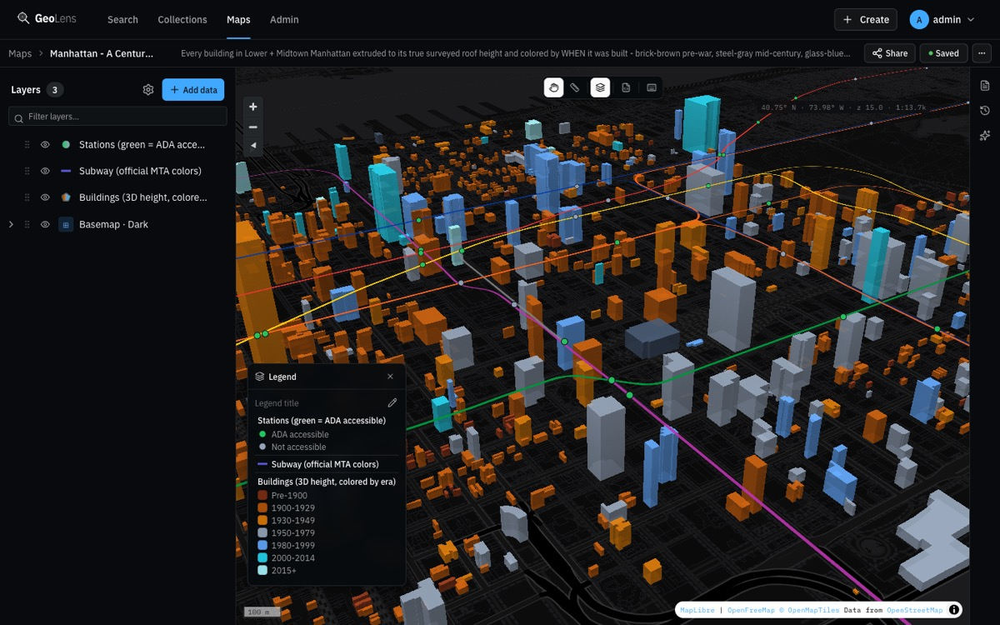
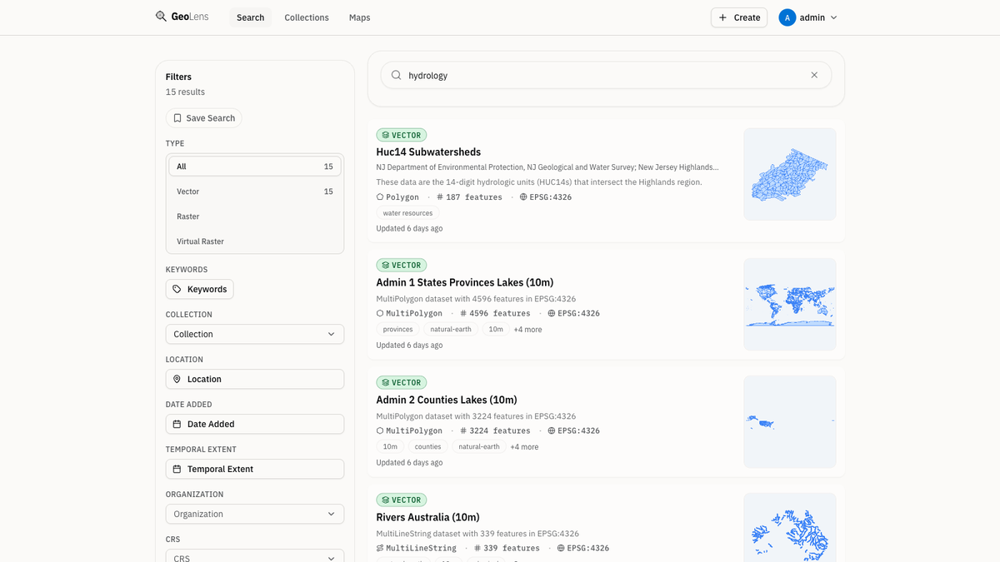
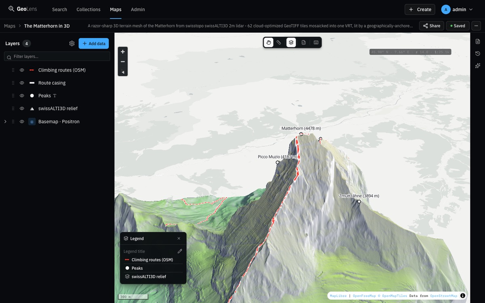
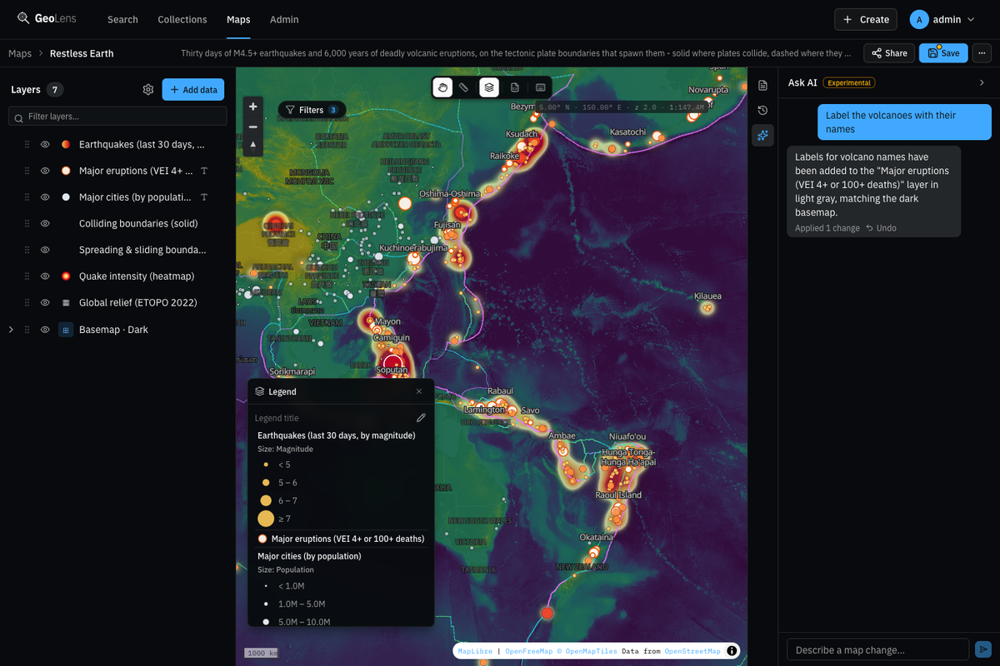
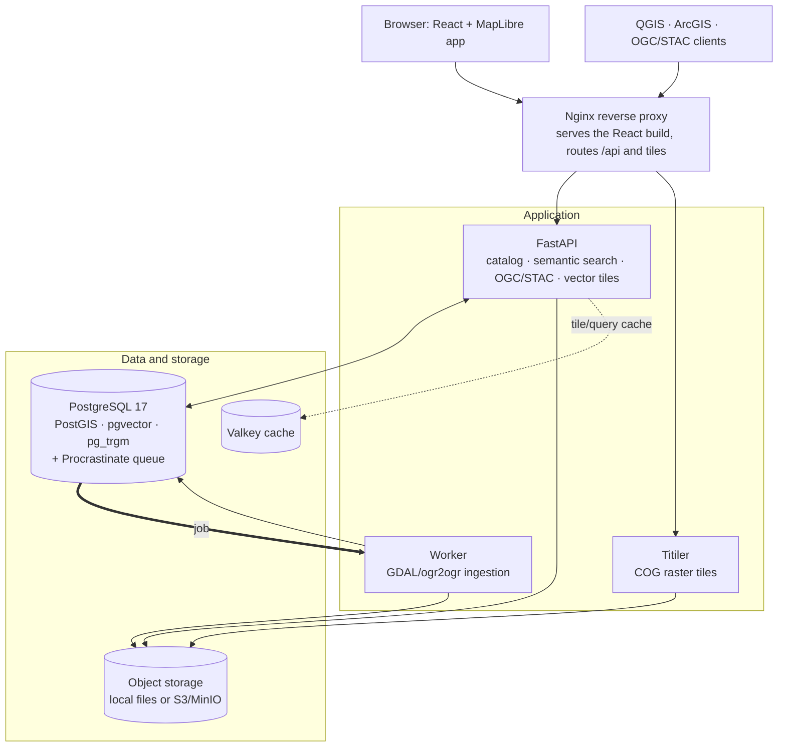

# GeoLens

[English](README.md) | [Español](README.es.md) | [Français](README.fr.md) | [Deutsch](README.de.md)

**Your team's spatial data: searchable, mappable, and shareable in one place.**

GeoLens is an open-source, self-hosted catalog and map builder for GIS and data teams: a single home for spatial data that you run on infrastructure you control, with no telemetry. GeoLens itself phones home to nothing. (Features you opt into can make outbound calls: AI assist to your chosen OpenAI-compatible endpoint, OAuth/OIDC sign-in, SMTP, basemap tiles, remote/S3 data sources, and off-site backups.) Upload Shapefiles, GeoTIFFs, GeoPackages, or CSVs (or register data you already have); GeoLens stores everything in PostGIS, indexes it with pgvector + pg_trgm for semantic and fuzzy search, and serves OGC/STAC APIs that QGIS, ArcGIS, and MapLibre clients connect to natively. Compose, style, and share multi-layer maps right in the browser. Built on FastAPI and React. Deployed with one command.

<p align="center">
  <a href="https://demo.getgeolens.com"></a>
  <br />
  <sub>No install required. Explore the map builder with sample maps. Sign in as <code>guest</code> / <code>GeoLensDemo1!</code></sub>
</p>

[](https://github.com/geolens-io/geolens/actions/workflows/ci.yml)
[](LICENSE)
[]()
[](https://postgis.net/)
[](https://ogcapi.ogc.org/)

```bash
curl -fsSL https://getgeolens.com/install.sh | sh
# Open http://localhost:8080, then log in with the credentials you chose
```

<p align="center">
  
  <br />
  <em>The map builder: Manhattan's building footprints extruded to roof height and color-graded by a data-driven style, built from open data with <code>scripts/seed-showcase.py</code></em>
</p>

> [!NOTE]
> **Early release.** GeoLens is actively developed and maintained, and newly
> open-sourced. The core has run in production, but the self-hosted distribution is
> young and some features and APIs may still change. Please
> [open an issue](https://github.com/geolens-io/geolens/issues) if you hit a rough edge.

## Documentation

Full user, admin, and API documentation lives at **[docs.getgeolens.com](https://docs.getgeolens.com)**. The [Reference](#reference) table below links each guide.

## Published artifacts

GeoLens is published through the standard package registries:

```bash
pip install geolens          # Python SDK
pip install geolens-cli      # CLI; installs the `geolens` command
npm install @geolens/sdk     # TypeScript/JavaScript SDK
```

Prebuilt public API and frontend images are published to GitHub Container Registry:

```bash
docker pull ghcr.io/geolens-io/geolens-api:latest
docker pull ghcr.io/geolens-io/geolens-frontend:latest
```

The `latest` tag tracks the newest published stable release.

## Why GeoLens?

Spatial data ends up scattered: shapefiles on shared drives, tables in database schemas, rasters in cloud buckets, metadata in spreadsheets. Finding the right dataset means asking Slack or grepping file servers. Sharing it means exporting, emailing, and hoping the CRS matches.

GeoLens replaces that workflow:

- **One catalog:** upload Shapefiles, GeoPackages, GeoTIFFs, or CSVs and they become searchable, previewable, and exportable in minutes
- **Works with your tools:** OGC API Features/Records, STAC API 1.0, direct tile URLs for QGIS, ArcGIS, and MapLibre
- **Semantic and spatial search:** find datasets by meaning rather than exact keywords, powered by pgvector and pg_trgm full-text search
- **Built-in map builder:** compose multi-layer maps, style them, and share via public link or embeddable iframe
- **AI-assisted (optional):** chat with your maps, auto-generate descriptions, search by natural language. Bring any OpenAI-compatible API key or skip it entirely

## See it in action

The examples below use a JWT bearer token. Mint one against the local stack (the login endpoint accepts an OAuth2 password form, so use `-d` with form fields, not JSON). Substitute your admin username and the password from `.env` (`grep '^GEOLENS_ADMIN_PASSWORD=' .env`):

```bash
TOKEN=$(curl -s -X POST http://localhost:8080/api/auth/login/ \
  -d 'username=admin&password=<your-admin-password>' | jq -r '.access_token')
```

Search datasets by meaning instead of exact keyword matches:

```bash
# Semantic search ranks by meaning: "hydrology" surfaces subwatersheds, lakes,
# and river networks whose titles never mention the word
curl "http://localhost:8080/api/search/datasets/?q=hydrology&limit=3" \
  -H "Authorization: Bearer $TOKEN" | jq '.features[].properties.title'
```

Every dataset is also a standard OGC API Features endpoint:

```bash
# Grab a public collection id from the catalog. Search anonymously (no token) so
# the id is one anyone can read, matching the unauthenticated items request below.
CID=$(curl -s "http://localhost:8080/api/search/datasets/?q=countries&limit=1" \
  | jq -r '.features[0].id')

# GeoJSON features with a bbox filter, works in QGIS, ArcGIS, any OGC client
curl "http://localhost:8080/api/collections/$CID/items?bbox=-10,35,30,60&limit=5"
```

PostGIS and pgvector share one database, so you can rank datasets by meaning *inside* a spatial window in a single query. See the [search guide](https://docs.getgeolens.com/guides/user/search/) for how semantic and spatial search work together.

Connect directly from QGIS: **Layer > Add WFS / OGC API Features** and point at `http://localhost:8080/api/`.

## Features

Each example above has a full guide in the [docs](https://docs.getgeolens.com/guides/). What GeoLens reads, writes, and exposes:

### Data ingestion and export

- **Vector:** Shapefile, GeoPackage, GeoJSON, CSV, XLSX
- **Raster:** GeoTIFF and Cloud-Optimized GeoTIFF (COG) with automatic conversion
- **Mosaics:** VRT-based raster mosaics from multiple source files
- **Export:** GeoJSON, Shapefile, GeoPackage, CSV, with CRS reprojection
- Provenance tracking and metadata editing

### Standards and interop

- OGC API - Features and OGC API - Records; STAC API 1.0 catalog endpoint
- Direct tile URLs and per-user API keys for QGIS, ArcGIS, MapLibre, and any OGC client
- JWT + OAuth 2.0/OIDC, RBAC with per-dataset permissions

<details>
<summary>Security</summary>

- JWT authentication with refresh tokens
- API key management per user
- OAuth 2.0 / OIDC support (Google, Microsoft, generic providers)
- Role-based access control (RBAC) with per-dataset permissions
- Audit logging for all administrative actions
- Internationalization: English, Spanish, French, German

</details>

## Screenshots

<p align="center">
  
  <br />
  <em><strong>Find:</strong> search by meaning. A query for "hydrology" ranks subwatersheds, lakes, and river networks, with type, spatial, and temporal filters</em>
</p>

<p align="center">
  
  <br />
  <em><strong>Inspect:</strong> every dataset gets a map preview, schema stats, and a typed, filterable attribute table (here: 1,473 river centerlines, 38 columns)</em>
</p>

<p align="center">
  
  <br />
  <em><strong>Build:</strong> compose multi-layer maps in the browser with a drag-orderable layer stack and per-layer editors (here: the Matterhorn as a 3D terrain mesh from swissALTI3D lidar)</em>
</p>

<p align="center">
  
  <br />
  <em><strong>Ask AI:</strong> edit maps in natural language. "Add area labels" puts county names on a New York income choropleth (optional: bring your own OpenAI-compatible key)</em>
</p>

## Quick start

**Prerequisites:** Docker Engine 24+ and Docker Compose v2. The bundled stack
ships PostgreSQL 17. If you point GeoLens at an externally managed database, it
must be **PostgreSQL 13+** (for `gen_random_uuid()`) with **pgvector 0.5+** (for
HNSW semantic-search indexes), plus PostGIS, pg_trgm, and unaccent. The API and
worker run in containers (Python 3.13 bundled, no host Python needed). The
optional CLI runs on your host and requires Python 3.11+; the Python SDK and
seed scripts require Python 3.10+.

The one-line install pulls the prebuilt, version-pinned images and starts the stack:

```bash
curl -fsSL https://getgeolens.com/install.sh | sh
```

Prefer to read the script or build from source first? Clone the repo and run the same installer. It builds the images locally instead of pulling them:

```bash
git clone https://github.com/geolens-io/geolens.git
cd geolens
bash scripts/install.sh
```

Either way, `scripts/install.sh` copies `.env.example` to `.env`, generates a JWT signing
secret, sets up admin credentials, and runs `docker compose up -d`. The admin **username**
defaults to `admin`; the admin **password** is auto-generated as a strong random value
(written to `.env`, never printed to your terminal) unless you supply your own. It is never `admin` / `admin`.
For unattended installs, set `GEOLENS_ADMIN_USERNAME` and `GEOLENS_ADMIN_PASSWORD` in the
environment before running and the prompts are skipped. Re-running the script is idempotent:
existing values in `.env` are preserved.

Wait about 60 seconds for services to start, then open [http://localhost:8080](http://localhost:8080).
Log in with your admin username and the generated password (retrieve it with
`grep '^GEOLENS_ADMIN_PASSWORD=' .env`).

Verify all services are healthy:

```bash
docker compose ps
```

First-run notes: the one-line install **pulls** prebuilt images and is up in about
a minute (only the small PostGIS + pgvector database layer builds locally). Cloning
and running `bash scripts/install.sh` instead **builds** every image from source:
5-10 minutes on the first run (GDAL + Postgres extensions + the frontend bundle);
subsequent starts settle in ~60 seconds either way. If ports 5434/8001/8080 are
already taken, change `DB_PORT`, `API_PORT`,
or `FRONTEND_PORT` in `.env`. For port conflicts, stuck startups, out-of-memory,
and migration warnings, see the [Troubleshooting guide](https://docs.getgeolens.com/guides/quickstart/install/#troubleshooting).

For production deployment, see the [Install Guide](https://docs.getgeolens.com/guides/quickstart/install/). A community-maintained Kubernetes [Helm chart](https://github.com/geolens-io/geolens-deployments) lives in the separate [`geolens-deployments`](https://github.com/geolens-io/geolens-deployments) repo.

### Verify the installer

Each [GitHub Release](https://github.com/geolens-io/geolens/releases) attaches a `SHA256SUMS`
file generated by CI alongside `install.sh`. To confirm a downloaded installer was not tampered
with before running it, download both assets from the same release and place them in the same
directory, then run:

```bash
# Linux / Windows WSL
sha256sum -c SHA256SUMS

# macOS
shasum -a 256 -c SHA256SUMS
```

A passing check prints `install.sh: OK`.

### Upgrading

To upgrade a prebuilt install, run `./scripts/upgrade.sh` from your install
directory. It backs up the database, pulls the new images, runs migrations
behind a health gate, and prints a rollback recipe if anything fails. See
[`UPGRADING.md`](UPGRADING.md) for the prebuilt and source-build flows plus
rollback, or the online [Upgrade Guide](https://docs.getgeolens.com/guides/quickstart/upgrade/).

### Add your first dataset

The repo ships a small `city-parks.geojson`. Upload and publish it in one command with the **GeoLens CLI**:

```bash
pip install geolens-cli                              # installs the `geolens` command
geolens login http://localhost:8080/api              # use your admin username + password
geolens publish examples/manifests/first-catalog/city-parks.geojson --name "City Parks"
```

`geolens publish` runs the upload → preview → commit ingest flow and prints the new dataset's URL. One command takes a local file to a published, mappable dataset.

For repeatable, multi-dataset catalogs, describe your sources in a **manifest** (`geolens.yaml`) and apply it with `geolens apply`. Manifest sources are referenced by HTTP(S) URL, S3 URI, or a path already staged on the server; the examples in [`examples/manifests/`](examples/manifests/) are templates to adapt. Scaffold a fresh one with `geolens init` and edit it for your sources:

```bash
geolens init                       # writes geolens.yaml in the current directory
geolens validate geolens.yaml      # local schema check, no API call
geolens apply geolens.yaml         # validates + applies via /ingest/manifest/apply
```

See the [CLI guide](https://docs.getgeolens.com/guides/cli/) for the full manifest schema, source kinds, and CI integration patterns.

### Seed data

`scripts/seed-showcase.py` builds three demo maps from public open data: a Manhattan 3D skyline (the hero above), a New York income choropleth, and an optional Matterhorn 3D-terrain hero:

```bash
pip install httpx
python scripts/seed-showcase.py --username admin --password "$(grep '^GEOLENS_ADMIN_PASSWORD=' .env | cut -d= -f2-)" [--with-terrain] [--only manhattan|income|matterhorn]
```

Requires internet access to the upstream open-data sources.

## Architecture

GeoLens is a small set of services around a single PostgreSQL/PostGIS database: the
API serves the catalog, search, and OGC/STAC endpoints; a worker handles ingestion;
and Titiler serves raster tiles from object storage.



| Component | Technology |
|-----------|-----------|
| Frontend | React 19, Vite, MapLibre GL v5, TanStack Query, Tailwind CSS |
| Backend API | FastAPI (Python), GDAL/ogr2ogr, Procrastinate (task queue) |
| Raster Tiles | Titiler (COG tile server) |
| Object Storage | MinIO (S3-compatible, local dev) or any S3 provider |
| Cache | Valkey (tile and query cache) |
| Database | PostgreSQL 17 + PostGIS 3.5 + pgvector + pg_trgm (minimum: PostgreSQL 13, pgvector 0.5) |
| Reverse Proxy | Nginx (production) / Vite dev proxy (development) |

## Configuration

All configuration is managed through environment variables in `.env`. See the [Configuration Reference](https://docs.getgeolens.com/guides/quickstart/configuration/) for the full list of options with defaults and descriptions.

### Connection pool budget

GeoLens ships tuned for a **single PostgreSQL** instance: the API, worker, and admin
pools fit within **30 of 30 max_connections** out of the box (Postgres
`max_connections` is set to 30), sized by `DB_POOL_SIZE` (`pool_size`) and
`DB_MAX_OVERFLOW` (`max_overflow`, default 3). See
[Connection Pool Tuning](https://docs.getgeolens.com/guides/quickstart/configuration/#connection-pool-tuning)
for the per-process budget and how to raise the ceiling.

### Backups

Automated, scheduled backups run **by default**. You do not need a `--profile backup` flag.
The backup service starts alongside `api`, `worker`, and `db` on every
`docker compose up` and runs `pg_dump` on a daily/weekly schedule alongside an
archive of the object-storage staging volume, so a restore reproduces a working
instance (DB + uploaded files).

**Off-site (S3) upload** is additionally gated on `BACKUP_S3_ENABLED=true`. The
built-in uploader signs requests with **AWS Signature V4** (awscli), compatible
with Cloudflare R2, modern AWS S3, and MinIO. A failed upload surfaces a visible
`ERROR` in container logs (not a swallowed warning), so silent offsite backup
loss is detectable immediately.

For day-2 operations, restore procedures, and incident response, see
[RUNBOOK.md](RUNBOOK.md). For provider-specific configuration options, see
[Backups & Restore](https://docs.getgeolens.com/guides/admin/backups/#backup-destinations).

## Reference

| Guide | Description |
|-------|-------------|
| [Install Guide](https://docs.getgeolens.com/guides/quickstart/install/) | Step-by-step deployment with Docker Compose |
| [Upgrade Guide](https://docs.getgeolens.com/guides/quickstart/upgrade/) | Upgrading between versions with rollback procedures |
| [Configuration Reference](https://docs.getgeolens.com/guides/quickstart/configuration/) | All environment variables and their defaults |
| [Admin Guide](https://docs.getgeolens.com/guides/admin/) | User management, datasets, system health |
| [Cloud Deployment](https://docs.getgeolens.com/guides/quickstart/cloud-deployment/) | AWS, GCP, and DigitalOcean deployment guides |
| [CLI & Manifests](https://docs.getgeolens.com/guides/cli/) | Publish files and manage catalogs with the `geolens` CLI |
| [API Reference](https://docs.getgeolens.com/guides/api/) | Auto-generated reference at docs.getgeolens.com; interactive Swagger UI at `/api/docs` when running |
| [Manifest examples](examples/manifests/) | Template `geolens.yaml` manifests to adapt: public-cog (remote COG), url-source, s3-source, publication-states |

## Community

- [GitHub Discussions](https://github.com/geolens-io/geolens/discussions): questions, ideas, show and tell
- [Contributing Guide](.github/CONTRIBUTING.md): development setup, code style, and PR guidelines

## Known limitations

- Single PostgreSQL instance, with no built-in high availability or clustering.
- Multi-tenant cloud mode is not included. GeoLens is single-organization and self-hosted.
- Terrain rendering assumes DEM units are in meters; datasets in other vertical units may render exaggerated.
- The self-hosted distribution is young and some features and APIs may still change (see the Early release note above).

## License

GeoLens is licensed under the [Apache License 2.0](LICENSE). The GeoLens name, logo, and brand assets are not covered by this license. See [TRADEMARKS.md](TRADEMARKS.md). Third-party sample-data attribution is in [THIRD_PARTY_DATA.md](THIRD_PARTY_DATA.md).

GeoLens is **open core**: the full platform in this repository is Apache-2.0 and free to self-host for one organization with many users. A separately-licensed, commercial Enterprise overlay adds organization-scale identity, governance, compliance, and branding. It is never required to run GeoLens. See [EDITIONS.md](EDITIONS.md) for the exact free-vs-commercial boundary and the commitments we hold ourselves to.

Project policies: [editions](EDITIONS.md) · [governance](GOVERNANCE.md) · [maintainers](MAINTAINERS.md) · [contributing](.github/CONTRIBUTING.md) · [security](.github/SECURITY.md) · [release process](RELEASE.md) · [egress &amp; air-gap](EGRESS.md).
