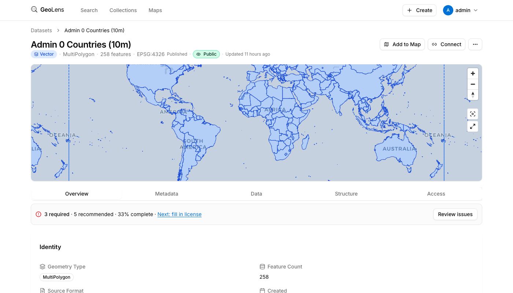

# GeoLens

**AI-powered spatial data catalog with a built-in map builder.**

Upload your GIS data, search and preview it instantly, build styled interactive maps, and share or export — all from a single Docker Compose stack. Optional AI features let you chat with your maps, generate metadata, and search semantically.

[](LICENSE)
[](docker-compose.yml)
[](https://github.com/geolens-io/geolens/commits/main)

<p align="center">
  
</p>

<p align="center">
  
</p>

### Why GeoLens?

Most open-source GIS catalogs (GeoServer, GeoNode) are heavyweight Java stacks designed for enterprise IT teams. GeoLens is a lightweight Python/React stack that runs in a single `docker compose up` and gives you a modern catalog with a visual map builder and optional AI features — chat-driven map editing, semantic search, and automated metadata — out of the box.

## Features

| | |
|---|---|
| **Map Builder** | Create multi-layer interactive maps with custom styling, filters, labels, and per-category color ramps |
| **AI Chat** | Talk to your map — style layers, filter data, and run spatial queries in natural language (Claude or OpenAI) |
| **Semantic Search** | Find datasets by meaning, not just keywords, powered by pgvector embeddings |
| **AI Metadata** | One-click AI-generated summaries, keywords, lineage, and quality statements for any dataset |
| **Search & Discovery** | Full-text search, spatial/bbox filtering, type facets, keyword tags, saved searches, and collection browsing |
| **Vector & Raster** | Upload Shapefiles, GeoJSON, GeoPackage, CSV, XLSX, GeoTIFF, COG, and VRT — served as vector tiles (ST_AsMVT) or raster tiles (Titiler) |
| **Export** | Download in GeoJSON, Shapefile, GeoPackage, CSV, or KML |
| **Sharing & Embeds** | Public share links with expiration, embeddable map iframes with domain-restricted token-based access |
| **OGC Standards** | OGC API Features, Records, and STAC endpoints for interoperability with QGIS, ArcGIS, and other clients |
| **Admin Panel** | User management, roles, permissions, audit logging, published maps registry, AI provider configuration |
| **Auth** | JWT + API keys + OAuth/OIDC (Google, Microsoft, custom providers) |
| **i18n** | English, Spanish, French, German |

## Quick Start

**Prerequisites:** Docker Engine 24+ and Docker Compose v2.

```bash
git clone https://github.com/geolens-io/geolens.git
cd geolens
docker compose up -d
```

Open `http://localhost:8080` — log in with `admin` / `admin` and change the password immediately.

### Seed with sample data

Populate your catalog with 130 [Natural Earth](https://www.naturalearthdata.com/) vector datasets:

```bash
pip install httpx
python scripts/seed-natural-earth.py --api-key admin
```

The script downloads, ingests, and organizes datasets into collections automatically. Re-runs are idempotent.

## Architecture

| Component | Technology |
| --- | --- |
| Backend | FastAPI, SQLAlchemy, Alembic |
| Frontend | React 19, Vite, TanStack Query, MapLibre GL |
| Database | PostgreSQL + PostGIS + pgvector |
| Raster Tiles | Titiler |
| Object Storage | S3-compatible (MinIO for local dev) |
| Cache | Valkey (Redis-compatible) |
| Reverse Proxy | nginx |

## Configuration

GeoLens is configured through environment variables. Key settings:

| Variable | Description | Default |
|---|---|---|
| `GEOLENS_ADMIN_USERNAME` | Initial admin username | (required) |
| `GEOLENS_ADMIN_PASSWORD` | Initial admin password | (required) |
| `JWT_SECRET_KEY` | Secret for JWT signing | (required) |
| `DATABASE_URL` | PostgreSQL connection string | `postgresql+asyncpg://...` |
| `STORAGE_PROVIDER` | `local` or `s3` | `local` |

See [docs/configuration-reference.md](docs/configuration-reference.md) for the full reference.

## Documentation

| Guide | Description |
|---|---|
| [Install Guide](docs/install-guide.md) | Detailed setup instructions |
| [Configuration Reference](docs/configuration-reference.md) | All environment variables and settings |
| [Admin Guide](docs/admin-guide.md) | User management, permissions, and system settings |
| [Cloud Deployment](docs/cloud-deployment.md) | AWS, DigitalOcean, and Kubernetes guides |
| [Database Design](docs/database-design.md) | Schema documentation |
| [AI Map Features](docs/llm-map-features.md) | AI chat and map generation |
| [AI Data Features](docs/llm-data-features.md) | Semantic search and metadata generation |
| [Testing & CI](docs/testing-and-ci.md) | Test suites and CI/CD |

## Contributing

Contributions are welcome! See [CONTRIBUTING.md](.github/CONTRIBUTING.md) for development setup, code style, and PR guidelines.

## License

GeoLens is licensed under the [Business Source License 1.1](LICENSE).

- **Free** for your organization's internal use, including commercial organizations and consultant deployments for clients.
- **Restricted** from being offered as a hosted/managed service to third parties.
- **Converts to MIT** on 2030-02-17.

See [LICENSE-FAQ.md](LICENSE-FAQ.md) for plain-English answers to common questions.
