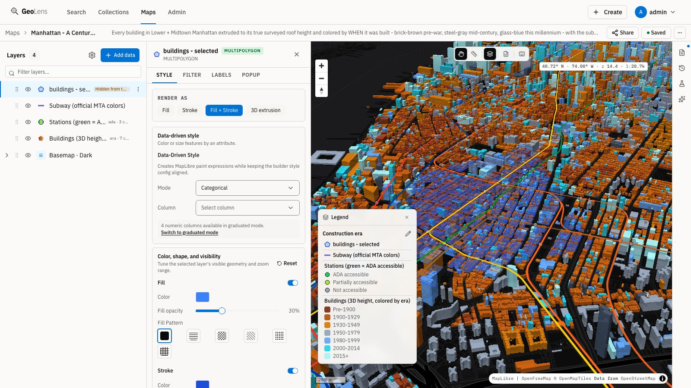
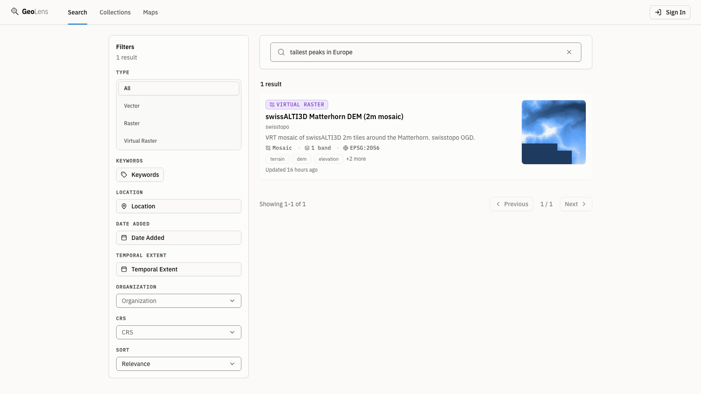
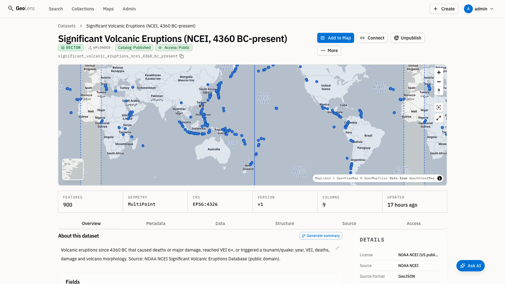
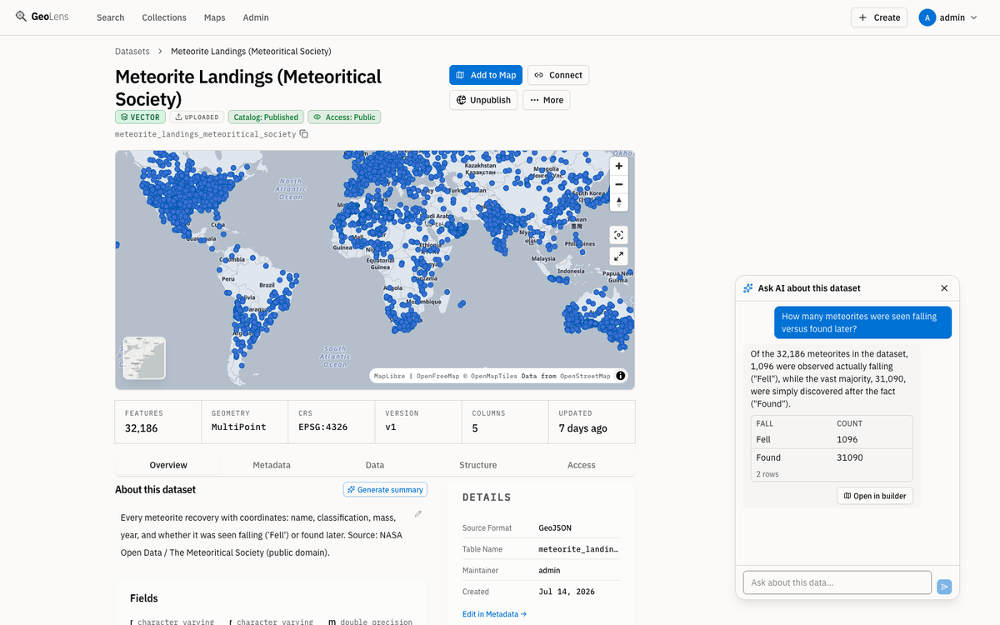
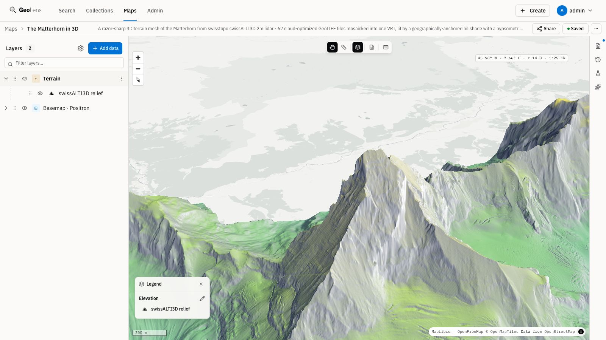
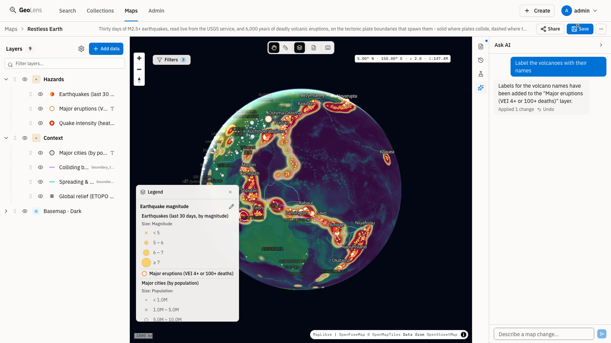
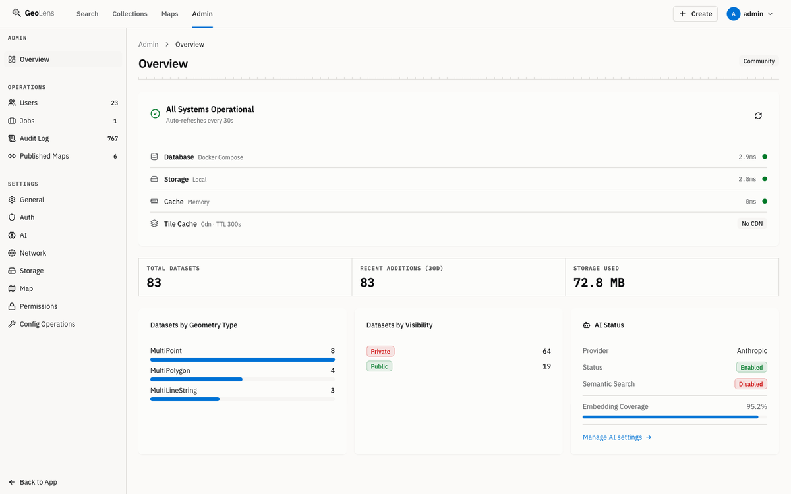
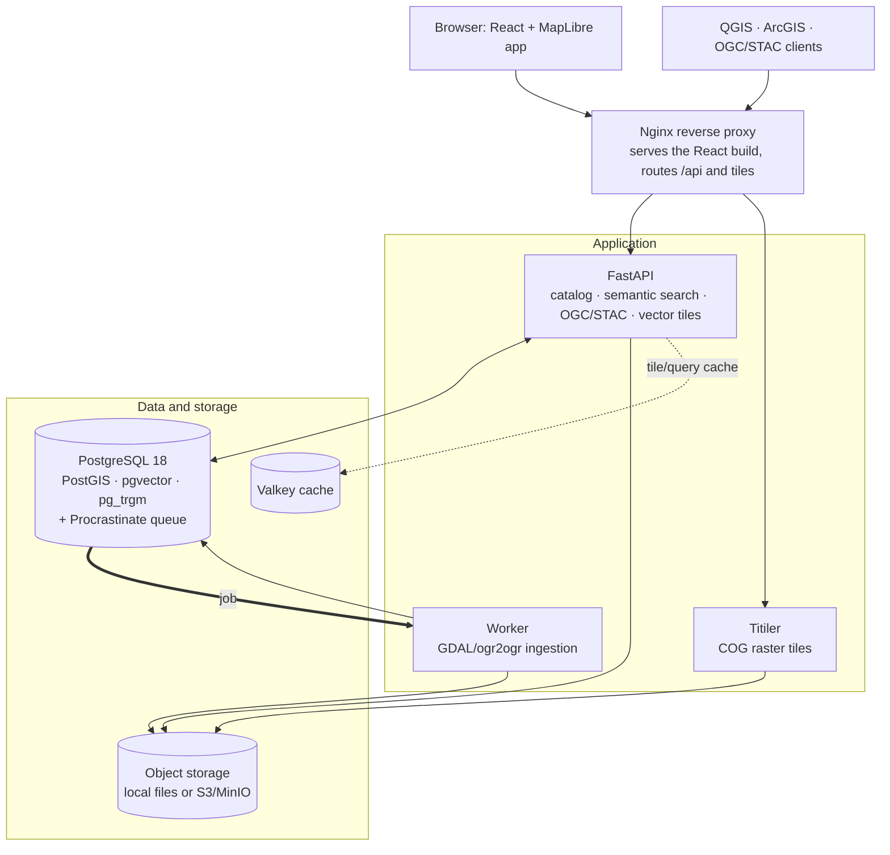

# GeoLens

[English](README.md) | [Español](README.es.md) | [Français](README.fr.md) | [Deutsch](README.de.md) | [简体中文](README.zh.md)

**您团队的自托管空间数据枢纽：在一个地方完成搜索、制图与共享。**

GeoLens 是一个面向 GIS 和数据团队的开源空间数据枢纽：在您自己掌控的基础设施上查找和使用数据，全程无遥测。GeoLens 本身不会主动连接任何外部服务，唯一的例外是默认底图瓦片——在管理员配置其他底图之前，它们从 tiles.openfreemap.org 加载。（您主动启用的其他功能可能产生出站请求：连接您所选的 OpenAI 兼容端点或 Anthropic 密钥的 AI 助手、OAuth/OIDC 登录、SMTP、远程/S3 数据源以及异地备份。）上传文件、在浏览器中创建数据集、免复制地注册 GeoLens 自身 PostGIS 数据库中已有的表、从 WFS、ArcGIS FeatureServer 或 OGC API Features 导入一次性副本，或实时引用远程 STAC 资产。GeoLens 记录每个数据集的来源，开箱即用地用 pg_trgm 索引目录元数据以支持模糊搜索（配置嵌入提供方并启用语义搜索后，pgvector 还会带来语义排序），并通过 OGC/STAC API 让 QGIS、ArcGIS 和 MapLibre 客户端原生连接。直接在浏览器中组合、样式化并共享多图层地图。基于 FastAPI 和 React 构建。一条命令完成部署。

<p align="center">
  <a href="https://demo.getgeolens.com"></a>
  <br />
  <sub>无需安装。无需账号即可浏览示例目录和地图，或使用 Google、GitHub 或 Microsoft 登录体验地图构建器。演示数据可能随时被清除。</sub>
</p>

[](https://github.com/geolens-io/geolens/actions/workflows/ci.yml)
[](LICENSE)
[](https://www.python.org/)
[](https://postgis.net/)
[](https://ogcapi.ogc.org/)

```bash
curl -fsSL https://getgeolens.com/install.sh | sh
# Open http://localhost:8080, then log in with the credentials you chose
```

<p align="center">
  
  <br />
  <em>地图构建器：曼哈顿每栋建筑按真实屋顶高度挤出并按建造年代着色，地铁在下方穿行——由开放数据通过 <code>scripts/seed-showcase.py</code> 生成</em>
</p>

> [!NOTE]
> **API 稳定性。** 标准化接口（OGC API Features/Records、STAC
> 以及瓦片端点）严格遵循各自规范，可放心在其上构建集成。GeoLens 自身的
> REST API 在小版本之间仍可能变化：契约变更会记录在
> [CHANGELOG](CHANGELOG.md) 中，破坏性变更会保持旧形式至少再兼容一个小
> 版本。遇到问题？[提交 issue](https://github.com/geolens-io/geolens/issues)。

## 文档

完整的用户、管理员和 API 文档位于 **[docs.getgeolens.com](https://docs.getgeolens.com)**。下方的[参考](#参考)表格链接了每份指南。

## 发布产物

GeoLens 通过标准软件包仓库发布：

```bash
pip install geolens          # Python SDK
pip install geolens-cli      # CLI；安装 geolens 命令
pip install geolens-mcp      # 面向编程代理的 MCP 服务器（只读）
npm install @geolens/sdk     # TypeScript/JavaScript SDK
```

预构建的公共 API 和前端镜像发布在 GitHub Container Registry：

```bash
docker pull ghcr.io/geolens-io/geolens-api:latest
docker pull ghcr.io/geolens-io/geolens-frontend:latest
```

`latest` 标签跟踪最新发布的稳定版本。

## 为什么选择 GeoLens？

空间数据总是四散各处：共享盘上的 Shapefile、数据库模式里的表、云存储桶中的栅格、电子表格里的元数据。想找到合适的数据集，要么在 Slack 里问人，要么在文件服务器上大海捞针。想共享它，就得导出、发邮件，然后祈祷 CRS 能对得上。

GeoLens 取代了这种工作方式：

- **统一的数据枢纽：** 上传文件、创建数据集、注册 GeoLens 数据库中已有的表、导入要素服务快照，或引用远程 STAC 资产——然后在一个地方统一搜索和预览
- **来源状态一目了然：** 查看每个数据集如何进入目录、上次刷新或检查是什么时候、最近一次刷新与其声明的更新节奏相比处于什么状态（时效正常、待刷新、刷新逾期或未知），以及远程 Service 或 STAC 来源当前是否仍可访问
- **与您现有的工具协同：** 支持服务端 CQL2 过滤的 OGC API Features/Records、STAC API 1.0、供 QGIS、ArcGIS 和 MapLibre 使用的直连瓦片 URL
- **无锁定：** 您的目录和 GeoLens 管理的副本始终留在您掌控的基础设施上，并可随时以开放格式迁出。矢量数据集可导出为 GeoPackage、GeoJSON、Shapefile、CSV、GeoParquet、FlatGeobuf 或 PMTiles；栅格可下载为云优化 GeoTIFF；任何 OGC API 客户端都能直接读取目录
- **语义与空间搜索：** 开箱即用的 pg_trgm 模糊匹配；添加嵌入提供方并启用语义搜索后，可按含义对数据集排序（pgvector）
- **内置地图构建器：** 组合多图层地图、样式化，并通过公开链接或可嵌入的 iframe 共享
- **AI 辅助（可选）：** 与您的地图对话、自动生成描述、用自然语言搜索。接入 OpenAI 兼容端点或 Anthropic 密钥，也可以完全不用

## 实际效果

以下示例使用 JWT Bearer 令牌。先在本地服务栈上生成一个（登录端点接受 OAuth2 密码表单，所以用 `-d` 传表单字段而不是 JSON）。把管理员用户名和 `.env` 中的密码替换成您自己的（`grep '^GEOLENS_ADMIN_PASSWORD=' .env`）：

```bash
TOKEN=$(curl -s -X POST http://localhost:8080/api/auth/login/ \
  -d 'username=admin&password=<your-admin-password>' | jq -r '.access_token')
```

语义搜索需要一次性管理员设置：一个嵌入提供方、管理后台 AI 设置中的 AI 与语义搜索开关，以及对设置前已接入数据的嵌入回填（[搜索指南](https://docs.getgeolens.com/guides/user/search/)有完整说明）。开启之后，就可以按含义而不是精确关键词搜索数据集：

```bash
# Semantic search ranks by meaning: "hydrology" surfaces the lake and river
# network datasets whose titles never mention the word
curl "http://localhost:8080/api/search/datasets/?q=hydrology&limit=3" \
  -H "Authorization: Bearer $TOKEN" | jq '.features[].properties.title'
```

以编程方式调用搜索端点时需要了解一个行为：第一页会在数据集结果之外附加最多五个匹配的集合，所以 `numberReturned` 只在第 0 页可能超过 `limit`。这是有意设计而非缺陷——`limit` 约束的始终是每页的*数据集*数量。

每个数据集同时也是一个标准的 OGC API Features 端点：

```bash
# Grab a public collection id from the catalog. Search anonymously (no token) so
# the id is one anyone can read, matching the unauthenticated items request below.
CID=$(curl -s "http://localhost:8080/api/search/datasets/?q=countries&limit=1" \
  | jq -r '.features[0].id')

# GeoJSON features with a bbox filter, works in QGIS, ArcGIS, any OGC client
curl "http://localhost:8080/api/collections/$CID/items?bbox=-10,35,30,60&limit=5"
```

PostGIS 和 pgvector 共享同一个数据库，因此启用语义搜索后，您可以在单个查询中在空间窗口*内部*按含义对数据集排序。语义搜索与空间搜索如何协同，参见[搜索指南](https://docs.getgeolens.com/guides/user/search/)。

从 QGIS 直连：**图层 > 添加 WFS / OGC API Features**，地址填 `http://localhost:8080/api/`。

用您熟悉的工具直连同样的端点：[geolens-examples](https://github.com/geolens-io/geolens-examples) 提供单文件 MapLibre、Leaflet、OpenLayers 和 ArcGIS JS 页面，QGIS 与 DuckDB 演练，两个 GeoLens SDK、语义目录搜索、STAC 浏览器、已保存地图嵌入、Python/GeoPandas 分析、供 CLI 使用的 catalog-as-code 清单，以及 MCP 配置示例。其中只读示例直接运行在在线演示上，CI 会在每次推送和每周在那里重放它们，所以您复制的是本周刚验证过可用的代码。[浏览示例库](https://geolens-io.github.io/geolens-examples/)。

## 功能特性

上述每个示例在[文档](https://docs.getgeolens.com/guides/)中都有完整指南。GeoLens 读取、写出和暴露的能力：

### 数据接入与导出

- **五种数据源模式：** 上传和创建的数据在本地管理；注册数据表（Register Table）原位提供 GeoLens 自身 PostGIS 数据库中的已有表；服务（Service）导入生成一次性本地副本；STAC 数据集保持对远程资产的实时引用
- **矢量：** Shapefile、GeoPackage、GeoJSON、GeoParquet、FlatGeobuf、KML/KMZ、zip 压缩的 File Geodatabase、CSV、XLSX
- **栅格：** GeoTIFF 与云优化 GeoTIFF（COG），自动转换
- **镶嵌：** 基于多个源文件构建 VRT 栅格镶嵌
- **导出：** GeoJSON、Shapefile、GeoPackage、CSV 和 FlatGeobuf，支持 CRS 重投影；GeoParquet（始终为 EPSG:4326）；PMTiles 作为自包含瓦片档案，适用于支持 Range 请求的静态托管
- **来源状态：** 来源与上次刷新/上次检查时间戳、基于更新节奏的数据源时效性，以及对 Service 和 STAC 来源的按需健康检查
- 血缘追踪与元数据编辑

### 分析

- **缓冲区**（米、千米、英尺或英里）、**质心**、按绘制范围或另一多边形图层**裁剪**、可选按列分组的**融合**；**空间连接**和**按位置选择**按相交匹配要素，**测量**添加 `area_sqm` 和 `length_m` 列，**相交**写出带双方属性的逐对叠加结果
- 除融合外，所有操作都可在地图上预览（融合仅支持物化）；预览上限 500 个要素。**创建数据集**随后将八种操作中的任意一种作为后台任务在全部要素上运行，受各操作的数据源上限约束（融合 25 万要素，缓冲区 50 万要素）
- 输出是普通的矢量数据集——可样式化、可导出，并像其他数据集一样通过 OGC API 端点提供服务
- 聊天助手可按需运行缓冲区、质心和基于图层的裁剪预览

### 标准与互操作

- OGC API - Features（支持服务端 CQL2 过滤和逐集合的 `/queryables`）与 OGC API - Records；STAC API 1.0 目录端点；面向 DCAT 3、DCAT-US 3.0 和 GeoDCAT-AP 的 JSON-LD 目录
- 直连瓦片 URL 和按用户的 API 密钥，供 QGIS、ArcGIS、MapLibre 及任何 OGC 客户端使用
- 矢量瓦片在缩放级别 10 以下省略属性列以控制低层级瓦片体积；在瓦片 URL 上添加 `cols=<column>,<column>` 查询参数可让指定列在所有层级保留（列名会对照数据集的列做校验，未知列名会被丢弃）
- JWT + OAuth 2.0/OIDC，带逐数据集权限的 RBAC
- 界面支持英语、西班牙语、法语、德语和简体中文

<details>
<summary>安全</summary>

- 带刷新令牌的 JWT 身份验证
- 按用户的 API 密钥管理
- OAuth 2.0 / OIDC 支持（Google、Microsoft 及通用提供方）
- 基于角色的访问控制（RBAC），支持逐数据集权限
- 自助注册默认关闭；启用 SMTP 邮箱验证后，新注册与用户名冲突的注册请求采用一致的邮件发送行为
- 所有管理操作均有审计日志

</details>

## 截图

<p align="center">
  
  <br />
  <em><strong>查找：</strong>按含义搜索。“欧洲最高峰”能找到马特洪峰地形模型，尽管没有任何结果包含这些字词；还配有类型、位置和时间筛选器</em>
</p>

<p align="center">
  
  <br />
  <em><strong>检视：</strong>每个数据集都有地图预览、字段结构统计和类型化元数据。这里展示的是 NOAA NCEI 六千年间的重大火山喷发数据</em>
</p>

<p align="center">
  <picture>
    <source media="(prefers-color-scheme: dark)" srcset=".github/assets/geolens-dataset-chat-dark.png" />
    
  </picture>
  <br />
  <em><strong>向数据提问：</strong>用自然语言向数据集提问。“目击坠落的陨石与后来发现的陨石各有多少？”返回答案、计数（1,096 对 31,090）以及一键跳转到构建器</em>
</p>

<p align="center">
  
  <br />
  <em><strong>构建：</strong>在浏览器中用可拖拽排序的图层栈和逐图层编辑器组合多图层地图（此处：swissALTI3D 激光雷达下的马特洪峰 3D 地形网格）</em>
</p>

<p align="center">
  
  <br />
  <em><strong>Ask AI：</strong>用自然语言编辑地图。“给火山标上名称”为地图添加清晰可读的标注（可选：接入 OpenAI 兼容端点或 Anthropic 密钥）</em>
</p>

<p align="center">
  <picture>
    <source media="(prefers-color-scheme: dark)" srcset=".github/assets/geolens-admin-overview-dark.png" />
    
  </picture>
  <br />
  <em><strong>运营：</strong>内置管理面板覆盖实时健康、用量、用户、任务、审计日志和 AI 状态——无需额外搭建任何东西</em>
</p>

## 快速开始

**前置条件：** Docker Engine 24+ 和 Docker Compose v2。自带的服务栈内置
PostgreSQL 18。如果您将 GeoLens 指向外部管理的数据库，它必须是
**PostgreSQL 13+**（为了 `gen_random_uuid()`）并带 **pgvector 0.5+**
（为了 HNSW 语义搜索索引），另需 PostGIS、pg_trgm 和 unaccent。API 和
worker 运行在容器中（内置 Python 3.14，无需宿主机 Python）。可选的 CLI
运行在宿主机上，需要 Python 3.11+；Python SDK 和种子脚本需要
Python 3.10+。

一行安装命令会拉取预构建、版本固定的镜像并启动服务栈：

```bash
curl -fsSL https://getgeolens.com/install.sh | sh
```

想先读一读安装脚本，或者从源码构建？克隆仓库后运行同一个安装器，它会
在本地构建镜像而不是拉取：

```bash
git clone https://github.com/geolens-io/geolens.git
cd geolens
bash scripts/install.sh
```

两种方式下，`scripts/install.sh` 都会把 `.env.example` 复制为 `.env`，
生成 JWT 签名密钥，设置管理员凭据，并运行 `docker compose up -d`。管理员
**用户名**默认为 `admin`；管理员**密码**会自动生成为强随机值（写入
`.env`，绝不打印到终端），除非您自己提供。无人值守安装时，在运行前在
环境变量中设置 `GEOLENS_ADMIN_USERNAME` 和 `GEOLENS_ADMIN_PASSWORD`
即可跳过交互提示。重复运行脚本是幂等的：`.env` 中的既有值会被保留。

等待约 60 秒让服务启动，然后打开
[http://localhost:8080](http://localhost:8080)。用管理员用户名和生成的密码
登录（用 `grep '^GEOLENS_ADMIN_PASSWORD=' geolens/.env` 获取密码——一行
安装器会克隆到您运行它的目录下的 `geolens/` 中；在源码检出内则是
`.env`）。

验证所有服务健康：

```bash
docker compose ps
```

首次运行说明：一行安装**拉取**预构建镜像，约一分钟就绪（只有较小的
PostGIS + pgvector 数据库层在本地构建）。克隆仓库并运行
`bash scripts/install.sh` 则会从源码**构建**每个镜像：首次运行 5-10 分钟
（GDAL + Postgres 扩展 + 前端打包）；此后无论哪种方式，启动都在约 60 秒内
完成。如果端口 5434/8001/8080 已被占用，修改 `.env` 中的 `DB_PORT`、
`API_PORT` 或 `FRONTEND_PORT`。端口冲突、启动卡住、内存不足和迁移警告
等问题，参见[故障排除指南](https://docs.getgeolens.com/guides/quickstart/install/#troubleshooting)。

生产部署请参见[安装指南](https://docs.getgeolens.com/guides/quickstart/install/)。Kubernetes Helm chart 位于独立的 [`geolens-deployments`](https://github.com/geolens-io/geolens-deployments) 仓库。

### 校验安装器

每个 [GitHub Release](https://github.com/geolens-io/geolens/releases) 都附带
CI 生成的 `SHA256SUMS` 文件与 `install.sh` 放在一起。要在运行前确认下载
的安装器未被篡改，从同一发布下载两个文件并放在同一目录，然后运行：

```bash
# Linux / Windows WSL
sha256sum -c SHA256SUMS

# macOS
shasum -a 256 -c SHA256SUMS
```

校验通过会输出 `install.sh: OK`。

### 升级

升级预构建安装，在您的安装目录运行 `./scripts/upgrade.sh`。它会备份数据
库、拉取新镜像、在健康门控下运行迁移，并在失败时打印回滚方案。预构建与
源码构建两种流程及回滚详见 [`UPGRADING.md`](UPGRADING.md)，或在线
[升级指南](https://docs.getgeolens.com/guides/quickstart/upgrade/)。

### 添加您的第一个数据集

仓库自带一个小文件 `city-parks.geojson`。用 **GeoLens CLI** 一条命令完成
上传并发布：

```bash
pip install geolens-cli                              # installs the `geolens` command
geolens login http://localhost:8080/api              # use your admin username + password
geolens publish examples/manifests/first-catalog/city-parks.geojson --name "City Parks"
```

`geolens publish` 运行上传 → 预览 → 提交的接入流程，并打印新数据集的
URL。一条命令把本地文件变成已发布、可制图的数据集。

对于可重复、多数据集的目录，可以在**清单**（`geolens.yaml`）中描述您的
数据源并用 `geolens apply` 应用。清单数据源通过 HTTP(S) URL、S3 URI 或
服务器上已暂存的路径引用；[`examples/manifests/`](examples/manifests/)
中的示例就是可改编的模板。用 `geolens init` 生成新清单，再按您的数据源
编辑：

```bash
geolens init                       # writes geolens.yaml in the current directory
geolens validate geolens.yaml      # local schema check, no API call
geolens apply geolens.yaml         # validates + applies via /ingest/manifest/apply
```

完整的清单结构、数据源种类和 CI 集成模式，参见 [CLI 指南](https://docs.getgeolens.com/guides/cli/)。

### 种子数据

`scripts/seed-showcase.py` 用公开开放数据构建七张展示地图：基于真实洋底
地形的全球构造故事、按建造年代着色的曼哈顿 3D 天际线（即页首主图）、
1950 年以来的大西洋飓风路径、聚类显示的陨石坠落点、2 米激光雷达下的马特
洪峰 3D 地形、按引用接入的纽约 Sentinel-2 影像，以及用缓冲区、相交和融合
从风暴路径原地计算的飓风暴露图：

```bash
pip install httpx
python scripts/seed-showcase.py --username admin --password "$(grep '^GEOLENS_ADMIN_PASSWORD=' .env | cut -d= -f2-)"
```

需要能访问上游开放数据源。参数（`--no-terrain`、`--prune` 等）见
[`scripts/README.md`](scripts/README.md)。

## 架构

GeoLens 是围绕单一 PostgreSQL/PostGIS 数据库的一小组服务：API 提供目录、
搜索和 OGC/STAC 端点；worker 处理数据接入；Titiler 从对象存储提供栅格
瓦片。



| 组件 | 技术 |
|-----------|-----------|
| 前端 | React 19、Vite、MapLibre GL v6、TanStack Query、Tailwind CSS |
| 后端 API | FastAPI（Python）、GDAL/ogr2ogr、Procrastinate（任务队列） |
| 栅格瓦片 | Titiler（COG 瓦片服务） |
| 对象存储 | MinIO（S3 兼容，本地开发）或任意 S3 提供方 |
| 缓存 | Valkey（瓦片与查询缓存） |
| 数据库 | PostgreSQL 18 + PostGIS 3.6 + pgvector + pg_trgm（最低要求：PostgreSQL 13、pgvector 0.5） |
| 反向代理 | Nginx（生产）/ Vite 开发代理（开发） |

## 配置

所有配置通过 `.env` 中的环境变量管理。完整的选项列表（含默认值和说明）
参见[配置参考](https://docs.getgeolens.com/guides/quickstart/configuration/)。

### 连接池预算

GeoLens 的默认调优面向**单一 PostgreSQL** 实例：API、worker 和管理进程的
连接池开箱即用地控制在 80 个 `max_connections` 中的 **70 个** 以内
（Postgres `max_connections` 设为 80），由 `DB_POOL_SIZE`（`pool_size`）
和 `DB_MAX_OVERFLOW`（`max_overflow`，默认 3）决定规模。逐进程预算及如何
提高上限，参见
[连接池调优](https://docs.getgeolens.com/guides/quickstart/configuration/#connection-pool-tuning)。

### 备份

自动定时备份**默认开启**。不需要 `--profile backup` 标志。备份服务随
`api`、`worker` 和 `db` 在每次 `docker compose up` 时启动，按日/周
计划运行 `pg_dump` 并连同对象存储暂存卷的归档一起备份，因此一次恢复就能
还原一个可用实例（数据库 + 已上传文件）。

**异地（S3）上传**额外受 `BACKUP_S3_ENABLED=true` 门控。内置上传器使用
**AWS Signature V4**（awscli）签名请求，兼容 Cloudflare R2、新版 AWS S3
和 MinIO。上传失败会在容器日志中显示可见的 `ERROR`（而不是被吞掉的
警告），因此静默的异地备份丢失能被立即发现。

日常运维、恢复流程和事件响应参见 [RUNBOOK.md](RUNBOOK.md)。按提供方的
配置选项参见[备份与恢复](https://docs.getgeolens.com/guides/admin/backups/#backup-destinations)。

### 监控

API 和 worker 开箱即用地导出 Prometheus 指标（HTTP 速率/延迟/错误、任务
队列深度、数据库连接池、瓦片缓存）。参考抓取配置、告警规则和 Grafana
仪表盘位于 [`infra/monitoring/`](infra/monitoring/)；设置步骤见
[RUNBOOK.md §4](RUNBOOK.md#4-monitoring)。

## 参考

| 指南 | 说明 |
|-------|-------------|
| [安装指南](https://docs.getgeolens.com/guides/quickstart/install/) | 使用 Docker Compose 逐步部署 |
| [升级指南](https://docs.getgeolens.com/guides/quickstart/upgrade/) | 跨版本升级与回滚流程 |
| [配置参考](https://docs.getgeolens.com/guides/quickstart/configuration/) | 全部环境变量及其默认值 |
| [管理指南](https://docs.getgeolens.com/guides/admin/) | 用户管理、数据集、系统健康 |
| [在 AWS、GCP 或 DigitalOcean 上自托管](https://docs.getgeolens.com/guides/quickstart/cloud-deployment/) | 托管数据库、对象存储和缓存的部署指南 |
| [CLI 与清单](https://docs.getgeolens.com/guides/cli/) | 用 `geolens` CLI 发布文件并管理目录 |
| [API 参考](https://docs.getgeolens.com/guides/api/) | docs.getgeolens.com 上的自动生成参考；开发模式服务栈还在 `/api/docs` 提供 Swagger UI（生产环境禁用） |
| [清单示例](examples/manifests/) | 可改编的 `geolens.yaml` 清单模板：public-cog（远程 COG）、url-source、s3-source、publication-states |
| [客户端示例](https://github.com/geolens-io/geolens-examples) | 可运行的浏览器、QGIS、DuckDB、SDK、CLI、嵌入、Python 和 MCP 示例；其中只读示例由 CI 在在线演示上验证（[示例库](https://geolens-io.github.io/geolens-examples/)） |

## 社区

- [GitHub Discussions](https://github.com/geolens-io/geolens/discussions)：提问、想法、成果展示
- [支持](SUPPORT.md)：去哪里寻求帮助以及问题如何分派
- [贡献指南](.github/CONTRIBUTING.md)：开发环境搭建、代码风格和 PR 规范

## 已知限制

- 单一 PostgreSQL 实例，无内置高可用或集群。
- GeoLens 面向每次自托管部署对应一个组织的设计。
- 地形渲染假定 DEM 单位为米；采用其他垂直单位的数据集渲染可能失真。
- GeoLens 自身的 REST API 在小版本之间仍可能变化（见上文 API 稳定性说明）。

## 许可证

GeoLens 基于 [Apache License 2.0](LICENSE) 许可。GeoLens 名称、徽标和品牌资产不在本许可范围内，参见 [TRADEMARKS.md](TRADEMARKS.md)。第三方示例数据的署名见 [THIRD_PARTY_DATA.md](THIRD_PARTY_DATA.md)。

项目政策：[治理](GOVERNANCE.md) · [维护者](MAINTAINERS.md) · [贡献](.github/CONTRIBUTING.md) · [安全](.github/SECURITY.md) · [发布流程](RELEASE.md) · [出口流量与气隙隔离](EGRESS.md)。
